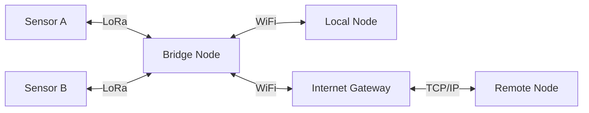

# Layer 0: Physical Transport

Mehr is transport-agnostic — any medium that can move bits is a valid link. LoRa, WiFi, Ethernet, cellular, packet radio, fiber, free-space optical: if it supports at least a half-duplex channel with ≥5 bps throughput and ≥500 byte MTU, Mehr will run on it. The transport layer is a swappable implementation detail — Mehr defines the interface it needs, not the implementation.

## Transport Requirements

The transport layer must provide:

- **Any medium is a valid link**: LoRa, LTE-M, NB-IoT, WiFi, Ethernet, serial, packet radio, fiber, free-space optical, TCP/IP
- **Multiple simultaneous interfaces**: A node can bridge between transports automatically
- **Announce-based routing**: No manual configuration of addresses, subnets, or routing tables
- **Mandatory encryption**: All traffic is encrypted; unencrypted packets are dropped as invalid
- **Sender anonymity**: No source address in packets
- **Constrained-link operation**: Functional at ≥5 bps

:::info[Specification]
Minimum transport interface: half-duplex channel, ≥5 bps throughput, ≥500 byte MTU, mandatory link-layer encryption. Any medium meeting these requirements is a valid Mehr transport.
:::

## Transport Interface Specification

This section defines the interface that **any** transport implementation must expose — whether Reticulum, a clean-room implementation, or a future replacement. The Mehr protocol stack depends only on this interface; it never depends on transport internals.

### Required Operations

A conforming transport implementation must provide the following operations:

```
TransportInterface {
    // Identity
    generate_identity() → NodeIdentity
        // Create Ed25519 keypair, derive destination hash and X25519 public key

    // Link management
    establish_link(peer_identity, interface) → EncryptedLink
        // X25519 key exchange, derive session key, negotiate link capabilities
        // MUST exchange LinkCapabilities (max_frame_size, supports_fragmentation)
        // Negotiated link MTU = min(local_mtu, peer_mtu)

    send_packet(link, destination_hash, context, data) → Result
        // Encrypt and transmit. Packet MUST NOT contain source address.
        // data length ≤ negotiated link MTU - header overhead (19 bytes)

    receive_packet(link) → (destination_hash, context, data)
        // Decrypt and deliver. Returns destination, not source.

    // Routing
    announce(identity, app_data) → ()
        // Broadcast signed announce with app_data (carries MehrExtension).
        // Announce propagates hop-by-hop; each relay forwards with updated metrics.

    get_path(destination_hash) → Option<Path>
        // Look up best known path to destination from routing table.

    // Key management
    rotate_link_keys(link) → ()
        // Periodic re-keying (≤1 hour or bandwidth threshold, whichever first).
}
```

### Required Properties

| Property | Requirement | Rationale |
|----------|-------------|-----------|
| **Minimum MTU** | ≥500 bytes per frame | Ensures all protocol messages fit in a single packet |
| **Variable MTU support** | MUST support per-link MTU negotiation via `LinkCapabilities` exchange | Enables transport classes (484B → 4,096B) |
| **Mandatory encryption** | All link traffic encrypted (ChaCha20-Poly1305 or equivalent) | Unencrypted packets are invalid |
| **No source address** | Packets carry destination hash only; source is never included | Structural sender anonymity |
| **Announce-based routing** | Signed announces propagate identity and reachability | No manual address/route configuration |
| **Reverse-path forwarding** | Relays record incoming interface for forwarded packets; responses follow the reverse path | Enables bidirectional communication without source addresses |
| **Opaque app_data** | Transport MUST forward announce `app_data` unchanged even if it doesn't understand the contents | Enables Mehr extensions on L0 transport-only nodes |
| **Forward secrecy** | Ephemeral key exchange per link; periodic key rotation | Compromise of one session key doesn't affect others |
| **Multi-interface** | A node MAY have multiple simultaneous interfaces; transport selects the best for each destination | Enables cross-transport bridging |

### Frame Format

The transport frame format is:

```
[HEADER 2B] [ADDRESSES 16/32B] [CONTEXT 1B] [DATA 0-N bytes]
```

- **Header** (2 bytes): Propagation type, destination type, packet type
- **Addresses** (16 or 32 bytes): Destination hash (16B), optionally transport ID (16B)
- **Context** (1 byte): Application-layer context identifier
- **Data** (variable): Payload, encrypted end-to-end by sender

Maximum header overhead: 35 bytes. The DATA field length varies by transport class:

| Transport Class | Max Frame | Max DATA |
|----------------|-----------|----------|
| Constrained | 484 bytes | 465 bytes |
| Standard | 1,500 bytes | 1,481 bytes |
| Bulk | 4,096 bytes | 4,077 bytes |

A conforming implementation MUST support at least the Constrained frame size (484 bytes). Support for Standard and Bulk frame sizes is REQUIRED to realize the full performance benefits of variable packet sizing.

:::tip[Key Insight]
All economic extensions ride as opaque payload in transport announces — the transport never needs to understand Mehr. Any conforming transport implementation can be used without changes to any protocol layer above.
:::

:::note[Reference Transport]
The [Reticulum Network Stack](https://reticulum.network/) satisfies the core transport requirements (mandatory encryption, sender anonymity, announce-based routing, 5 bps minimum) and is the design reference for this specification. A conforming Mehr transport must meet the full [Transport Interface Specification](#transport-interface-specification) above, including per-link MTU negotiation and variable frame sizes — requirements that go beyond Reticulum's fixed 500-byte frame limit. See [Design Decisions](../development/design-decisions#network-stack-reticulum-as-initial-transport) for the rationale behind the Reticulum reference.
:::

## Participation Levels

Not all nodes need to understand Mehr extensions. Three participation levels coexist on the same mesh:

| Level | Node Type | Understands | Earns MHR | Marketplace |
|-------|-----------|-------------|-----------|-------------|
| **L0** | Transport-only | Wire protocol only | No | No |
| **L1** | Mehr Relay | L0 + CompactPathCost + stochastic rewards | Yes (relay only) | No |
| **L2** | Full Mehr | Everything | Yes | Yes |

**L0 nodes** relay packets and forward announces (including Mehr extensions as opaque bytes) but do not parse economic extensions, earn rewards, or participate in the marketplace. They are zero-cost hops from Mehr's perspective. This ensures the mesh works even when some nodes run the transport layer alone.

**L1 nodes** are the minimum viable Mehr implementation — they parse CompactPathCost, run the VRF relay lottery, and maintain payment channels. This is the target for ESP32 firmware.

**L2 nodes** implement the full protocol stack including capability marketplace, storage, compute, and application services.

## Implementation Strategy

| Platform | Implementation |
|---|---|
| Raspberry Pi, desktop, phone | Rust implementation (primary) |
| ESP32, embedded | Rust `no_std` implementation (L1 minimum) |

All implementations speak the same wire protocol and interoperate on the same network.

## Supported Transports

| Transport | Typical Bandwidth | Typical Range | Typical Latency | Duplex | Notes |
|---|---|---|---|---|---|
| **LoRa (ISM band)** | 0.3-50 kbps | 2-15 km | 1-5 s | Half | Unlicensed, low power, high range. [RNode](https://reticulum.network/manual/hardware.html) as reference hardware. |
| **WiFi (local)** | 10-300 Mbps | 50-200 m | 1-10 ms | Full | Infrastructure or mesh (802.11s); ubiquitous, short range |
| **WiFi (point-to-point)** | 100-800 Mbps | 1-10 km | 1-5 ms | Full | Directional antennas for backbone links between fixed sites |
| **Cellular (LTE/5G)** | 1-100 Mbps | Via carrier | 10-50 ms | Full | Requires carrier subscription |
| **LTE-M** | 0.375-1 Mbps | Via carrier | 50-100 ms | Full | Licensed LPWAN; better building penetration than LoRa, carrier-managed |
| **NB-IoT** | 0.02-0.25 Mbps | Via carrier | 1-10 s | Half | Licensed LPWAN; extreme range and battery life, carrier-managed |
| **Ethernet** | 100 Mbps-10 Gbps | Local | ≤1 ms | Full | Backbone, data center |
| **Serial (RS-232, AX.25)** | 1.2-56 kbps | Varies | 10-500 ms | Half | Legacy radio, packet radio |
| **Fiber** | 1-100 Gbps | Long haul | ≤1 ms | Full | Backbone |
| **Bluetooth/BLE** | 1-3 Mbps | 10-100 m | 5-30 ms | Full | Wearables, phone-to-phone |
| **TCP/IP (Internet)** | Varies | Global | 10-200 ms | Full | Standard internet overlay; most accessible entry point for new nodes |

A node can have **multiple interfaces active simultaneously**. The network layer selects the best interface for each destination based on cost, latency, and reliability.

## Multi-Interface Bridging

A node with both LoRa and WiFi interfaces automatically bridges between the two networks. Traffic arriving on LoRa can be forwarded over WiFi and vice versa.

The bridge node is where bandwidth characteristics change dramatically — and where the [capability marketplace](/docs/L4-marketplace/overview) becomes valuable. A bridge node can:

- Accept low-bandwidth LoRa traffic from remote sensors
- Forward it over high-bandwidth WiFi to a local network
- Earn relay rewards for the bridging service
- Advertise its bridging capability to nearby nodes



## Bandwidth Ranges and Their Implications

The 20,000,000x range between the slowest and fastest supported transports (500 bps to 10 Gbps) has profound implications for protocol design:

:::caution[Trade-off]
Supporting 500 bps to 10 Gbps (a 20,000,000x range) means every protocol overhead byte must be budgeted. Data objects carry `min_bandwidth` requirements so large transfers are never attempted over constrained links — only hashes and metadata propagate on LoRa.
:::

- **All protocol overhead must be budgeted.** Gossip, routing updates, and economic state consume bandwidth that could carry user data. On a 1 kbps LoRa link, every byte matters.
- **Data objects carry minimum bandwidth requirements.** A 500 KB image declares `min_bandwidth: 10000` (10 kbps). LoRa nodes never attempt to transfer it — they only propagate its hash and metadata.
- **Applications adapt to link quality.** The protocol provides link metrics; applications decide what to send based on available bandwidth.
- **Packet sizes adapt to the path.** The [bottleneck_mtu](../L1-network/network-protocol#mehr-extension-compact-path-cost) field in announces tells senders the maximum packet size a path supports. Senders construct packets sized for the path — not the global minimum.

## Transport Classes and Variable Packet Sizes

The protocol-minimum MTU is 500 bytes, but many transports support much larger frames. Fixing all packets at 484 bytes (the Constrained-class maximum) wastes 68–95% of available frame capacity on WiFi, Ethernet, and fiber links.

:::info[Specification]
Mehr defines three **transport classes** by MTU. The path packet size is the minimum MTU across all hops, reported via the `bottleneck_mtu` field in [CompactPathCost](../L1-network/network-protocol#mehr-extension-compact-path-cost).
:::

| Transport Class | Max Packet Size | Transports | Notes |
|----------------|----------------|------------|-------|
| **Constrained** | 484 bytes | LoRa, NB-IoT, serial, Meshtastic bridge | Minimum transport class. LoRa padding to fixed size retained for traffic analysis resistance. |
| **Standard** | 1,500 bytes | WiFi, BLE, cellular, LTE-M | Matches Ethernet MTU. ~3× more data per packet than constrained. |
| **Bulk** | 4,096 bytes | Ethernet, fiber, TCP/IP | ~8.5× more data per packet than constrained. Capped to prevent single-packet link monopolization. |

### Per-Link MTU Negotiation

During link establishment, after the X25519 key exchange, both nodes exchange their interface capabilities:

```
LinkCapabilities {
    max_frame_size: u16,          // this interface's MTU in bytes
    supports_fragmentation: bool, // can reassemble fragments (false on ESP32 Minimal tier)
}
```

The negotiated link MTU is `min(alice_mtu, bob_mtu)`. All packets on this link may use up to `negotiated_mtu` bytes. The `LinkCapabilities` exchange adds 3 bytes to the existing link establishment handshake.

### Path MTU Behavior

Senders use the `bottleneck_mtu` from the routing table to size packets for a given destination:

- **Path crosses a LoRa hop** → `bottleneck_mtu` reports 484 bytes → sender uses 484-byte packets (same as v1.0)
- **Pure WiFi path** → `bottleneck_mtu` reports 1,500 bytes → sender uses up to 1,500-byte packets (3× improvement)
- **Pure Ethernet/fiber path** → `bottleneck_mtu` reports 4,096 bytes → sender uses up to 4,096-byte packets

If a relay receives a packet larger than its outbound link’s negotiated MTU, it sends a `PacketTooBig` signal upstream:

```
PacketTooBig {
    original_dest: DestinationHash,  // 16 bytes — which destination was unreachable at this size
    link_mtu: u16,                   // the MTU that was exceeded
}
// 18 bytes — fits in any transport
```

The sender caches the reduced MTU for that path and retries with smaller packets. The next announce from the relay will also propagate the corrected `bottleneck_mtu`.

### What Does Not Change

- **Wire format**: The Mehr header, addresses, context byte, and all field layouts are identical regardless of packet size. Only the DATA field length varies.
- **LoRa behavior**: Constrained-class links continue using 484-byte packets with fixed-size padding. No change to LoRa traffic analysis resistance.
- **Payment model**: Stochastic rewards already price per-byte. Larger packets = proportionally more reward per packet but same cost per byte.
- **Protocol overhead budget**: The ≤10% gossip budget is computed relative to link bandwidth, not packet count. Larger packets on fast links means fewer gossip packets but the same bandwidth fraction.

### Efficiency Gains

| Operation | 484B packets | 1,500B packets | 4,096B packets |
|-----------|-------------|---------------|----------------|
| Transfer 1 MB | 2,151 packets | 694 packets | 256 packets |
| Header overhead | 7.3% | 2.3% | 0.9% |
| 10 KB gossip filter | 22 packets | 7 packets | 3 packets |
| 4 KB storage chunk | 9 packets | 3 packets | 1 packet |

## NAT Traversal

Residential nodes behind NATs (common for WiFi and Ethernet interfaces) are handled at the transport layer. The NATed node initiates an outbound TCP or UDP connection to a publicly reachable peer, establishing a persistent bidirectional channel — the same mechanism that WebSockets and persistent TCP connections use to bypass NAT. No port forwarding, STUN, or TURN servers are required.

For nodes that cannot establish outbound connections (rare), the announce mechanism still propagates their presence. Traffic destined for a NATed node is routed through a neighbor that does have a direct link — functionally equivalent to standard relay forwarding. No special NAT-awareness is needed at the Mehr protocol layers above transport.

## What Mehr Adds Above Transport

The transport layer provides packet delivery, routing, and encryption. Mehr adds everything above:

| Extension | Purpose |
|---|---|
| **[CompactPathCost](../L1-network/network-protocol#mehr-extension-compact-path-cost) on announces** | Enables economic routing — cheapest, fastest, or balanced path selection |
| **[Stochastic relay rewards](/docs/L3-economics/payment-channels)** | Incentivizes relay operators without per-packet payment overhead |
| **[Capability advertisements](/docs/L4-marketplace/overview)** | Makes compute, storage, and connectivity discoverable and purchasable |
| **[CRDT economic ledger](/docs/L3-economics/crdt-ledger)** | Tracks balances without consensus or blockchain |
| **[Trust graph](/docs/L3-economics/trust-neighborhoods)** | Enables free communication between trusted peers |
| **[Congestion control](../L1-network/network-protocol#congestion-control)** | CSMA/CA, per-neighbor fair sharing, priority queuing, backpressure |

These extensions ride on top of the transport's existing gossip and announce mechanisms, staying within the protocol's [bandwidth budget](../L1-network/network-protocol#bandwidth-budget).

## Security Considerations

<details className="security-item">
<summary>RF Jamming / Denial of Service</summary>

**Vulnerability:** An adversary overwhelms LoRa, WiFi, or BLE frequencies with noise, denying service to all nodes within range.

**Mitigation:** Multi-interface failover — if LoRa is jammed, WiFi or Ethernet interfaces continue operating. Mesh routing automatically reroutes traffic around the jammed area. Frequency-hopping radios (BLE, some LoRa modes) increase jamming cost. Sustained wideband jamming in close proximity can deny all RF links; wired fallback (Ethernet, serial) is the only complete counter.

</details>

<details className="security-item">
<summary>Traffic Analysis via RF Observation</summary>

**Vulnerability:** Encrypted content is unreadable, but an observer with a software-defined radio can detect *that* communication is happening, measure volume, and correlate timing patterns to infer activity.

**Mitigation:** LoRa frames are [padded to fixed size](../L2-security/security#traffic-analysis-resistance) (constrained transport class retains fixed-size padding), preventing message-length analysis on broadcast RF links. Standard and bulk transport classes use variable-size packets since they operate over encrypted point-to-point links where passive RF observation is not feasible. Applications with high privacy requirements can opt into payload padding to MTU on any transport class via `PathPolicy` flags, trading bandwidth for traffic analysis resistance. Multi-path routing reduces timing correlation. Optional dummy traffic on quiet links raises the noise floor. A local observer with directional antennas can still detect RF activity from a specific location, but cannot determine content, sender, or recipient.

</details>

<details className="security-item">
<summary>Direction Finding / Node Localization</summary>

**Vulnerability:** An adversary with multiple receivers triangulates RF emissions to determine the physical location of a transmitting node.

**Mitigation:** Omnidirectional antennas reduce bearing precision. The relay topology means the emitting node may not be the message originator — [sender anonymity](../L2-security/security#sender-anonymity) ensures a relay can't distinguish originator from forwarder. Low-power LoRa limits detection range. A determined adversary with multiple coordinated receivers can localize any actively transmitting node; operational countermeasures (elevated or concealed antenna placement) reduce this risk.

</details>

<details className="security-item">
<summary>RF Fingerprinting</summary>

**Vulnerability:** Each radio has unique analog characteristics (clock drift, power ramp shape, modulation quirks) that can identify a specific physical device across sessions, even if cryptographic identity changes.

**Mitigation:** Not mitigated by protocol — this is a hardware-layer property below the transport abstraction. Identity is already pseudonymous (destination hashes, no source addresses), so fingerprinting reveals physical device continuity but not identity. Operational countermeasure: rotate or swap radio hardware. Practical impact is limited unless combined with direction finding.

</details>

<details className="security-item">
<summary>Rogue Relay / Eclipse Attack</summary>

**Vulnerability:** An adversary controls all physical links to a target node (e.g., operates the only LoRa gateway within range), enabling selective packet dropping, traffic manipulation, or isolation.

**Mitigation:** Multiple simultaneous interfaces reduce single-point dependency — a node with both LoRa and WiFi is harder to eclipse. [Trust neighborhoods](/docs/L3-economics/trust-neighborhoods) detect behavioral anomalies from relays. The economic layer makes sustained eclipse costly — the attacker must fund [payment channels](/docs/L3-economics/payment-channels) and maintain them. A geographically isolated node with a single transport has no alternative path; physical diversity (adding a second radio or wired link) is the operational counter.

</details>

<details className="security-item">
<summary>Physical Tampering</summary>

**Vulnerability:** An adversary gains physical access to an unattended node (rooftop relay, solar station, rural repeater) and extracts cryptographic keys, installs modified firmware, or implants surveillance hardware.

**Mitigation:** Tamper-evident enclosures for outdoor deployments. Secure boot on ESP32 and similar MCUs prevents unauthorized firmware. Keys stored in hardware secure elements where available. [KeyCompromiseAdvisory](../L2-security/security#key-compromise-and-identity-migration) enables identity migration after detected compromise. Unattended outdoor nodes are inherently vulnerable to physical access — deployments in hostile environments should assume eventual physical compromise and plan for key rotation.

</details>

<details className="security-item">
<summary>PacketTooBig as an Oracle</summary>

**Vulnerability:** A relay can observe `PacketTooBig` signals to learn the MTU of downstream links it does not directly participate in. The `original_dest` field reveals which destination the sender was trying to reach at the oversized MTU.

**Mitigation:** `PacketTooBig` propagates only 1-hop upstream — it is not forwarded further. The `original_dest` is already in the packet header (destination hash is always visible to relays), so `PacketTooBig` reveals no new destination information. The signal does reveal that a downstream link has a lower MTU than expected, but this information is already available in the next announce's `bottleneck_mtu` — the signal's timing advantage is at most one gossip round (60 seconds).

</details>

<details className="security-item">
<summary>Fragment Reassembly Attacks</summary>

**Vulnerability:** Overlapping fragments, fragment floods, and incomplete fragment sets can exhaust reassembly buffers on constrained devices (e.g., ESP32 with 520 KB RAM), causing denial of service.

**Mitigation:** Fragmentation is deferred. If implemented, reassembly is hop-by-hop (not end-to-end), limiting buffer state to the immediate bottleneck relay. Fragment sets expire after `3 × worst_latency_ms`. Concurrent fragment sets are capped at 2–3 per relay. Overlapping fragments are dropped. Fragment floods are throttled by the existing per-neighbor token bucket.

</details>

<details className="security-item">
<summary>MTU Negotiation Downgrade</summary>

**Vulnerability:** A malicious node claims a lower MTU than its interface actually supports during `LinkCapabilities` exchange, forcing all traffic on the link to use smaller packets and reducing throughput.

**Mitigation:** Low-impact — the attacker degrades only the single link it participates in, not the entire path. The `bottleneck_mtu` in announces reflects the artificially low MTU, causing senders to avoid this path for large transfers (self-penalizing). A relay that consistently claims low MTU while its physical interface supports higher will have lower throughput, earn fewer relay rewards, and accumulate lower reputation.

</details>

<details className="security-item">
<summary>Replay at RF Layer</summary>

**Vulnerability:** An adversary captures RF frames and re-transmits them to inject duplicate packets, confuse routing, or replay old announces.

**Mitigation:** [Link-layer encryption](../L2-security/security#link-layer-encryption) with rotating keys and sequence numbers ensures replayed frames fail authentication and are dropped as invalid. No residual risk — replay is fully mitigated by the transport's cryptographic layer.

</details>

<!-- faq-start -->

## Frequently Asked Questions

<details className="faq-item">
<summary>Which radios should I buy to get started with Mehr?</summary>

The easiest entry point is an [RNode](https://reticulum.network/manual/hardware.html) — a LoRa-based radio that serves as the reference hardware for the transport layer. For higher bandwidth, any WiFi-capable device (Raspberry Pi, laptop, phone) can participate. You don’t need a specific radio to join — any supported transport works, and nodes with multiple interfaces bridge between them automatically.

</details>

<details className="faq-item">
<summary>What kind of range can I expect from LoRa?</summary>

LoRa typically achieves 2–15 km line-of-sight depending on antenna height, terrain, and power settings. In urban areas with buildings in the way, expect 1–5 km. Directional antennas and elevated mounting points dramatically improve range. For longer distances, WiFi point-to-point links can reach 1–10 km.

</details>

<details className="faq-item">
<summary>Can Mehr work over the regular internet, or does it require radio hardware?</summary>

Mehr works over any transport — including the internet. Ethernet, WiFi, and cellular connections all function as valid transports. You can run a Mehr node on a home computer connected to your router. Radio hardware (LoRa, packet radio) extends the network into areas without internet connectivity, but it’s not required.

</details>

<details className="faq-item">
<summary>What happens when a message crosses from LoRa to WiFi or vice versa?</summary>

Bridge nodes with multiple interfaces handle this transparently. A packet arriving on LoRa is forwarded over WiFi (or any other interface) by the bridge node. The sender and receiver don’t need to know which transports were used — the routing layer picks the best path automatically. The bridge node can earn relay rewards for providing this service.

</details>

<details className="faq-item">
<summary>Does mixing slow and fast transports create bottlenecks?</summary>

The protocol is designed for this. Data objects carry a `min_bandwidth` field that prevents large transfers from being attempted over slow links. A 500 KB image won't be pushed over LoRa — only its hash and metadata propagate. Applications adapt to link quality in real time, degrading gracefully on constrained links and resuming full quality on fast ones. The `bottleneck_mtu` field in routing announces tells senders the maximum packet size a path supports, so packets are sized appropriately for the weakest link.

</details>

<details className="faq-item">
<summary>Why are packets bigger on WiFi than on LoRa?</summary>

Mehr defines three [transport classes](./physical-transport#transport-classes-and-variable-packet-sizes): Constrained (484 bytes, LoRa), Standard (1,500 bytes, WiFi), and Bulk (4,096 bytes, Ethernet/fiber). During link establishment, nodes negotiate the link MTU. Paths that cross a LoRa hop are capped at 484 bytes (same as before). Pure WiFi paths get 3× more data per packet, reducing overhead from 7.3% to 2.3%. The wire format is identical regardless of packet size — only the DATA field length changes. LoRa links retain fixed-size padding for traffic analysis resistance; WiFi+ links use variable sizes since the threat model differs.

</details>

<details className="faq-item">
<summary>Do variable packet sizes break compatibility with constrained-only nodes?</summary>

No. Variable packet sizes are a Mehr-layer extension negotiated during link establishment via `LinkCapabilities`. Nodes that do not support variable MTU continue using 484-byte packets and forward unknown TLV fields opaquely. The `bottleneck_mtu` field in CompactPathCost rides in the existing TLV envelope with a version field — nodes that don't understand it ignore it and propagate a default value (484 bytes) that correctly reflects the constrained assumption. Mixed paths work correctly: if any hop is 484-byte only, `bottleneck_mtu` reflects 484 bytes and the sender sizes packets accordingly.

</details>

<details className="faq-item">
<summary>Why not just use fragmentation instead of transport classes?</summary>

Fragmentation is deferred because application-layer chunking (MHR-Store's 4 KB chunks) is simpler and avoids reassembly buffer pressure on constrained devices (e.g., ESP32 with 520 KB RAM). A 1,500-byte Ethernet packet fragmented into 4× 484-byte LoRa packets takes 4× the airtime plus 4× the header overhead plus reassembly delay — the LoRa hop becomes a painful bottleneck. It is more efficient for the sender to right-size packets to the path MTU and let the application layer manage chunking.

</details>

<details className="faq-item">
<summary>What happens if a path's MTU changes after a transfer starts?</summary>

The sender uses the cached `bottleneck_mtu` from the routing table. If a relay's link degrades (e.g., a WiFi bridge drops and traffic reroutes through LoRa), the relay sends a `PacketTooBig` signal upstream with the new lower MTU. The sender caches the reduced MTU for that path and retries with smaller packets. The next announce from the affected relay propagates the corrected `bottleneck_mtu` to all routing tables across the mesh.

</details>

<details className="faq-item">
<summary>Can variable packet sizes be exploited for DDoS amplification?</summary>

No. Variable packet sizes don't create amplification — the response to any request is not larger than the request due to packet size alone. Larger packets on Bulk transport classes allow more data in fewer packets, but the per-link token bucket and per-neighbor fair-share enforcement still apply. A node sending 4,096-byte packets consumes its bandwidth share proportionally faster than one sending 484-byte packets.

</details>

<!-- faq-end -->
