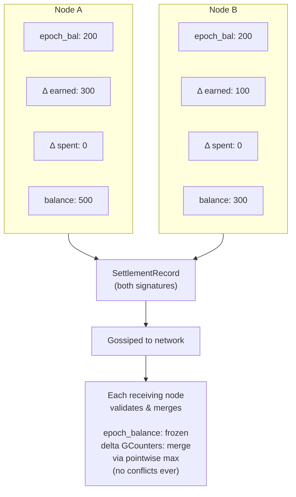

# CRDT Ledger

The global balance sheet in Mehr is a CRDT-based distributed ledger. Not a blockchain. No consensus protocol. No mining. CRDTs (Conflict-free Replicated Data Types) provide automatic, deterministic convergence without coordination — exactly what a partition-tolerant network requires.

## Why Not a Blockchain?

Blockchains require global consensus: all nodes must agree on the order of transactions. This is fundamentally incompatible with Mehr's partition tolerance requirement. When a village mesh is disconnected from the wider network for days or weeks, it must still process payments internally. CRDTs make this possible.

## Account State



```
AccountState {
    node_id: NodeID,
    epoch_number: u64,            // which epoch this state is relative to
    epoch_balance: u64,           // frozen balance at last epoch compaction
    delta_earned: GCounter,       // post-epoch earnings (per-node entries, merge = pointwise max)
    delta_spent: GCounter,        // post-epoch spending (same structure)
    // Balance = epoch_balance + value(delta_earned) - value(delta_spent)
    settlements: GSet<SettlementHash>,  // dedup set (post-epoch only)
}
```

:::info[Specification]
Balance is always derived: `epoch_balance + value(delta_earned) - value(delta_spent)`. GCounters use per-node entries with pointwise-max merge — no conflicts possible, regardless of message ordering.
:::

### How GCounters Work

A GCounter (grow-only counter) is a CRDT that can only increase. Each node maintains its own entry, and merging takes the pointwise maximum:

- Node A says "Node X has earned 100" and Node B says "Node X has earned 150"
- Merge result: "Node X has earned 150" (the higher value wins)
- This works regardless of the order updates arrive

### Why Separate epoch_balance from Deltas?

The `epoch_balance` is a frozen scalar from the authoritative epoch snapshot. The `delta_earned` and `delta_spent` GCounters track only post-epoch activity using per-node entries. This separation is critical for partition safety — see [GCounter Rebase](./epoch-compaction#gcounter-rebase) for the full analysis.

Balance is always derived: `balance = epoch_balance + value(delta_earned) - value(delta_spent)`. It is never stored directly.

## Settlement Flow

```
SettlementRecord {
    channel_id: [u8; 16],
    party_a: [u8; 16],
    party_b: [u8; 16],
    amount_a_to_b: i64,           // net transfer (negative = B pays A)
    final_sequence: u64,          // channel state sequence at settlement
    sig_a: Ed25519Signature,
    sig_b: Ed25519Signature,
}
// settlement_hash = Blake3(channel_id || party_a || party_b || amount || sequence)
// Signatures are over the settlement_hash (sign-then-hash, not hash-then-sign)

Settlement flow:
1. Alice and Bob settle their payment channel (SettlementRecord signed by both)
2. SettlementRecord is gossiped to the network
3. Each receiving node validates:
   - Both signatures verify against the settlement_hash
   - settlement_hash is not already in the GSet (dedup)
   - Neither party's derived balance goes negative after applying
   - If any check fails: silently drop (do not gossip)
4. If valid and new:
   - Increment party_a's delta_spent / party_b's delta_earned (or vice versa)
   - Add settlement_hash to GSet
   - Gossip forward to neighbors
5. Convergence: O(log N) gossip rounds
```

Settlement validation is performed by **every node** that receives the record. This is cheap (two Ed25519 signature verifications + one Blake3 hash + one GSet lookup) and ensures no node relies on a single validator. Invalid settlements are dropped silently — no penalty, no gossip.

### Gossip Bandwidth

With [stochastic relay rewards](payment-channels), settlements happen far less frequently than under per-packet payment — channel updates only trigger on lottery wins. This dramatically reduces the volume of settlement records the CRDT ledger must gossip.

- Baseline gossip: proportional to settlement frequency (~100-200 bytes per settlement)
- On constrained links (< 10 kbps): batching interval increases, reducing overhead further
- Fits within **Tier 2 (economic)** of the [gossip bandwidth budget](/docs/L1-network/network-protocol#bandwidth-budget)

## Double-Spend Prevention

Double-spend prevention is **probabilistic, not perfect**. Perfect prevention requires global consensus, which contradicts partition tolerance. Mehr mitigates double-spending through multiple layers:

:::tip[Key Insight]
Perfect double-spend prevention requires global consensus — incompatible with partition tolerance. Mehr's layered probabilistic defense makes cheating economically irrational: the cost of losing your identity and reputation exceeds any single double-spend gain.
:::

1. **Channel deposits**: Both parties must have visible balance to open a channel
2. **Credit limits**: Based on locally-known balance
3. **Reputation staking**: Long-lived nodes get higher credit limits
4. **Fraud detection**: Overdrafts are flagged network-wide; the offending node is blacklisted
5. **Economic disincentive**: For micropayments, blacklisting makes cheating unprofitable — the cost of losing your identity and accumulated reputation exceeds any single double-spend gain

## Partition Minting and Supply Convergence

When the network is partitioned, each partition independently runs the emission schedule and mints MHR proportional to local service work. Emission is **scaled by the partition's active set size** (`scaled_emission = emission × min(active_set_size, 100) / 100`), and a **2% service burn** on every funded-channel payment creates a deflationary counterforce. On merge, the winning epoch's `epoch_balance` snapshot is adopted and the losing partition's settlements are recovered via settlement proofs (see [Partition-Safe Merge Rules](./epoch-compaction#partition-safe-merge-rules)). Individual balance correctness is preserved — no one loses earned MHR.

```
Example (with active-set scaling):
  Epoch 5 emission schedule: 1000 MHR total, reference_size = 100
  Partition A (60 nodes): scaled_emission = 600 MHR, mints up to 600 MHR
  Partition B (40 nodes): scaled_emission = 400 MHR, mints up to 400 MHR
  On merge: total minted in epoch 5 = up to 1000 MHR (no overminting!)

  Compare without scaling:
  Partition A: mints up to 1000 MHR
  Partition B: mints up to 1000 MHR
  On merge: total = up to 2000 MHR (2x overminting)
```

Active-set scaling eliminates overminting when the partition sizes sum to the reference size or less. When the total active set exceeds the reference size, some overminting can still occur (each large partition mints at full emission), but this is bounded and further reduced by the 2% service burn within each partition.

The remaining overminting bounds:

1. **Proportional to scale factors**: Two partitions with N₁ + N₂ ≤ reference_size produce no overminting at all. Larger networks may produce up to Kx (K = partition count), but this is offset by burns.
2. **Reduced by service burn**: 2% of economic activity is permanently destroyed each epoch, creating a deflationary counterforce that partially offsets any overminting.
3. **Self-correcting over time**: The emission schedule decays geometrically. Partition supply shocks become negligible as emission decreases.
4. **Offset by lost keys**: The estimated 1-2% annual key loss rate further reduces effective supply.

The protocol does not attempt to "claw back" overminted supply. The cost of the mechanism (requiring consensus) exceeds the cost of the problem (minor temporary supply inflation during rare partitions).

## Service Compensation Tracking

Minting rewards are computed during epoch finalization. All service types — relay, storage, and compute — contribute to a unified minting pool. Emission is scaled by the active set size (`min(active_set_size, 100) / 100`). A 2% service burn is applied to every funded-channel payment before crediting the provider. The revenue cap uses **net income** (income minus spending per provider) to prevent [cycling attacks](./token-security#attack-channel-cycling), while distribution uses gross income to reward all service provision fairly. See [All-Service Minting](./mhr-token#all-service-minting).

For relay specifically, VRF lottery win proofs are accumulated as service proofs:

```
ServiceDebitSummary {
    provider_id: NodeID,
    relay_income: u64,                  // total relay payments received this epoch (μMHR, post-burn)
    storage_income: u64,                // total storage payments received this epoch (μMHR, post-burn)
    compute_income: u64,                // total compute payments received this epoch (μMHR, post-burn)
    total_spending: u64,                // total payments sent across all channels (μMHR)
    burn_total: u64,                    // total μMHR burned this epoch (2% of all funded-channel payments)
    relay_sample_proofs: Vec<VRFProof>, // subset of relay VRF proofs (up to 10) for spot-checking
    income_hash: Blake3Hash,            // Blake3 of all income/spending proofs (verifiable if challenged)
}

Derived fields:
  gross_income = relay_income + storage_income + compute_income
  net_income   = max(0, gross_income - total_spending)
  // Note: income fields are post-burn (provider receives 98% of channel payment)
  // burn_total tracks the 2% that was permanently destroyed
```

The epoch proposer aggregates debit summaries from gossip and includes totals in the epoch snapshot. The revenue cap is `epoch_minting = min(scaled_emission, 0.5 × Σ net_income)`, where `scaled_emission = emission × min(active_set_size, 100) / 100`. This prevents cycling (round-trip payments produce net income = 0) and limits small-partition minting. The `epoch_burn_total` in the Epoch struct tracks total burns for the epoch. Distribution uses gross income: each provider's mint share is `epoch_minting × (provider_gross_income / Σ all_gross_income)`. Full proof sets are not gossiped (too large) — only summaries with spot-check samples. Any node can challenge a provider's income/spending/burn claims during the 4-epoch grace period by requesting the full proof set. Fraudulent claims result in the provider's minting share being redistributed and the provider's reputation being penalized.

<!-- faq-start -->

## Frequently Asked Questions

<details className="faq-item">
<summary>Why use a CRDT ledger instead of a blockchain?</summary>

Blockchains require global consensus — all nodes must agree on transaction order. This is fundamentally incompatible with partition tolerance. When a village mesh is disconnected for days or weeks, it must still process payments internally. CRDTs (Conflict-free Replicated Data Types) provide automatic, deterministic convergence without coordination. Two partitions operating independently will produce identical merged state regardless of the order updates arrive.

</details>

<details className="faq-item">
<summary>How does the CRDT ledger prevent double-spending?</summary>

Double-spend prevention is probabilistic, not perfect — perfect prevention requires global consensus, which contradicts partition tolerance. Mehr uses layered defenses: channel deposits require visible balance, credit limits are based on locally-known balance, reputation staking gives long-lived nodes higher credit limits, and overdrafts are flagged network-wide with the offending node blacklisted. For micropayments, the cost of losing your identity and accumulated reputation exceeds any single double-spend gain.

</details>

<details className="faq-item">
<summary>What happens to account balances when two network partitions reconnect?</summary>

The CRDT merge handles this automatically. If both partitions share the same epoch number, GCounters merge via pointwise maximum and settlement GSets take the union. If epoch numbers differ, the higher epoch wins and the lower partition's settlements are recovered via settlement proofs during a verification window. Individual balance correctness is preserved — no one loses earned MHR. Active-set-scaled emission and the 2% service burn limit any supply overshoot.

</details>

<details className="faq-item">
<summary>How does settlement validation work without a central authority?</summary>

Every node that receives a SettlementRecord validates it independently: both Ed25519 signatures are verified against the settlement hash, the settlement hash is checked for uniqueness in the GSet, and derived balances are confirmed non-negative after applying the settlement. Invalid settlements are silently dropped. This distributed validation is cheap (two signature verifications + one hash + one lookup) and ensures no single validator has authority.

</details>

<!-- faq-end -->
