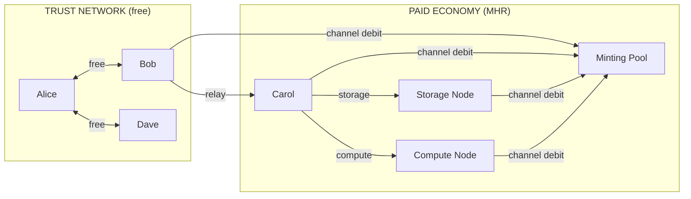
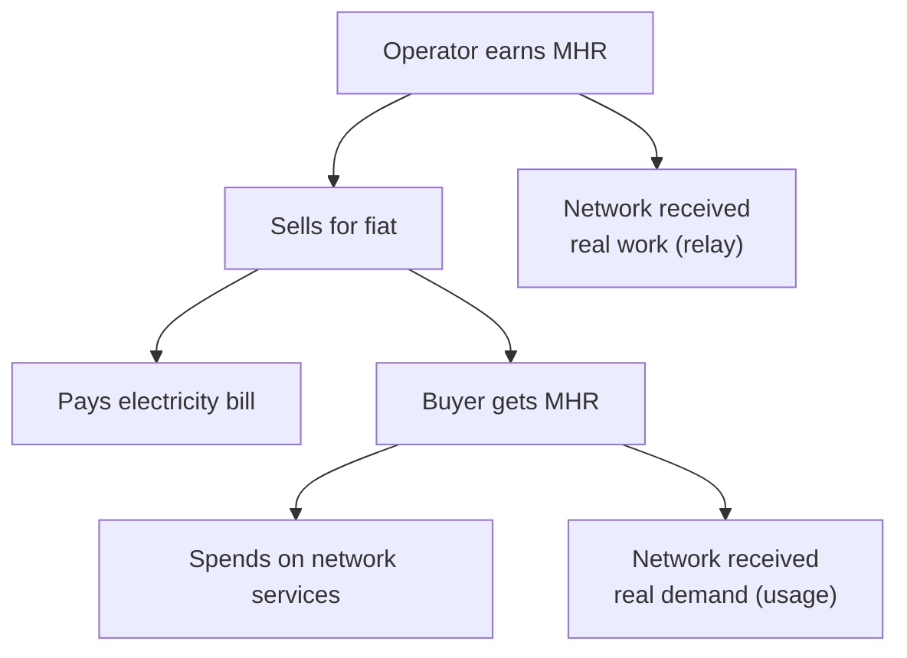
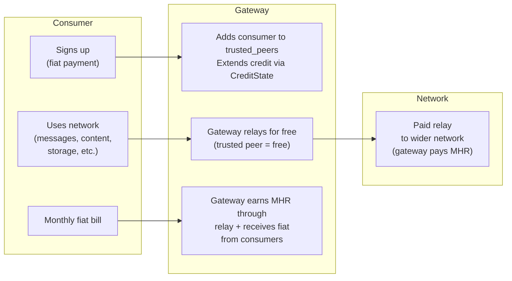

# Token Economics

## Economic Architecture

Mehr has a simple economic model: **free between friends, paid between strangers.**

:::tip[Key Insight]
The economic layer activates only at trust boundaries. A local mesh where everyone trusts each other has **zero economic overhead** — no tokens, no channels, no settlements needed.
:::



### Free Tier (Trust-Based)

- Traffic between [trusted peers](trust-neighborhoods) is **always free**
- No tokens, no channels, no settlements needed
- A local mesh where everyone trusts each other has **zero economic overhead**

### Paid Tier (MHR)

- Services crossing trust boundaries earn through [bilateral payment channels](payment-channels)
- Relay uses [stochastic lottery](payment-channels) for bandwidth efficiency; storage and compute use direct channel debits
- All channel debits contribute to the minting pool (proportional, revenue-capped)
- Settled via [CRDT ledger](crdt-ledger)

## Genesis and Bootstrapping

The bootstrapping problem — needing MHR to use services, but needing to provide services to earn MHR — is solved by separating free-tier operation from the paid economy:

### Free-Tier Operation (No MHR Required)

- **Trusted peer communication is always free** — no tokens needed
- **A local mesh works with zero tokens in circulation**
- The protocol is fully functional without any MHR — just limited to your trust network

### Demand-Backed Proof-of-Service Mining (MHR Genesis)

All services — relay, storage, and compute — earn minting rewards proportional to their channel debits. The **funding source** depends on the economic context:

1. **Minting (subsidy, demand-backed)**: Each epoch, the emission schedule determines the minting ceiling. Actual minting is distributed proportionally to all service providers based on their channel debits during that epoch — but only debits from **funded payment channels** are minting-eligible. Free-tier trusted traffic does not earn minting rewards. This demand-backed requirement ensures minting reflects real economic activity, not fabricated traffic.

2. **Channel debit (market)**: Service providers earn directly from clients through [payment channels](payment-channels). Relay uses a [stochastic lottery](payment-channels) for bandwidth efficiency; storage and compute use direct per-epoch or per-job channel debits. This becomes the dominant income source as MHR enters circulation.

Both mechanisms coexist. As the economy matures, channel-funded service payments naturally replace minting as the primary income source, while the decaying emission schedule ensures the transition is smooth.

```
Service provider compensation per epoch:

  Epoch mint pool: max(10^12 >> (epoch / 100_000), tail_floor)
    → new supply created (not transferred from a pool)
    → halves every 100,000 epochs; floors at 0.1% annual inflation

  Active-set-scaled emission:
    scaled_emission = epoch_mint_pool × min(active_set_size, 100) / 100
    → 3-node partition: 3% of full emission
    → 100+ nodes: full emission

  Service burn (2%):
    Every funded-channel payment burns 2% before crediting the provider.
    Provider receives 98% of the channel payment.
    Burned amount is permanently destroyed (removed from supply).

  Per-provider net income (post-burn):
    P_income  = relay + storage + compute payments received (after burn)
    P_spending = total payments sent across all channels
    P_net     = max(0, P_income - P_spending)
    → only funded-channel activity counts (free-tier excluded)

  Revenue-capped minting (net-income based):
    minting_eligible = Σ P_net for all providers P
    epoch_minting = min(scaled_emission, 0.5 × minting_eligible)

  Provider P's mint share: epoch_minting × (P_income / Σ all_income)
    → distribution uses gross income (rewards all service provision)
    → a storage node earning 10% of total income gets 10% of minting

  Channel revenue: direct payments from clients (separate from minting)
    → relay: VRF lottery wins debited from sender channels (98% after burn)
    → storage: per-epoch debits from storage agreements (98% after burn)
    → compute: per-job debits from compute agreements (98% after burn)

  Total provider income = mint share + channel revenue
```

### Genesis Service Gateway

The bootstrapping problem is solved by a **Genesis Service Gateway** — a known, trusted operator that provides real services for fiat and bootstraps the MHR economy with genuine demand:

:::caution[Trade-off]
The genesis gateway centralizes initial MHR distribution — a deliberate bootstrapping dependency. Genesis attestation sunsets at epoch 100,000 (first halving, ~1.9 years), after which the economy is fully decentralized.
:::

1. **Transparent allocation**: The genesis gateway operator receives a disclosed MHR allocation. No hidden allocation, no ICO — the amount is visible in the ledger from epoch 0.
2. **Competitive fiat pricing**: The gateway offers relay, storage, and compute at market-competitive fiat prices (see [Initial Pricing](#initial-pricing) below).
3. **Funded channels**: Consumer fiat payments are converted to MHR credit extensions, creating funded payment channels. This generates the first real service demand on the network (relay, storage, compute).
4. **Demand-backed minting**: All funded-channel activity — relay traffic, storage agreements, compute jobs — earns minting rewards proportional to channel debits, backed by actual economic activity.
5. **MHR circulation**: Minted MHR enters circulation — all service providers can spend it on other services.
6. **Decentralization**: As more operators join and offer competing services, the genesis gateway becomes one of many providers. The economy transitions from gateway-bootstrapped to fully market-driven.

### Bootstrap Sequence

1. Genesis gateway receives transparent MHR allocation, begins offering fiat-priced services (relay, storage, compute)
2. Genesis nodes begin signing [GenesisAttestations](./mhr-token#genesis-anchored-minting) for connected peers — minting eligibility requires attestation during bootstrap
3. Nodes form local meshes (free between trusted peers, no tokens)
4. Consumers pay fiat to genesis gateway → funded channels created for all service types
5. Funded-channel activity triggers demand-backed minting: relay VRF lottery wins + storage/compute direct debits. 2% of each payment is [burned](./mhr-token#service-burn).
6. All service providers (relay, storage, compute) with valid genesis attestations earn minting proportional to their channel debits
7. Providers open payment channels and begin spending MHR on other services
8. More operators join, offer competing services across all types, prices fall toward marginal cost
9. At epoch 100,000 (first halving): genesis attestation sunsets — [trust-gated active set](./token-security#trust-gated-active-set) + [merge-time trust audit](./token-security#merge-time-trust-audit) provide post-bootstrap partition defense
10. Market pricing emerges from supply/demand

### Trust-Based Credit

Trusted peers can [vouch for each other](./trust-neighborhoods#trust-based-credit) by extending transitive credit. Each node configures the credit line it extends to its direct trusted peers (e.g., "I'll cover up to 1000 μMHR for Alice"). A friend-of-a-friend gets a configurable ratio (default 10%) of that direct limit — backed by the vouching peer's MHR balance. If a credited node defaults, the voucher absorbs the debt. This provides an on-ramp for new users without needing to earn MHR first.

**Free direct communication works immediately** with no tokens at all. MHR is only needed when your packets traverse untrusted infrastructure.

### Revenue-Capped Minting

The emission schedule sets a ceiling, but actual minting per epoch is capped at a fraction of **net economic activity** across all service types. Emission is further scaled by the partition's active set size, and a 2% [service burn](./mhr-token#service-burn) on every funded-channel payment creates a deflationary counterforce:

```
Revenue-capped minting formula:

  For each provider P this epoch:
    P_income  = total payments received for services (relay + storage + compute)
              (post-burn: provider receives 98% of channel payment)
    P_spending = total payments sent across all channels
    P_net     = max(0, P_income - P_spending)
      → only funded-channel activity counts (free-tier excluded)

  minting_eligible = Σ P_net for all providers P

  Active-set-scaled emission:
    scaled_emission = emission_schedule(epoch) × min(active_set_size, 100) / 100

  effective_minting(epoch) = min(
      scaled_emission,                          // active-set-scaled halving ceiling
      minting_cap × minting_eligible            // 0.5 × net economic activity
  )

  minting_cap = 0.5  (minting can never exceed 50% of net service activity)

  Service burn: 2% of every funded-channel payment permanently destroyed.
  This reduces circulating supply and imposes friction on isolated partition
  supply growth (~4% reduction in attacker growth rate per epoch).
```

**Why net income, not gross debits:** Gross debits can be inflated by cycling — two colluding nodes pass the same MHR back and forth, each pass creating new "debits." Net income eliminates this: a round-trip produces income = spending → net = 0 → zero minting. See [Channel Cycling](./token-security#attack-channel-cycling) in the Security Analysis for the full defense.

**Why self-dealing is unprofitable — the complete analysis:**

Self-dealing means the attacker controls both the client and the server. The channel debit between them is an internal transfer (net cost 0). The attacker's only gain is minting. The defense has two parts:

1. **Non-deterministic assignment** forces the attacker to pay honest nodes for most of their fake demand
2. **Net-income revenue cap** limits the minting the attacker can capture

```
Self-dealing attack analysis (with non-deterministic assignment):

  Setup:
    Attacker controls X fraction of network economic capacity
    Attacker generates Y MHR in fake service demand

  Non-deterministic assignment:
    Relay: mesh routing sends packets through honest relays (topology-determined)
    Storage: DHT assigns honest nodes for (1-X) fraction of requests
    Compute: DHT assigns honest nodes for (1-X) fraction of requests

  Cost to attacker:
    (1-X) × Y → paid to honest nodes (REAL, irrecoverable cost)
    X × Y → paid to own nodes (internal transfer, net 0)

  Attacker's net income (for minting cap):
    Honest providers' net: (1-X) × Y (they received, didn't spend to attacker)
    Attacker providers' net: 0 (received X×Y from own nodes, internal transfer)
    But attacker also spent (1-X)Y to honest nodes, so:
      Attacker's total spending: Y
      Attacker's total income: X × Y (from own fake demand)
      Attacker's net: max(0, XY - Y) = 0 (since X < 1)

  Revenue for attacker:
    Minting share = (attacker_income / total_income) × epoch_minting
    = (XY / Y) × min(E, 0.5 × minting_eligible)
    = X × min(E, 0.5 × (1-X)Y)    // only honest providers have positive net

  Attacker's profit (assuming 0.5(1-X)Y < E):
    -(1-X)Y + X × 0.5(1-X)Y = (1-X)Y × (0.5X - 1)

  This is ALWAYS negative for X < 1. The net-income cap makes the
  defense STRONGER than the gross-debit analysis (which allowed profit
  at X > 67%). With net income, self-dealing in a connected network is
  NEVER profitable — the attacker's own net income is always 0.
```

**Important**: The "never profitable" result applies to the **connected** network case where non-deterministic assignment routes most demand to honest nodes. In an [isolated partition](./token-security#attack-isolated-partition) where the attacker controls all nodes, non-deterministic assignment is nullified — but the [trust-gated active set](./token-security#trust-gated-active-set) + [merge-time trust audit](./token-security#merge-time-trust-audit) (rejects untrusted minting on reconnection), active-set scaling, and service burn bound supply growth.

**What happens to "unminted" emission:**

- During early bootstrap, net service activity is small, so actual minting is well below the emission schedule
- The difference is NOT minted — it is simply not created (supply grows slower)
- As traffic grows, actual minting approaches the emission schedule ceiling
- In mature economy, the cap is rarely binding (net service activity far exceeds the emission schedule)
- The 2% service burn continuously removes supply, creating a tighter equilibrium than emission alone would suggest

This changes the supply curve: instead of predictable emission, supply growth tracks actual economic activity minus burns. Early supply grows slowly (good — prevents speculation without real usage), mature supply follows the emission schedule minus the burn rate. The steady-state effective supply is where `minting ≈ burns + lost_keys`.

### Initial Pricing

The genesis gateway prices services at or slightly above market competitors. This is deliberate — the goal is fair pricing with operational margin, not undercutting.

```
Initial pricing strategy:

  Principle: Price at market rate with overhead, NOT undercutting.

  The genesis gateway publishes maximum prices (ceilings). These serve as a
  ceiling that competitors can undercut as they join. The gateway can initially
  run on AWS/cloud infrastructure — it needs margin to cover that cost.

  Service             Market Benchmark              Genesis Ceiling
  ────────────────────────────────────────────────────────────────────
  Storage             AWS S3: $0.023/GB/mo          ~$0.02/GB/mo
  Internet gateway    ISP: $30-100/mo               ~$30/mo
  Compute             AWS Lambda: ~$0.20/1M req     At market
  Relay (per-packet)  Bundled in gateway price      ~5 μMHR

  Rationale:
  - Storage: At market, not below — no reason to subsidize
  - Gateway: Match ISP rate; value is privacy/resilience, not cheapness
  - Compute: No reason to undercut cloud pricing initially
  - Relay: Derived from gateway fiat price ÷ expected packet volume
```

**How prices fall over time:**

```
Price evolution:

  Genesis:     Gateway sets ceiling (market rate + overhead)
  Growth:      New providers enter, set prices ≤ ceiling to attract users
  Maturity:    Competition drives prices toward marginal cost
               (Mehr's marginal cost is low — spare bandwidth/disk on existing devices)
```

The genesis gateway doesn't need to be cheapest. It needs to be **trusted, available, and fairly priced**. Price competition comes from the market, not from subsidized undercutting. The gateway's fiat-to-MHR conversion rate becomes the initial exchange rate for MHR.

### Genesis Gateway Discovery

New nodes discover the genesis gateway through DNS:

```
Genesis gateway discovery:

  1. Well-known DNS domain resolves to genesis gateway IP(s)
  2. Hardcoded fallback list in daemon binary (in case DNS is unavailable)
  3. DNS is for initial contact only — once connected, gossip takes over
  4. Multiple DNS records for redundancy (A/AAAA records)

  Note: DNS is used ONLY for initial genesis gateway discovery,
  not for ongoing protocol operation. See roadmap Milestone 1.2.
```

This ties into the existing bootstrap mechanism (Milestone 1.2 in the [roadmap](../development/roadmap#milestone-12-bootstrap--peer-discovery)), elevating DNS from "optional" to the primary method for locating genesis gateways.

## Why One Global Currency

MHR is a single global unit of account, not a per-community token. This is a deliberate design choice.

### The Alternative: Per-Community Currencies

If each isolated community minted its own token, connecting two communities would require a currency exchange — someone to set an exchange rate, provide liquidity, and settle trades. On a mesh network of 50–500 nodes, there is not enough trading volume to sustain a functioning exchange market. The complexity (order books, matching, dispute resolution) vastly exceeds what constrained devices can support.

### How One Currency Works Across Partitions

When two communities operate in isolation:

1. **Internally**: Both communities communicate free between trusted peers — no MHR needed
2. **Independently**: Each community mints MHR via proof-of-service, proportional to actual service activity (relay, storage, compute). The [CRDT ledger](crdt-ledger) tracks balances independently on each side
3. **On reconnection**: The CRDT ledger merges automatically (CRDTs guarantee convergence). Both communities' MHR is valid because it was earned through real work, not printed arbitrarily

MHR derives its value from **labor** (relaying, storage, compute), not from community membership. One hour of relaying in Community A is roughly equivalent to one hour in Community B. Different hardware costs are reflected in **market pricing** — nodes set their own per-byte charges — not in separate currencies.

### Fiat Exchange

MHR has no official fiat exchange rate. The protocol includes no exchange mechanism, no order book, no trading pair. But MHR buys real services — bandwidth, storage, compute, content access — so it has real value. People will trade it for fiat currency, whether through informal markets, OTC trades, or external exchanges.

This is expected and not inherently harmful.

**Why exchange doesn't break the system:**



1. **Purchased MHR is legitimate.** If someone buys MHR with fiat instead of earning it through relay, the seller earned it through real work. The network benefited from that work. The buyer funds network infrastructure indirectly — identical to buying bus tokens.

2. **MHR derives value from utility.** Its value comes from the services it buys, not from artificial scarcity. If the service economy is healthy, MHR has value regardless of exchange markets.

3. **Hoarding is self-correcting.** Someone who buys MHR and holds it is funding operators (paying fiat for earned MHR) while removing tokens from circulation. Remaining MHR becomes more valuable per service unit, incentivizing earning through service provision. Tail emission (0.1% annual) mildly dilutes idle holdings.

**What could go wrong:**

| Risk | Mitigation |
|------|-----------|
| **Deflationary spiral** (hoarding prevents spending) | Tail emission; free tier ensures basic functionality regardless |
| **Speculation** (price detaches from utility) | Utility value creates a floor; MHR has no use outside the network |
| **Regulatory attention** | Protocol doesn't facilitate exchange; users must understand their jurisdiction |

**Internal price discovery** still works as designed — service prices float based on supply and demand:

```
Abundant relay capacity + low demand → relay prices drop (in μMHR)
Scarce relay capacity + high demand  → relay prices rise (in μMHR)
```

Users don't need to know what 1 μMHR is worth in fiat. They need to know: "Can I afford this service?" — and the answer is usually yes, because they earn MHR by providing services. The economy is circular even if some participants enter through fiat exchange.

### Gateway Operators (Fiat Onramp)

The [Genesis Service Gateway](#genesis-service-gateway) is the first instance of this pattern. The same mechanics — trust extension, credit lines, fiat billing — apply to all subsequent gateway operators. As more gateways join, the economy decentralizes and pricing becomes competitive.

Not everyone wants to run a relay. Pure consumers — people who just want to use the network — should be able to pay with fiat and never think about MHR. **Gateway operators** make this possible.

A gateway operator is a trusted intermediary who bridges fiat payment and MHR economics. The consumer interacts with the gateway; the gateway interacts with the network. This uses existing protocol mechanics — no new wire formats or consensus changes.



**How it works:**

1. **Sign-up**: Consumer pays the gateway in fiat (monthly subscription, prepaid, pay-as-you-go — the gateway chooses its business model)
2. **Trust extension**: Gateway adds the consumer to `trusted_peers` and extends a credit line via [CreditState](./trust-neighborhoods#trust-based-credit). The consumer's traffic through the gateway is free (trusted peer relay)
3. **Network access**: The consumer uses the network normally. Their traffic reaches the gateway for free, and the gateway pays MHR for onward relay to untrusted nodes
4. **Settlement**: The gateway earns MHR through service minting (relay, storage, compute) + charges fiat to consumers. The spread between fiat revenue and MHR costs is the gateway's margin

**The consumer never sees MHR.** From their perspective, they pay a monthly bill and use the network. Like a mobile carrier — you don't think about interconnect fees between networks.

```
Trust-based gateway mechanics:

  Gateway's TrustConfig:
    trusted_peers: { consumer_1, consumer_2, ... }
    cost_overrides: { consumer_1: 0, consumer_2: 0 }  // free for consumers

  Gateway's CreditState per consumer:
    credit_limit: proportional to fiat subscription tier
    rate_limit: prevents abuse (e.g., 10 MB/epoch for basic tier)

  Consumer's view:
    - No MHR wallet needed
    - No payment channels
    - No economic complexity
    - Just "install app, sign up, use"
```

**Why this works without protocol changes:**

| Mechanism | Already Exists |
|-----------|---------------|
| Free relay for trusted peers | [Trust Neighborhoods](./trust-neighborhoods#free-local-communication) |
| Credit extension | [CreditState](./trust-neighborhoods#trust-based-credit) |
| Rate limiting | Per-epoch credit limits in CreditState |
| Abuse prevention | Gateway revokes trust on non-payment (fiat side) |

**Gateway business models:**

| Model | Description | Consumer Experience |
|-------|-------------|-------------------|
| **Subscription** | Monthly fiat fee for a usage tier | Like a phone plan |
| **Prepaid** | Buy credit in advance, use until depleted | Like a prepaid SIM |
| **Pay-as-you-go** | Fiat bill based on actual usage | Like a metered utility |
| **Freemium** | Free tier (rate-limited) + paid upgrade | Like free WiFi with premium option |

**Gateway incentives:**

- Gateways earn minting rewards across all services they provide (relay, storage, compute)
- Gateways earn fiat from consumer subscriptions
- Gateways with many consumers generate high channel debit volume = proportionally more minting
- Competition between gateways drives prices toward cost (standard market dynamics)

## Security Considerations

<details className="security-item">
<summary>Gateway Failure or Censorship</summary>

**Vulnerability:** A gateway operator goes offline or begins censoring traffic, stranding consumers who depend on it for network access.

**Mitigation:** Consumers can switch gateways at any time — identity is self-certifying and not tied to any gateway. Multiple gateways compete in any area with demand. No lock-in exists; the barrier to switching is zero.

</details>

<details className="security-item">
<summary>Gateway Overcharging</summary>

**Vulnerability:** A gateway operator charges excessive fiat fees for network access, exploiting consumers who don't understand the underlying economics.

**Mitigation:** Market competition between gateways drives prices toward cost. Consumers can compare pricing across providers. Low switching cost means overcharging gateways lose customers.

</details>

<details className="security-item">
<summary>Consumer Abuse of Gateway Credit</summary>

**Vulnerability:** A consumer signs up with a gateway, consumes network resources on credit, then defaults on fiat payment.

**Mitigation:** The gateway revokes trust and cuts off credit immediately. Fiat non-payment is handled off-protocol through standard billing mechanisms. Rate limiting via per-epoch credit caps in CreditState prevents abuse from accumulating before detection.

</details>

## Economic Design Goals

- **Utility-first**: MHR is designed for purchasing services. Fiat exchange may emerge but the protocol's health doesn't depend on it, and the internal economy functions as a closed loop for participants who never touch fiat.
- **Transparent genesis**: Disclosed genesis allocation to the gateway operator, visible in the ledger from epoch 0. No ICO, no hidden allocation, no insider advantage.
- **Demand-backed minting**: Funded payment channels required for minting eligibility across all service types. Non-deterministic assignment + net-income revenue cap guarantee self-dealing is never profitable in connected networks. Isolated partition damage is defended by [trust-gated active set](./token-security#trust-gated-active-set) + [merge-time trust audit](./token-security#merge-time-trust-audit) + active-set scaling + 2% service burn. See [Security Analysis](./token-security#security-analysis).
- **Spend-incentivized**: Tail emission (0.1% annual) mildly dilutes idle holdings. Lost keys (~1–2% annually) permanently remove supply. MHR earns nothing by sitting still — only by being spent on services or lent via trust-based credit.
- **Partition-safe**: The economic layer works correctly during network partitions and converges when they heal
- **Minimal overhead**: [Stochastic rewards](payment-channels) reduce economic bandwidth overhead by ~10x compared to per-packet payment
- **Communities first**: Trusted peer communication is free. The economic layer only activates at trust boundaries.

<!-- faq-start -->

## Frequently Asked Questions

<details className="faq-item">
<summary>Do I need MHR tokens to use the Mehr network?</summary>

No — communication between trusted peers is always free with zero economic overhead. MHR is only needed when your traffic crosses trust boundaries (traverses nodes outside your trust network). A local community mesh where everyone trusts each other operates with no tokens in circulation at all. Gateway operators also offer fiat payment options so consumers never need to interact with MHR directly.

</details>

<details className="faq-item">
<summary>How does the genesis gateway bootstrap the economy without an ICO?</summary>

The genesis gateway operator receives a transparent, disclosed MHR allocation visible in the ledger from epoch 0. The gateway offers real services (relay, storage, compute) at market-competitive fiat prices. Consumer fiat payments create funded payment channels, generating the first real service demand. This demand-backed activity triggers minting for all service providers, putting MHR into circulation backed by actual economic work — not speculation.

</details>

<details className="faq-item">
<summary>What stops gateway operators from overcharging consumers?</summary>

Market competition. The genesis gateway publishes maximum prices (ceilings) that subsequent operators can undercut. Anyone can become a gateway operator using standard trust and credit mechanics — there is no special privilege. As more gateways join, prices fall toward marginal cost. Consumers face low switching costs since identity is self-certifying and not locked to any gateway.

</details>

<details className="faq-item">
<summary>Why use a single global currency instead of per-community tokens?</summary>

Per-community tokens would require currency exchanges between communities — order books, matching engines, and liquidity providers. A mesh of 50–500 nodes lacks the trading volume to sustain functioning exchange markets. MHR derives value from labor (relaying, storage, compute), not community membership. When two isolated communities reconnect, their CRDT ledgers merge automatically with no exchange needed, because both earned MHR through real work.

</details>

<details className="faq-item">
<summary>Can someone buy MHR with fiat and use it on the network?</summary>

Yes, and this is expected. Purchased MHR is legitimate because the seller earned it through real service provision — the network benefited from that work. The buyer funds infrastructure indirectly (like buying bus tokens). MHR derives value from the services it buys, not artificial scarcity. Hoarding is self-correcting: held tokens are removed from circulation, making remaining MHR more valuable and incentivizing service provision. Tail emission of 0.1% annually mildly dilutes idle holdings.

</details>

<!-- faq-end -->
