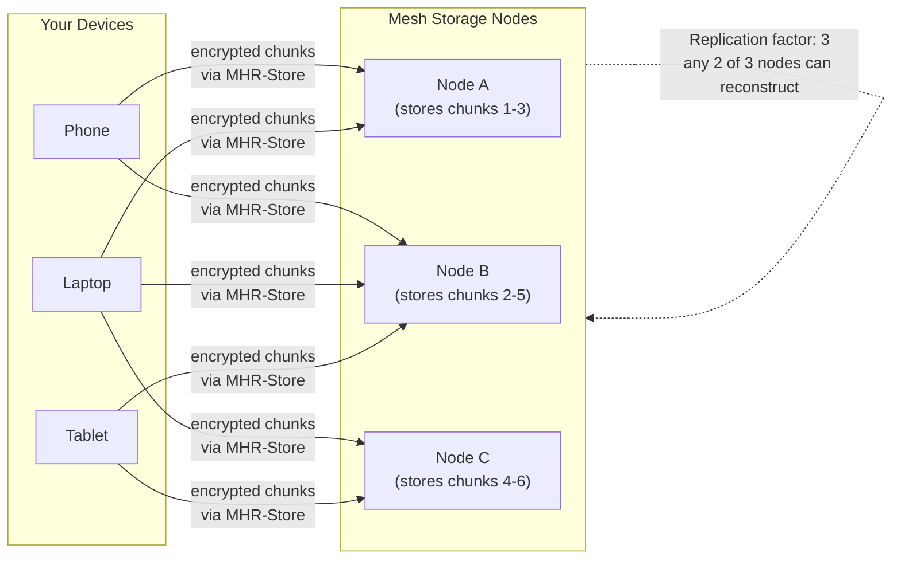
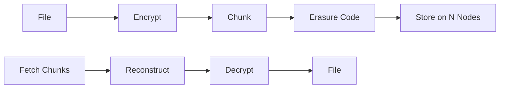

# Cloud Storage

Mehr provides **decentralized file storage** — like Dropbox or iCloud, but backed by the mesh instead of a corporate data center. Your files are encrypted client-side, replicated across multiple nodes, and accessible from any of your devices. No account with a cloud provider, no monthly subscription to a tech company, no data on someone else's server.

:::info[App Manifest]
Cloud storage is packaged as a **Full** (UI + compute) [AppManifest](/docs/L5-services/mhr-app). It composes MHR-Store for encrypted file chunks, FileManifests, and SyncManifests; MHR-Pub for cross-device sync notifications; MHR-DHT for chunk location lookups; and MHR-Name for user-friendly file and folder addressing. The state schema tracks per-device sync state as CRDT registers, and the UI bundle provides file browser, upload, and sharing interfaces.
:::

## Overview





## How It Works

Cloud storage on Mehr uses the same primitives as every other application:

1. **[MHR-Store](/docs/L5-services/mhr-store)** for persistent storage with replication
2. **[StorageAgreements](/docs/L4-marketplace/agreements)** for payment and SLA terms
3. **Client-side encryption** for privacy (storage nodes see only ciphertext)
4. **[Erasure coding](/docs/L5-services/mhr-store#chunking)** for fault tolerance

### Storing a File

```
Store flow:

  1. Client encrypts file with owner's key (ChaCha20-Poly1305)
  2. Client chunks encrypted file into 4 KB blocks
  3. Client applies Reed-Solomon erasure coding (e.g., 4+2 → any 4 of 6 chunks reconstruct)
  4. Client forms StorageAgreements with N storage nodes
     → each node stores a subset of chunks
     → replication factor chosen by user (default: 3)
  5. Client stores a FileManifest (metadata) as a mutable DataObject:
       → file name, size, chunk map, encryption nonce, replication info
  6. FileManifest is synced to all owner's devices via MHR-Pub
```

### Retrieving a File

```
Retrieve flow:

  1. Client reads FileManifest (from local cache or DHT)
  2. Client fetches chunks from nearest available storage nodes
     → parallel fetch across multiple nodes
     → only need k of n chunks (erasure coding)
  3. Client reconstructs, decrypts, presents file
```

### Syncing Between Devices

A user's devices sync through a **SyncManifest** — a mutable DataObject that lists all stored files:

```
SyncManifest {
    owner: NodeID,
    files: Vec<FileEntry>,
    sequence: u64,                      // monotonic version counter
    signature: Ed25519Sig,
}

FileEntry {
    file_id: Blake3Hash,                // stable ID for this file
    name: String,                       // human-readable filename
    size: u64,                          // original file size (bytes)
    manifest_hash: Blake3Hash,          // hash of the FileManifest DataObject
    modified: Timestamp,                // last modification time
    deleted: bool,                      // soft delete (tombstone)
}
```

When a device stores a new file, it updates the SyncManifest. Other devices subscribe to the SyncManifest via [MHR-Pub](/docs/L5-services/mhr-pub) and pull new files on change. Conflict resolution uses standard mutable DataObject semantics — highest sequence number wins.

## File Manifest

Each stored file has a manifest describing its chunks and encryption:

```
FileManifest {
    file_id: Blake3Hash,                // stable identifier
    owner: NodeID,
    original_name: String,
    original_size: u64,
    content_hash: Blake3Hash,           // hash of unencrypted content (for integrity)
    encryption: EncryptionInfo {
        algorithm: "ChaCha20-Poly1305",
        nonce: [u8; 12],
        key_derivation: "HKDF-SHA256",  // derived from owner's identity key + file_id
    },
    chunks: Vec<ChunkInfo>,
    erasure: ErasureInfo {
        data_chunks: u8,                // k
        parity_chunks: u8,             // m (total = k + m)
    },
    replication_factor: u8,
    storage_nodes: Vec<NodeID>,         // nodes holding chunks
    created: Timestamp,
    modified: Timestamp,
    sequence: u64,                      // for updates (file overwrite)
    signature: Ed25519Sig,
}

ChunkInfo {
    index: u16,
    hash: Blake3Hash,                   // hash of encrypted chunk
    size: u16,                          // chunk size (usually 4 KB, last may be smaller)
    storage_node: NodeID,               // which node holds this chunk
}
```

## Sharing

Files can be shared with other users by granting decryption access:

```
Sharing flow:

  1. Owner generates a file-specific decryption key
     (derived from owner's key + file_id via HKDF)
  2. Owner encrypts the file key with the recipient's public key (X25519)
  3. Owner sends the encrypted key to the recipient
     (via encrypted message or MHR-Pub)
  4. Recipient can now fetch and decrypt the file chunks
     using the shared key

Revoking:
  → Owner re-encrypts file with a new key
  → Updates FileManifest
  → Does NOT send new key to revoked user
  → Revoked user can still access old version (if cached)
    but cannot decrypt future updates
```

Sharing is **out-of-band** from the storage nodes' perspective. Storage nodes hold encrypted chunks — they don't know or care who has the decryption key.

## Earning MHR Through Storage

Sharing your device's spare storage is one of the simplest ways to earn MHR. Any node with available disk space can offer storage services:

```
Storage provider flow:

  1. Configure how much storage to offer
     (e.g., 10 GB of your 256 GB drive)
  2. Advertise storage capability via presence beacon
  3. Accept StorageAgreements from clients
  4. Store encrypted chunks, respond to retrieval requests
  5. Earn μMHR per epoch for each active agreement
  6. Pass periodic proof-of-storage challenges

No special hardware needed — any device with spare disk space qualifies.
```

**Why storage is a good starting point for earning:**

- **Zero marginal cost** — you're using disk space that would otherwise sit empty
- **Passive income** — once configured, storage agreements run automatically
- **Low barrier** — no relay infrastructure, no routing complexity, just storing bytes
- **Scales with hardware** — a Raspberry Pi with a USB drive, a NAS, or a server rack all work
- **Builds reputation** — reliable storage providers earn trust, which enables credit extension and higher-value agreements

```
Typical storage earnings:

  Device                    Offered Storage    Est. Monthly Earnings
  ─────────────────────────────────────────────────────────────────
  Raspberry Pi + 32 GB SD   10 GB              ~500-2,000 μMHR
  Old laptop + 500 GB HDD   200 GB             ~10,000-50,000 μMHR
  NAS (4 TB)                2 TB               ~100,000-500,000 μMHR
  Server rack               10+ TB             ~500,000+ μMHR

  Earnings vary with demand, competition, and reputation.
  Early network participants earn more (less competition).
```

### Storage Provider Configuration

```
StorageConfig {
    // How much space to offer
    max_storage: u64,                   // bytes (e.g., 10_000_000_000 for 10 GB)

    // Pricing
    price_per_byte_per_epoch: u64,      // μMHR (market-set, compete with other providers)

    // Policies
    min_agreement_duration: u64,        // minimum epochs for a storage agreement
    max_agreement_duration: u64,        // maximum epochs
    max_single_object_size: u64,        // largest object you'll accept (bytes)

    // Replication
    accept_replica_requests: bool,      // serve as a replication target for others' data
}
```

## Gateway-Operated Cloud Storage

The [genesis service gateway](/docs/L3-economics/token-economics#genesis-service-gateway) is the first operator to offer fiat-priced cloud storage, providing the initial market benchmark for storage pricing. Any [gateway operator](/docs/L3-economics/token-economics#gateway-operators-fiat-onramp) can offer cloud storage as a fiat-billed service — consumers upload files through the gateway's app, the gateway handles MHR storage agreements on their behalf, and the consumer pays a monthly fiat subscription.

```
Gateway cloud storage:

  Consumer → gateway app → files stored on mesh via MHR-Store
                         → consumer pays fiat monthly
                         → gateway pays MHR to storage nodes
                         → consumer never sees tokens

  Pricing examples (gateway-set, competitive):
    5 GB plan:   $2/month
    50 GB plan:  $5/month
    500 GB plan: $15/month
```

This makes Mehr cloud storage accessible to non-technical users — the same UX as any cloud storage app, but backed by decentralized mesh storage instead of a corporate data center.

## Comparison

| | Traditional Cloud | Mehr Cloud Storage |
|---|---|---|
| **Provider** | Single company (Google, Apple, Dropbox) | Multiple mesh nodes (no single provider) |
| **Encryption** | Provider holds keys (or offers client-side as premium) | Always client-side encrypted; storage nodes see only ciphertext |
| **Availability** | Provider's uptime SLA | Erasure coding + replication across independent nodes |
| **Payment** | Monthly fiat subscription | μMHR per epoch, or fiat via gateway |
| **Data location** | Provider's data centers | Distributed across mesh — you choose replication regions |
| **Censorship** | Provider can terminate your account | No single entity controls your data |
| **Earn by sharing** | Not possible | Share spare storage, earn μMHR |
| **Works offline** | No (requires internet) | Yes — local mesh nodes serve cached content |

## Security Considerations

<details className="security-item">
<summary>Corrupted Storage Chunks</summary>

**Vulnerability:** A malicious storage node returns garbage data instead of the requested chunk, causing file corruption on retrieval.

**Mitigation:** Every chunk is content-addressed — the client verifies `Blake3(chunk) == expected_hash` from the FileManifest's Merkle tree. Corrupted chunks are rejected immediately. The [Proof of Storage](/docs/L5-services/mhr-store#proof-of-storage) challenge-response protocol detects nodes that have silently lost or corrupted data, triggering re-replication to healthy nodes.

</details>

<details className="security-item">
<summary>Device Compromise and SyncManifest Tampering</summary>

**Vulnerability:** If one device in a multi-device setup is compromised, the attacker could push a malicious SyncManifest with a higher sequence number, deleting or replacing files across all synced devices.

**Mitigation:** SyncManifest updates propagate via CRDT merge rules — deletions must be explicitly tombstoned and are visible in the version history. Users can restore from previous manifest versions stored across the erasure-coded mesh. Multi-device setups should use [co-admin delegation](messaging#group-messaging) patterns for critical shared state, requiring multiple device signatures for destructive operations.

</details>

<details className="security-item">
<summary>Identity Key Compromise Exposes All Files</summary>

**Vulnerability:** All file encryption keys derive from the owner's identity key via HKDF. Compromising the identity key exposes every stored file.

**Mitigation:** Perform [key rotation](/docs/L5-services/mhr-id) immediately upon suspicion of compromise. Re-encrypt all files under the new identity key. The key rotation propagates through the trust graph, and old encrypted chunks become inaccessible once the old key is disavowed. For high-value data, use per-file random keys wrapped with the identity key — compromise then requires both the identity key and the wrapped key envelope.

</details>
