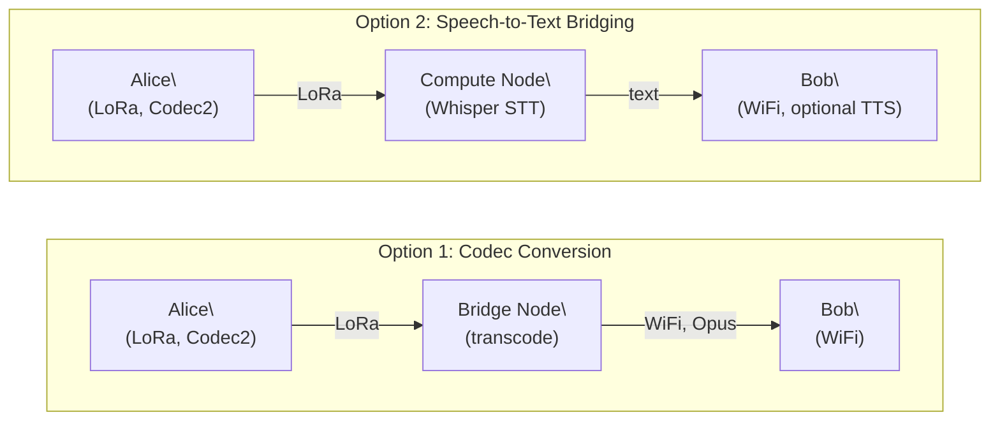

# Voice

Voice communication in Mehr ranges from push-to-talk over LoRa to full-duplex calls over WiFi, adapting to available bandwidth.

:::info[App Manifest]
Voice is packaged as a **Full** (UI + compute) [AppManifest](/docs/L5-services/mhr-app). It composes MHR-Pub for call signaling and presence, MHR-Compute for codec bridging contracts (Codec2 ↔ Opus transcoding and speech-to-text delegation), and MHR-Store for optional voicemail storage. Pub/sub topic templates handle per-call session channels, and the manifest declares `min_tier` based on codec requirements.
:::

## Codec Selection by Link Quality

| Link Type | Codec | Bitrate | Mode |
|-----------|-------|---------|------|
| LoRa (10+ kbps) | Codec2 | 700-3,200 bps | Push-to-talk |
| WiFi / Cellular | Opus | 6-510 kbps | Full-duplex |

### Codec2 on LoRa

Codec2 is an open-source voice codec designed for very low bitrates. At 700 bps, it produces intelligible speech — not high-fidelity, but functional for communication. At 3,200 bps, quality is similar to AM radio.

A 10 kbps LoRa link has enough bandwidth for Codec2 push-to-talk with room for protocol overhead.

### Opus on WiFi

On higher-bandwidth links, Opus provides near-CD-quality voice with full-duplex operation (both parties can talk simultaneously).

## Encryption

Voice streams are **end-to-end encrypted** using the standard [E2E encryption](/docs/L2-security/security#end-to-end-encryption-data-payloads) mechanism — each session generates an ephemeral X25519 keypair, and the symmetric session key is derived from a Diffie-Hellman exchange with the remote party's public key. Relay nodes carry encrypted voice packets they cannot decrypt.

## Bandwidth Bridging

When participants are on different link types, the application can use compute delegation to bridge:

This is an **application-level decision** using standard [compute delegation](/docs/L4-marketplace/agreements). The protocol has no concept of "voice" — it routes bytes. The application decides how to adapt between bandwidth tiers.

## Push-to-Talk Protocol

On half-duplex links (LoRa), push-to-talk works as:

1. Sender presses talk button
2. Audio captured, encoded with Codec2
3. Encoded frames sent as a stream of small packets
4. Receiver buffers and plays back
5. Sender releases button, receiver can now respond

The protocol handles this as ordinary data packets — there is no special voice channel.
