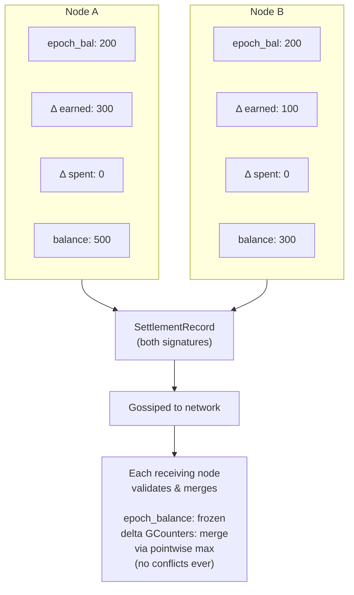

# CRDT Ledger

The global balance sheet in Mehr is a CRDT-based distributed ledger. Not a blockchain. No consensus protocol. No mining. CRDTs (Conflict-free Replicated Data Types) provide automatic, deterministic convergence without coordination — exactly what a partition-tolerant network requires.

## Why Not a Blockchain?

Blockchains require global consensus: all nodes must agree on the order of transactions. This is fundamentally incompatible with Mehr's partition tolerance requirement. When a village mesh is disconnected from the wider network for days or weeks, it must still process payments internally. CRDTs make this possible.

## Account State



```
AccountState {
    node_id: NodeID,
    epoch_number: u64,            // which epoch this state is relative to
    epoch_balance: u64,           // frozen balance at last epoch compaction
    delta_earned: GCounter,       // post-epoch earnings (per-node entries, merge = pointwise max)
    delta_spent: GCounter,        // post-epoch spending (same structure)
    // Balance = epoch_balance + value(delta_earned) - value(delta_spent)
    settlements: GSet<SettlementHash>,  // dedup set (post-epoch only)
}
```

### How GCounters Work

A GCounter (grow-only counter) is a CRDT that can only increase. Each node maintains its own entry, and merging takes the pointwise maximum:

- Node A says "Node X has earned 100" and Node B says "Node X has earned 150"
- Merge result: "Node X has earned 150" (the higher value wins)
- This works regardless of the order updates arrive

### Why Separate epoch_balance from Deltas?

The `epoch_balance` is a frozen scalar from the authoritative epoch snapshot. The `delta_earned` and `delta_spent` GCounters track only post-epoch activity using per-node entries. This separation is critical for partition safety — see [GCounter Rebase](#gcounter-rebase) for the full analysis.

Balance is always derived: `balance = epoch_balance + value(delta_earned) - value(delta_spent)`. It is never stored directly.

## Settlement Flow

```
SettlementRecord {
    channel_id: [u8; 16],
    party_a: [u8; 16],
    party_b: [u8; 16],
    amount_a_to_b: i64,           // net transfer (negative = B pays A)
    final_sequence: u64,          // channel state sequence at settlement
    sig_a: Ed25519Signature,
    sig_b: Ed25519Signature,
}
// settlement_hash = Blake3(channel_id || party_a || party_b || amount || sequence)
// Signatures are over the settlement_hash (sign-then-hash, not hash-then-sign)

Settlement flow:
1. Alice and Bob settle their payment channel (SettlementRecord signed by both)
2. SettlementRecord is gossiped to the network
3. Each receiving node validates:
   - Both signatures verify against the settlement_hash
   - settlement_hash is not already in the GSet (dedup)
   - Neither party's derived balance goes negative after applying
   - If any check fails: silently drop (do not gossip)
4. If valid and new:
   - Increment party_a's delta_spent / party_b's delta_earned (or vice versa)
   - Add settlement_hash to GSet
   - Gossip forward to neighbors
5. Convergence: O(log N) gossip rounds
```

Settlement validation is performed by **every node** that receives the record. This is cheap (two Ed25519 signature verifications + one Blake3 hash + one GSet lookup) and ensures no node relies on a single validator. Invalid settlements are dropped silently — no penalty, no gossip.

### Gossip Bandwidth

With [stochastic relay rewards](payment-channels), settlements happen far less frequently than under per-packet payment — channel updates only trigger on lottery wins. This dramatically reduces the volume of settlement records the CRDT ledger must gossip.

- Baseline gossip: proportional to settlement frequency (~100-200 bytes per settlement)
- On constrained links (< 10 kbps): batching interval increases, reducing overhead further
- Fits within **Tier 2 (economic)** of the [gossip bandwidth budget](../protocol/network-protocol#bandwidth-budget)

## Double-Spend Prevention

Double-spend prevention is **probabilistic, not perfect**. Perfect prevention requires global consensus, which contradicts partition tolerance. Mehr mitigates double-spending through multiple layers:

1. **Channel deposits**: Both parties must have visible balance to open a channel
2. **Credit limits**: Based on locally-known balance
3. **Reputation staking**: Long-lived nodes get higher credit limits
4. **Fraud detection**: Overdrafts are flagged network-wide; the offending node is blacklisted
5. **Economic disincentive**: For micropayments, blacklisting makes cheating unprofitable — the cost of losing your identity and accumulated reputation exceeds any single double-spend gain

## Partition Minting and Supply Convergence

When the network is partitioned, each partition independently runs the emission schedule and mints MHR proportional to local service work. Emission is **scaled by the partition's active set size** (`scaled_emission = emission × min(active_set_size, 100) / 100`), and a **2% service burn** on every funded-channel payment creates a deflationary counterforce. On merge, the winning epoch's `epoch_balance` snapshot is adopted and the losing partition's settlements are recovered via settlement proofs (see [Partition-Safe Merge Rules](#partition-safe-merge-rules)). Individual balance correctness is preserved — no one loses earned MHR.

```
Example (with active-set scaling):
  Epoch 5 emission schedule: 1000 MHR total, reference_size = 100
  Partition A (60 nodes): scaled_emission = 600 MHR, mints up to 600 MHR
  Partition B (40 nodes): scaled_emission = 400 MHR, mints up to 400 MHR
  On merge: total minted in epoch 5 = up to 1000 MHR (no overminting!)

  Compare without scaling:
  Partition A: mints up to 1000 MHR
  Partition B: mints up to 1000 MHR
  On merge: total = up to 2000 MHR (2x overminting)
```

Active-set scaling eliminates overminting when the partition sizes sum to the reference size or less. When the total active set exceeds the reference size, some overminting can still occur (each large partition mints at full emission), but this is bounded and further reduced by the 2% service burn within each partition.

The remaining overminting bounds:

1. **Proportional to scale factors**: Two partitions with N₁ + N₂ ≤ reference_size produce no overminting at all. Larger networks may produce up to Kx (K = partition count), but this is offset by burns.
2. **Reduced by service burn**: 2% of economic activity is permanently destroyed each epoch, creating a deflationary counterforce that partially offsets any overminting.
3. **Self-correcting over time**: The emission schedule decays geometrically. Partition supply shocks become negligible as emission decreases.
4. **Offset by lost keys**: The estimated 1-2% annual key loss rate further reduces effective supply.

The protocol does not attempt to "claw back" overminted supply. The cost of the mechanism (requiring consensus) exceeds the cost of the problem (minor temporary supply inflation during rare partitions).

## Service Compensation Tracking

Minting rewards are computed during epoch finalization. All service types — relay, storage, and compute — contribute to a unified minting pool. Emission is scaled by the active set size (`min(active_set_size, 100) / 100`). A 2% service burn is applied to every funded-channel payment before crediting the provider. The revenue cap uses **net income** (income minus spending per provider) to prevent [cycling attacks](mhr-token#attack-channel-cycling), while distribution uses gross income to reward all service provision fairly. See [All-Service Minting](mhr-token#all-service-minting).

For relay specifically, VRF lottery win proofs are accumulated as service proofs:

```
ServiceDebitSummary {
    provider_id: NodeID,
    relay_income: u64,                  // total relay payments received this epoch (μMHR, post-burn)
    storage_income: u64,                // total storage payments received this epoch (μMHR, post-burn)
    compute_income: u64,                // total compute payments received this epoch (μMHR, post-burn)
    total_spending: u64,                // total payments sent across all channels (μMHR)
    burn_total: u64,                    // total μMHR burned this epoch (2% of all funded-channel payments)
    relay_sample_proofs: Vec<VRFProof>, // subset of relay VRF proofs (up to 10) for spot-checking
    income_hash: Blake3Hash,            // Blake3 of all income/spending proofs (verifiable if challenged)
}

Derived fields:
  gross_income = relay_income + storage_income + compute_income
  net_income   = max(0, gross_income - total_spending)
  // Note: income fields are post-burn (provider receives 98% of channel payment)
  // burn_total tracks the 2% that was permanently destroyed
```

The epoch proposer aggregates debit summaries from gossip and includes totals in the epoch snapshot. The revenue cap is `epoch_minting = min(scaled_emission, 0.5 × Σ net_income)`, where `scaled_emission = emission × min(active_set_size, 100) / 100`. This prevents cycling (round-trip payments produce net income = 0) and limits small-partition minting. The `epoch_burn_total` in the Epoch struct tracks total burns for the epoch. Distribution uses gross income: each provider's mint share is `epoch_minting × (provider_gross_income / Σ all_gross_income)`. Full proof sets are not gossiped (too large) — only summaries with spot-check samples. Any node can challenge a provider's income/spending/burn claims during the 4-epoch grace period by requesting the full proof set. Fraudulent claims result in the provider's minting share being redistributed and the provider's reputation being penalized.

## Epoch Compaction

The settlement GSet grows without bound. The Epoch Checkpoint Protocol solves this by periodically snapshotting the ledger state.

```
Epoch {
    epoch_number: u64,
    timestamp: u64,

    // Frozen account balances at this epoch (see GCounter Rebase)
    account_snapshot: Map<NodeID, epoch_balance>,

    // Bloom filter of ALL settlement hashes included
    included_settlements: BloomFilter,

    // Active set: defines the 67% threshold denominator
    active_set_hash: Blake3Hash,    // hash of sorted NodeIDs active in last 2 epochs
    active_set_size: u32,           // number of nodes in the active set

    // Genesis-anchored minting (bootstrap only, before epoch 100,000)
    genesis_attestations: GSet<GenesisAttestationHash>,  // valid attestations this epoch

    // Service burn tracking
    epoch_burn_total: u64,          // total μMHR burned this epoch across all providers

    // Acknowledgment tracking
    ack_count: u32,
    ack_threshold: u32,             // 67% of active_set_size
    status: enum { Proposed, Active, Finalized, Archived },
}
```

### Epoch Triggers

An epoch is triggered when **any** of these conditions is met:

| Trigger | Threshold | Purpose |
|---------|-----------|---------|
| **Settlement count** | ≥ 10,000 batches | Standard trigger for large meshes |
| **GSet memory** | ≥ 500 KB | Protects constrained devices (ESP32 has ~520 KB usable RAM) |
| **Small partition** | ≥ max(200, active_set_size × 10) settlements AND ≥ 1,000 gossip rounds since last epoch | Prevents stagnation in small partitions |

The small-partition trigger ensures a 20-node village doesn't wait months for an epoch. At 200 settlements (the minimum), the GSet is ~6.4 KB — well within ESP32 capacity. The 1,000 gossip round floor (roughly 17 hours at 60-second intervals) prevents epochs from firing too rapidly in tiny partitions with bursty activity.

### Epoch Proposer Selection

Eligibility requirements adapt to partition size:

1. The node has processed ≥ min(10,000, current epoch trigger threshold) settlement batches since the last epoch
2. The node has direct links to ≥ min(3, active_set_size / 2) active nodes
3. No other epoch proposal for this `epoch_number` has been seen

In a 20-node partition, a node needs only 3 direct links (not 10) and 200 processed settlements (not 10,000) to propose.

**Conflict resolution**: If multiple proposals for the same `epoch_number` arrive, nodes ACK the one with the **highest settlement count** (most complete state). Ties broken by lowest proposer `destination_hash`.

**Active set divergence** (post-partition): Two partitions may propose epochs with different `active_set_hash` values because they've seen different settlement participants. Resolution:

```
Active set conflict handling:
  1. If your local settlement count is within 5% of the proposal's count:
     ACK the proposal's active_set_hash (defer to proposer — close enough)
  2. If your local settlement count exceeds the proposal's by >5%:
     NAK the proposal. Wait 3 gossip rounds for further convergence,
     then propose your own epoch if no better proposal arrives
  3. After partition merge: the epoch with the highest settlement count
     is accepted by all nodes. The losing partition's active set members
     that were missing from the winning proposal are included in the
     NEXT epoch's active set (no settlements are lost — they are applied
     on top of the winning snapshot during the verification window)
```

Epoch proposals are rate-limited to one per node per epoch period. Proposals that don't meet eligibility are silently ignored.

### Epoch Lifecycle

1. **Propose**: An eligible node proposes a new epoch with a snapshot of current state. The proposal includes an `active_set_hash` — a Blake3 hash of the sorted list of NodeIDs in the active set, as observed by the proposer. This fixes the denominator for the 67% threshold.

**Active set definition**: A node is in the active set if it appears as `party_a` or `party_b` in at least one `SettlementRecord` within the last 2 epochs. Relay-only nodes (that relay packets but never settle channels) are not in the active set — they participate in the economy via mining proofs, not via epoch consensus. This keeps the active set small and the 67% threshold meaningful.
2. **Acknowledge**: Nodes compare against their local state. If they've seen the same or more settlements, they ACK. If they have unseen settlements, they gossip those first. A node ACKs the proposal's `active_set_hash` — even if its own view differs slightly, it agrees to use the proposer's set as the threshold denominator for this epoch.
3. **Activate**: At 67% acknowledgment (of the active set defined in the proposal), the epoch becomes active. Nodes can discard individual settlement records and use only the bloom filter for dedup. If a significant fraction of nodes reject the active set (NAK), the proposer must re-propose with an updated set after further gossip convergence.
4. **Verification window**: During the grace period (4 epochs after activation), any node can submit a **settlement proof** — the full `SettlementRecord` — for any settlement it believes was missed. If the settlement is valid (signatures check) and NOT in the epoch's bloom filter, it is applied on top of the snapshot.
5. **Finalize**: After the grace period, previous epoch data is fully discarded. The bloom filter is the final word.

### GCounter Rebase

GCounter `delta_earned` and `delta_spent` grow monotonically between epochs. Over very long timescales (centuries), high-throughput nodes could approach the u64 maximum (1.84 × 10^19) due to money velocity: the same tokens are earned, spent, earned again, each cycle growing both delta counters.

Epoch compaction solves this. At each epoch, the snapshot freezes the balance and resets the deltas:

```
GCounter rebase at epoch compaction:

  Before epoch:
    Alice: epoch_balance = 200,000    delta_earned = {Y: 3,000,000, Z: 1,800,000}
    delta_spent = {W: 4,600,000, V: 200,000}
    Balance = 200,000 + 4,800,000 - 4,800,000 = 200,000

  After epoch snapshot (rebased):
    Alice: epoch_balance = 200,000    epoch_number incremented
    delta_earned = {}  (zeroed)
    delta_spent = {}   (zeroed)
    Balance = 200,000 (unchanged)

  Post-epoch settlements apply on top:
    Alice earns 50,000 (processed by node Y) → delta_earned = {Y: 50,000}
    Alice spends 30,000 (processed by node Z) → delta_spent = {Z: 30,000}
    Balance = 200,000 + 50,000 - 30,000 = 220,000 ✓
```

Without rebase, a node processing 10^10 μMHR/epoch of throughput would overflow u64 after ~1.84 × 10^9 epochs (~35,000 years). With rebase, delta counters never exceed one epoch's worth of activity — the protocol runs indefinitely.

### Partition-Safe Merge Rules

The separation of `epoch_balance` from delta GCounters is critical for correctness during partition merges. When two copies of the same account are merged:

```
CASE 1: Same epoch_number, same epoch_balance (normal operation)
  Standard CRDT merge:
    epoch_balance: unchanged (identical on both sides)
    delta_earned: GCounter pointwise max
    delta_spent:  GCounter pointwise max
    settlements:  GSet union

  This is the common case — both nodes are in the same partition
  or have received the same epoch snapshot.

CASE 2: Same epoch_number, DIFFERENT epoch_balance (concurrent partition compaction)
  Two partitions independently compacted to the same epoch number
  but processed different pre-rebase settlements, producing different
  epoch_balance values.

  Resolution:
    1. The epoch with the higher settlement count wins (existing rule)
    2. Winning epoch's account_snapshot provides epoch_balance for ALL accounts
    3. Winning partition's delta GCounters are kept as-is
    4. Losing partition's delta GCounters are discarded
    5. Losing partition's post-epoch settlements that are NOT in the winning
       epoch's bloom filter are submitted as settlement proofs during the
       verification window, which re-applies them to the delta GCounters
    6. Losing partition's PRE-epoch settlements that are NOT in the winning
       epoch's bloom filter are ALSO submitted as settlement proofs —
       these add the amounts that were absorbed into the losing partition's
       epoch_balance but lost when the winning partition's higher/lower
       epoch_balance was adopted

CASE 3: DIFFERENT epoch_numbers (one partition is ahead)
  The higher epoch_number wins entirely.
    epoch_number: higher value
    epoch_balance: from the higher-epoch partition
    delta_earned: from the higher-epoch partition
    delta_spent:  from the higher-epoch partition
  The lower-epoch partition's settlements are recovered via
  settlement proofs against the winning epoch's bloom filter.
```

**Why this is safe**: The delta GCounters use per-node entries (each processing node writes only to its own entry). Within a single partition, standard CRDT merge (pointwise max) is always correct. Across partitions with conflicting epochs, the settlement proof mechanism — which checks against the winning epoch's bloom filter, NOT the GSet — recovers any settlements that were lost during epoch_balance adoption. The bloom filter check is critical: a settlement may be in the merged GSet (from the losing partition's contribution) but NOT reflected in the winning epoch's delta GCounters, so the GSet must not be used for dedup during settlement proof processing.

**Settlement proof dedup rule**: During the verification window, settlement proofs are checked against the **winning epoch's bloom filter only**. The live GSet is NOT consulted. After successful re-application, the settlement hash is added to the GSet to prevent future re-processing during normal (non-verification-window) operation.

### Late Arrivals After Compaction

When a node reconnects after an epoch has been compacted, it checks its unprocessed settlements against the epoch's bloom filter:
- **Present in filter**: Already counted in epoch_balance, discard
- **Absent from filter**: New settlement, apply to delta GCounters on top of epoch_balance. If within the verification window, submit as a settlement proof.

**Important**: During the verification window after a partition merge, settlement proofs are checked against the **winning epoch's bloom filter only** — NOT the merged GSet. This is because a settlement may exist in the merged GSet (contributed by the losing partition) but not be reflected in the delta GCounters (because the losing partition's deltas were discarded during conflict resolution). The bloom-filter-only check ensures such settlements are correctly re-applied.

### Bloom Filter Sizing

| Data | Size |
|------|------|
| 1M settlement hashes (raw) | ~32 MB |
| Bloom filter (0.01% false positive rate) | ~2.4 MB |
| Target epoch frequency | ~10,000 settlement batches |
| Per-node storage target | Under 5 MB |

The false positive rate is set to **0.01% (1 in 10,000)** rather than 1%, because false positives cause legitimate settlements to be silently treated as duplicates. At 0.01%, the expected loss is negligible (~1 settlement per 10,000), and the verification window provides a recovery mechanism for any that are caught.

**Construction**: The bloom filter uses `k = 13` hash functions derived from Blake3:

```
Bloom filter hash construction:
  For each settlement_hash and index i in [0, k):
    h_i = Blake3(settlement_hash || i as u8) truncated to 32 bits
    bit_position = h_i mod m  (where m = total bits in filter)

  Bits per element: m/n = -ln(p) / (ln2)² ≈ 19.2 bits at p = 0.0001
  k = -log₂(p) ≈ 13.3, rounded to 13

  For 10,000 settlements: m = 192,000 bits = 24 KB
  For 1M settlements: m = 19.2M bits ≈ 2.4 MB
```

The Merkle tree over the account snapshot also uses Blake3 (consistent with all content hashing in Mehr). Leaf nodes are `Blake3(NodeID || epoch_balance)`, and internal nodes are `Blake3(left_child || right_child)`.

**Critical retention rule**: Both parties to a settlement **must retain the full `SettlementRecord`** until the epoch's verification window closes (4 epochs after activation). If both parties discard the record after epoch activation (believing it was included) and a bloom filter false positive caused it to be missed, the settlement would be permanently lost. During the verification window, each party independently checks that its settlements are reflected in the snapshot; if any are missing, it submits a settlement proof. Only after the window closes may the full record be discarded.

### Snapshot Scaling

At 1M+ nodes, the flat `account_snapshot` is ~32 MB — too large for constrained devices. The solution is a **Merkle-tree snapshot** with sparse views.

**Full snapshot** (backbone/gateway nodes only): The account snapshot is stored as a sorted Merkle tree keyed by NodeID. Only nodes that participate in epoch consensus need the full tree. At 1M nodes and 24 bytes per entry (16-byte NodeID + 8-byte epoch_balance), this is ~24 MB — feasible for nodes with SSDs.

**Sparse snapshot** (everyone else): Constrained devices store only:
- Their own balance
- Balances of direct channel partners
- Balances of trust graph neighbors (Ring 0-2)
- The Merkle root of the full snapshot

For a typical node with ~50 relevant accounts: 50 × 24 bytes = 1.2 KB.

**On-demand balance verification**: When a constrained node needs a balance it doesn't have locally (e.g., to extend credit to a new node), it requests a Merkle proof from any capable peer:

```
BalanceProof {
    node_id: NodeID,
    epoch_balance: u64,
    merkle_siblings: Vec<Blake3Hash>,  // path from leaf to root
    epoch_number: u64,
}
// Size: ~640 bytes for 1M nodes (20 tree levels × 32-byte hashes)
```

The constrained node verifies the proof against the Merkle root it already has. This proves the balance is in the snapshot without storing the full 32 MB.

### Constrained Node Epoch Summary

LoRa nodes and other constrained devices don't participate in epoch consensus. They receive a compact summary from their nearest capable peer:

```
EpochSummary {
    epoch_number: u64,
    merkle_root: Blake3Hash,               // root of full account snapshot
    proposer_id: NodeID,                   // who proposed this epoch
    proposer_sig: Ed25519Signature,        // signature over (epoch_number || merkle_root)
    my_epoch_balance: u64,                     // frozen balance at this epoch
    partner_epoch_balances: Vec<(NodeID, u64)>, // channel partners + trust neighbors
    bloom_segment: BloomFilter,            // relevant portion of settlement bloom
}
```

Typical size: under 5 KB for a node with 20-30 channel partners.

### Merkle Root Trust

The `merkle_root` is the anchor for all balance verification on constrained nodes. To prevent a malicious relay from feeding a fake root:

```
Merkle root acceptance:
  - If the source is a trusted peer (in trust graph): accept immediately
    (trusted peers have economic skin in the game)
  - If the source is untrusted: verify proposer_sig against proposer_id,
    then confirm with at least 1 additional independent peer in Ring 0/1
    (2-source quorum, same as DHT mutable object verification)
  - Cold start (no prior epoch): query 2+ peers and accept majority agreement
  - Retention: keep roots for the last 4 epochs (grace period for balance proofs)
```

The proposer's signature prevents trivial forgery — an attacker must either compromise the proposer's key or control the majority of a node's Ring 0 peers.
