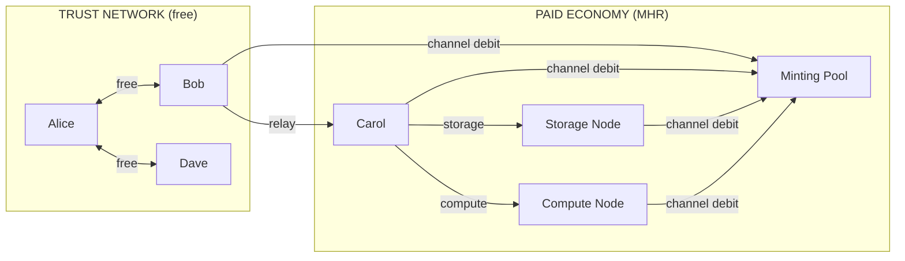
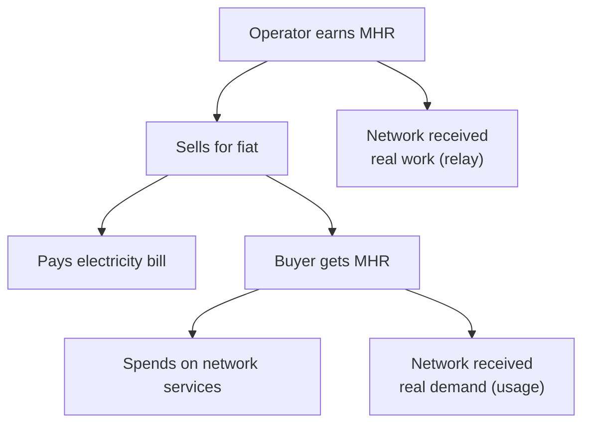
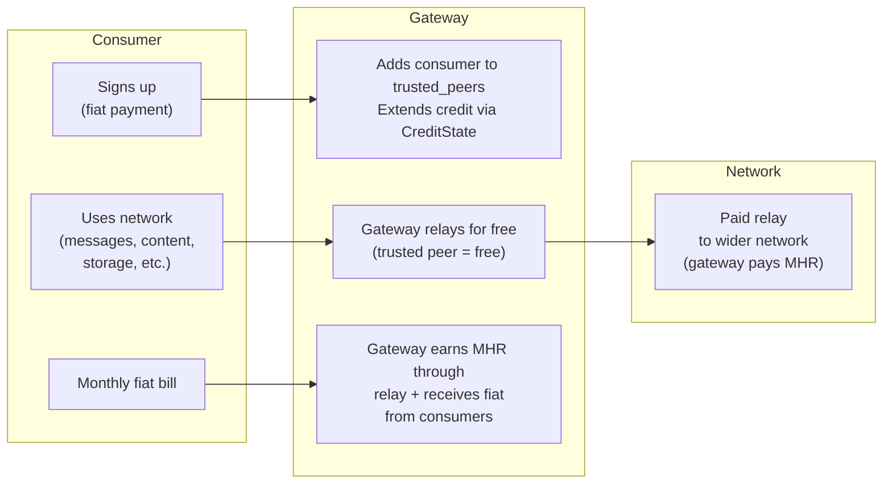

# MHR Token

MHR is the unit of account for the Mehr network. It is not a speculative asset — it is the internal currency for purchasing capabilities from nodes outside your trust network.

## Properties

```
MHR Properties:
  Smallest unit: 1 μMHR (micro-MHR)
  Initial distribution: Genesis service allocation + demand-backed proof-of-service mining (no ICO)
  Genesis allocation: Disclosed amount to genesis gateway operator (see Genesis below)
  Supply ceiling: 2^64 μMHR (~18.4 × 10^18 μMHR, asymptotic — never reached)
```

### Supply Model

MHR has an **asymptotic supply ceiling** with **decaying emission**:

| Phase | Epoch Range | Emission Per Epoch |
|-------|-------------|-------------------|
| Bootstrap | 0–99,999 | 10^12 μMHR (1,000,000 MHR) |
| Halving 1 | 100,000–199,999 | 5 × 10^11 μMHR |
| Halving 2 | 200,000–299,999 | 2.5 × 10^11 μMHR |
| Halving N | N × 100,000 – (N+1) × 100,000 − 1 | 10^12 × 2^(−N) μMHR |
| Tail | When halved reward is below floor | 0.1% of circulating supply / estimated epochs per year |

```
Emission formula:
  halving_shift = min(e / 100_000, 63)   // clamp to prevent undefined behavior
  epoch_reward(e) = max(
    10^12 >> halving_shift,              // discrete halving (bit-shift)
    circulating_supply * 0.001 / E_year  // tail floor
  )

  E_year = trailing 1,000-epoch moving average of epoch frequency
  Halving is epoch-counted, not wall-clock (partition-safe)
  At ~1 epoch per 10 minutes: 100,000 epochs ≈ 1.9 years

  Implementation note: the shift operand MUST be clamped to 63 (max
  for u64). At epoch 6,400,000 (~year 1218), unclamped shift = 64
  which is undefined behavior on most platforms. Clamping to 63 yields
  0 (10^12 >> 63 = 0), so the tail floor takes over — correct behavior.
```

The theoretical ceiling is 2^64 μMHR, but it is never reached — tail emission asymptotically approaches it. The initial reward of 10^12 μMHR/epoch yields ~1.5% of the supply ceiling minted in the first halving period, providing strong bootstrap incentive. Discrete halving every 100,000 epochs is epoch-counted (no clock synchronization needed) and trivially computable via bit-shift on integer-only hardware.

The tail ensures ongoing proof-of-service rewards exist indefinitely, funding all service operators (relay, storage, compute). In practice, lost keys (estimated 1–2% of supply annually) offset tail emission, keeping effective circulating supply roughly stable after year ~10.

### Typical Costs

| Operation | Cost |
|-----------|------|
| Expected relay cost per packet | ~5 μMHR |
| Relay lottery payout (on win) | ~500 μMHR (5 μMHR ÷ 1/100 win probability) |
| Expected cost: 1 KB message, 5 hops | ~75 μMHR (~3 packets × 5 μMHR × 5 hops) |
| 1 hour of storage (1 MB) | ~50 μMHR |
| 1 minute of compute (contract execution) | ~30–100 μMHR |

The relay lottery pays out infrequently but in larger amounts. Expected value per packet is the same: `500 μMHR × 1/100 = 5 μMHR`. See [Stochastic Relay Rewards](payment-channels) for the full mechanism.

## All-Service Minting

All services — relay, storage, and compute — earn minting rewards. Minting is proportional to real economic activity (channel debits) and capped at a fraction of that activity, making self-dealing structurally unprofitable. A 2% service burn on every funded-channel payment creates a deflationary force that bounds supply even in isolated partitions.

### Why All Services Mint

The anti-gaming defense is **not** service-specific proofs. It is three mechanisms that work uniformly across all services:

1. **Non-deterministic assignment** — the client cannot choose who serves the request
2. **Net-income revenue cap** — total minting cannot exceed 50% of net economic activity
3. **Service burn + active-set scaling** — 2% burn on all funded-channel payments + emission scaled by partition size bounds isolated partition supply growth to at most `E_s` per epoch

Together, these guarantee that self-dealing in a connected network is **never profitable**, and that isolated partition minting is bounded by scaled emission per epoch (convergent over time due to halving). See the [Security Analysis](#security-analysis) for the complete threat model.

### Non-Deterministic Assignment

Each service type has a natural mechanism that prevents the client from choosing the server:

```
Service assignment:

  Relay:    Mesh routing (Kleinberg greedy forwarding)
            Path determined by network topology, not client choice.
            Multi-hop paths include honest relays with high probability.
            Probability of ALL hops being attacker-controlled: X^hops
            (vanishingly small for typical path lengths).

  Storage:  DHT ring assignment
            responsible_node = DHT(hash(content_id || epoch_hash))
            The epoch_hash is unpredictable at request time, preventing
            the client from grinding content IDs to influence assignment.
            Replicas assigned to multiple DHT-ring positions for durability.

  Compute:  DHT ring assignment
            responsible_node = DHT(hash(job_spec || epoch_hash))
            Same mechanism as storage. The compute node is determined by
            the DHT ring, not by client choice.
```

The DHT ring is the same Kleinberg small-world ring used for routing. No new mechanism — storage and compute assignment reuse the existing topology.

### Unified Minting Formula

All service income contributes to one minting pool. The revenue cap uses **net income** (income minus spending per provider), not gross channel debits, to prevent [cycling attacks](#attack-channel-cycling). Emission is scaled by the active set size to limit small-partition minting:

```
Minting formula (all services):

  For each provider P this epoch:
    P_income  = relay_income + storage_income + compute_income  (payments received)
    P_spending = total payments sent across all channels
    P_net     = max(0, P_income - P_spending)

  Active-set-scaled emission:
    active_nodes = number of nodes in epoch's active set
    reference_size = 100  (configurable protocol parameter)
    scale_factor = min(active_nodes, reference_size) / reference_size
    scaled_emission = emission(epoch) × scale_factor
      → 3-node partition: 3/100 × E = 0.03E
      → 100+ node partition: full E

  Revenue cap (net-income based):
    minting_eligible = Σ P_net for all providers P
    epoch_minting = min(scaled_emission, 0.5 × minting_eligible)

  Service burn:
    burn_rate = 0.02  (2% of every funded-channel payment)
    Burned amount is permanently destroyed before minting calculation.
    Provider receives 98% of channel payment; 2% is removed from supply.

  Distribution (gross-income based):
    provider_mint_share = (P_income / Σ all_income) × epoch_minting

  The cap uses net income (prevents cycling). Distribution uses gross
  income (rewards all service provision fairly). A relay earning 1000 μMHR
  and a storage node earning 1000 μMHR get the same distribution share.

  Why net income for the cap:
    In a round-trip cycle (A→B→A), every provider's income = spending → net = 0.
    Cycling produces zero minting, regardless of how many times MHR circulates.
    One-directional spending (real demand) produces positive net income.

  Why active-set scaling:
    Without scaling, a 3-node partition mints the same as a 10,000-node network.
    With scaling, the 3-node partition mints 3% of full emission — proportional
    to its size. The 2% burn provides additional friction (~4% reduction in
    attacker growth rate) and absorbs excess supply after partition merge.
```

### Service-Specific Payment Mechanics

The VRF stochastic lottery remains relay-specific — it is a bandwidth optimization, not a minting mechanism:

```
Payment mechanics by service:

  Relay:    VRF stochastic lottery per-packet (existing)
            Channel debit on lottery win (~1/100 packets)
            High-frequency, low-value: lottery reduces overhead by ~10x

  Storage:  Direct channel debit per-epoch per-agreement
            Low-frequency: one payment per storage agreement per epoch
            No lottery needed — per-event channel updates are affordable

  Compute:  Direct channel debit per-job
            Medium-frequency: one payment per computation
            No lottery needed — per-event channel updates are affordable
```

### Proof: Self-Dealing Is Unprofitable

```
Self-dealing with non-deterministic assignment + net-income cap:

  Attacker has X fraction of network economic capacity.
  Attacker generates Y MHR in fake service demand.

  Non-deterministic assignment routes:
    X × Y  → attacker's own nodes (internal transfer, net cost 0)
    (1-X) × Y → honest nodes (REAL cost to attacker)

  Net income (for revenue cap):
    Honest providers: net = (1-X)Y (received payment, didn't spend back to attacker)
    Attacker providers: net = max(0, XY - Y) = 0 (income < spending for X < 1)
    minting_eligible = (1-X)Y  (only honest providers contribute)

  Minting earned by attacker:
    attacker_share = XY / Y = X  (gross income share)
    attacker_minting = X × min(E, 0.5 × (1-X)Y)

  Attacker's net profit (assuming 0.5(1-X)Y < E):
    -(1-X)Y + X × 0.5 × (1-X)Y = (1-X)Y × (0.5X - 1)

  This is ALWAYS negative for any X < 1:
    X = 10%: net = -0.45Y × 0.9 = -0.855Y  (85.5% loss)
    X = 30%: net = -0.35Y × 0.7 = -0.49Y   (49% loss)
    X = 50%: net = -0.25Y × 0.5 = -0.375Y  (37.5% loss)
    X = 90%: net = -0.05Y × 0.1 = -0.045Y  (4.5% loss)
    X = 99%: net = -0.005Y × 0.01 = -0.005Y (0.5% loss)

  Self-dealing is NEVER profitable in a connected network.
  The net-income cap ensures the attacker's own internal transfers
  don't count toward minting eligibility.
```

Non-deterministic assignment forces the attacker to pay honest nodes. The net-income cap ensures the attacker's internal transfers (paying their own nodes) produce zero minting eligibility. Together, self-dealing in a connected network always loses money — the attacker spends real MHR on honest nodes and earns nothing from their internal circulation.

**Note**: This "never profitable" result requires that the network is connected and non-deterministic assignment is operational. In an [isolated partition](#attack-isolated-partition) where the attacker controls all nodes, non-deterministic assignment is nullified — but the [trust-gated active set](#trust-gated-active-set) + [merge-time trust audit](#merge-time-trust-audit) (rejects untrusted partition minting on reconnection), active-set-scaled emission, and 2% service burn bound supply growth. See the [Security Analysis](#security-analysis) for the full threat model.

### What We Don't Need

The three-mechanism defense (non-deterministic assignment + net-income cap + burn/scaling) makes several commonly proposed anti-gaming mechanisms unnecessary:

| Mechanism | Why not needed |
|-----------|----------------|
| Numerical trust scores | Binary trust neighborhoods handle free/paid boundary |
| Staking | Channel funding provides implicit Sybil cost |
| Slashing | Attacks are structurally unprofitable — punishment is redundant |
| Service-specific proof protocols | DHT assignment + bilateral verification sufficient |
| Dynamic pool rebalancing | Single pool, proportional distribution, market adjusts prices |

Three mechanisms. One formula. Zero trust assumptions.

### Bootstrap by Service Type

```
Bootstrap sequence:

  Phase 0: FREE TIER
    ├── Relay:   Trusted peers relay for free (works immediately)
    ├── Storage: Trusted peers store each other's data for free
    └── Compute: Nodes run their own contracts locally

  Phase 0.5: GENESIS SERVICE GATEWAY
    ├── Genesis gateway receives transparent MHR allocation
    ├── Gateway offers real services for fiat (relay, storage, compute)
    ├── Consumer fiat → MHR credit extensions → funded channels
    └── Real service demand enters the network for the first time

  Phase 1: DEMAND-BACKED SERVICE MINTING
    ├── Funded-channel traffic triggers relay VRF lottery
    ├── Storage/compute agreements generate direct channel debits
    ├── ALL channel debits (relay + storage + compute) earn minting
    ├── Revenue-capped minting prevents self-dealing (see above)
    └── MHR enters circulation backed by real demand across all services

  Phase 2: MARKET ECONOMY
    ├── Service providers spend MHR on other services
    ├── Competition drives prices toward marginal cost
    └── All service types have mature bilateral payment markets

  Phase 3: MATURE ECONOMY
    ├── Bilateral payments dominate all services
    ├── Minting becomes residual (decaying emission)
    └── Service prices emerge from supply/demand
```

Every service type earns minting from Phase 1. A $30 solar relay earns minting by forwarding packets. A node with spare disk earns minting by storing data. A node with a GPU earns minting by running compute jobs. The minting subsidy is proportional to economic contribution, not service type.

**Storage is a particularly low-barrier entry point.** Any device with spare disk space can offer [cloud storage](../applications/cloud-storage#earning-mhr-through-storage) and earn MHR through both bilateral payments and minting rewards. The marginal cost is near zero (idle disk space), so even modest demand generates income. For users who want to participate in the economy without running relay infrastructure, storage is the simplest starting point.

### Genesis-Anchored Minting

During bootstrap (before the first halving at epoch 100,000), minting eligibility requires a **GenesisAttestation** — a signed proof of recent connectivity to a genesis node. This completely eliminates the [isolated partition attack](#attack-isolated-partition) during the most vulnerable period (high emission, low total supply).

```
GenesisAttestation {
    epoch_number: u64,              // epoch this attestation was issued
    attestor_id: NodeID,            // genesis node or attested peer
    attestor_sig: Ed25519Signature, // signature over (epoch_number || subject_id)
    chain_length: u8,               // 0 = genesis node itself, 1 = direct peer, etc.
    max_chain_length: u8,           // protocol parameter (default: 5)
}

How attestations propagate:
  1. Genesis nodes sign attestations for directly connected peers each epoch
     (chain_length = 1)
  2. Any node with a valid attestation (chain_length < max) can vouch for
     its own direct peers (chain_length + 1)
  3. Attestations propagate one hop per epoch via gossip
  4. TTL: attestations expire after 10 epochs — a node that loses genesis
     connectivity for >10 epochs can no longer mint
  5. Minting eligibility check:
     IF epoch_number < 100,000:  // bootstrap phase
       provider must have a valid GenesisAttestation (not expired, chain verified)
     ELSE:
       GenesisAttestation sunsets — trust-gated active set + merge-time audit take over

Why this works:
  - An isolated partition with no path to a genesis node gets ZERO minting
  - The attacker cannot forge attestations (Ed25519 signatures)
  - The attacker cannot relay attestations without actual connectivity
  - Legitimate isolated communities (natural partitions) also cannot mint
    during bootstrap — this is acceptable because the bootstrap period is
    when the genesis gateway is the primary MHR source anyway
```

**Post-bootstrap defense**: At epoch 100,000 (first halving), GenesisAttestation is retired. Post-bootstrap partition defense is provided by the [trust-gated active set](#trust-gated-active-set) (minting requires ≥1 mutual trust link) and the [merge-time trust audit](#merge-time-trust-audit) (rejects untrusted partition minting on reconnection). No attestation chains, no central authority, no expiring certificates. See [Partition Defense](#partition-defense) for the complete design.

### Service Burn

A **2% burn** is applied to every funded-channel payment, permanently destroying the burned amount. This creates a deflationary force that provides friction in isolated partitions and absorbs excess supply after partition merge.

```
Service burn mechanics:

  On every funded-channel payment (relay lottery win, storage debit, compute debit):
    burn_amount = payment × 0.02
    provider_receives = payment × 0.98
    burn_amount is permanently destroyed (removed from circulating supply)

  Applies to:
    ✓ Relay VRF lottery wins (burn 2% of the payout)
    ✓ Storage per-epoch debits (burn 2% of the payment)
    ✓ Compute per-job debits (burn 2% of the payment)
    ✗ Free-tier trusted traffic (no payment = nothing to burn)
    ✗ Minting rewards (new supply, not a payment)

  Burn tracking:
    Each ServiceDebitSummary includes a burn_total field
    Epoch snapshot includes epoch_burn_total (sum of all burns)
    Burns are reflected in the CRDT ledger as reduced delta_earned
    (provider's delta_earned increases by 98% of payment, not 100%)

Burn role in isolated partitions:
  In an isolated partition, the attacker spends the minimum needed to
  saturate the minting cap (~2.04 × E_s per epoch). The burn on this
  activity is ~0.04 × E_s per epoch — a ~4% reduction in the attacker's
  supply growth rate (see Supply Dynamics Proof in Security Analysis).
  After reconnection, the 2% burn on the entire network's economic
  activity gradually absorbs the excess supply.

Effect on connected networks:
  In the normal (connected) network, burns reduce effective circulating supply.
  Combined with lost keys (~1-2% annual), the deflationary pressure is mild
  but creates a tighter long-term equilibrium. Tail emission (0.1% annual)
  compensates — the steady state is: tail_emission ≈ burns + lost_keys.
```

## Economic Architecture

Mehr has a simple economic model: **free between friends, paid between strangers.**



### Free Tier (Trust-Based)

- Traffic between [trusted peers](trust-neighborhoods) is **always free**
- No tokens, no channels, no settlements needed
- A local mesh where everyone trusts each other has **zero economic overhead**

### Paid Tier (MHR)

- Services crossing trust boundaries earn through [bilateral payment channels](payment-channels)
- Relay uses [stochastic lottery](payment-channels) for bandwidth efficiency; storage and compute use direct channel debits
- All channel debits contribute to the minting pool (proportional, revenue-capped)
- Settled via [CRDT ledger](crdt-ledger)

## Genesis and Bootstrapping

The bootstrapping problem — needing MHR to use services, but needing to provide services to earn MHR — is solved by separating free-tier operation from the paid economy:

### Free-Tier Operation (No MHR Required)

- **Trusted peer communication is always free** — no tokens needed
- **A local mesh works with zero tokens in circulation**
- The protocol is fully functional without any MHR — just limited to your trust network

### Demand-Backed Proof-of-Service Mining (MHR Genesis)

All services — relay, storage, and compute — earn minting rewards proportional to their channel debits. The **funding source** depends on the economic context:

1. **Minting (subsidy, demand-backed)**: Each epoch, the emission schedule determines the minting ceiling. Actual minting is distributed proportionally to all service providers based on their channel debits during that epoch — but only debits from **funded payment channels** are minting-eligible. Free-tier trusted traffic does not earn minting rewards. This demand-backed requirement ensures minting reflects real economic activity, not fabricated traffic.

2. **Channel debit (market)**: Service providers earn directly from clients through [payment channels](payment-channels). Relay uses a [stochastic lottery](payment-channels) for bandwidth efficiency; storage and compute use direct per-epoch or per-job channel debits. This becomes the dominant income source as MHR enters circulation.

Both mechanisms coexist. As the economy matures, channel-funded service payments naturally replace minting as the primary income source, while the decaying emission schedule ensures the transition is smooth.

```
Service provider compensation per epoch:

  Epoch mint pool: max(10^12 >> (epoch / 100_000), tail_floor)
    → new supply created (not transferred from a pool)
    → halves every 100,000 epochs; floors at 0.1% annual inflation

  Active-set-scaled emission:
    scaled_emission = epoch_mint_pool × min(active_set_size, 100) / 100
    → 3-node partition: 3% of full emission
    → 100+ nodes: full emission

  Service burn (2%):
    Every funded-channel payment burns 2% before crediting the provider.
    Provider receives 98% of the channel payment.
    Burned amount is permanently destroyed (removed from supply).

  Per-provider net income (post-burn):
    P_income  = relay + storage + compute payments received (after burn)
    P_spending = total payments sent across all channels
    P_net     = max(0, P_income - P_spending)
    → only funded-channel activity counts (free-tier excluded)

  Revenue-capped minting (net-income based):
    minting_eligible = Σ P_net for all providers P
    epoch_minting = min(scaled_emission, 0.5 × minting_eligible)

  Provider P's mint share: epoch_minting × (P_income / Σ all_income)
    → distribution uses gross income (rewards all service provision)
    → a storage node earning 10% of total income gets 10% of minting

  Channel revenue: direct payments from clients (separate from minting)
    → relay: VRF lottery wins debited from sender channels (98% after burn)
    → storage: per-epoch debits from storage agreements (98% after burn)
    → compute: per-job debits from compute agreements (98% after burn)

  Total provider income = mint share + channel revenue
```

### Genesis Service Gateway

The bootstrapping problem is solved by a **Genesis Service Gateway** — a known, trusted operator that provides real services for fiat and bootstraps the MHR economy with genuine demand:

1. **Transparent allocation**: The genesis gateway operator receives a disclosed MHR allocation. No hidden allocation, no ICO — the amount is visible in the ledger from epoch 0.
2. **Competitive fiat pricing**: The gateway offers relay, storage, and compute at market-competitive fiat prices (see [Initial Pricing](#initial-pricing) below).
3. **Funded channels**: Consumer fiat payments are converted to MHR credit extensions, creating funded payment channels. This generates the first real service demand on the network (relay, storage, compute).
4. **Demand-backed minting**: All funded-channel activity — relay traffic, storage agreements, compute jobs — earns minting rewards proportional to channel debits, backed by actual economic activity.
5. **MHR circulation**: Minted MHR enters circulation — all service providers can spend it on other services.
6. **Decentralization**: As more operators join and offer competing services, the genesis gateway becomes one of many providers. The economy transitions from gateway-bootstrapped to fully market-driven.

### Bootstrap Sequence

1. Genesis gateway receives transparent MHR allocation, begins offering fiat-priced services (relay, storage, compute)
2. Genesis nodes begin signing [GenesisAttestations](#genesis-anchored-minting) for connected peers — minting eligibility requires attestation during bootstrap
3. Nodes form local meshes (free between trusted peers, no tokens)
4. Consumers pay fiat to genesis gateway → funded channels created for all service types
5. Funded-channel activity triggers demand-backed minting: relay VRF lottery wins + storage/compute direct debits. 2% of each payment is [burned](#service-burn).
6. All service providers (relay, storage, compute) with valid genesis attestations earn minting proportional to their channel debits
7. Providers open payment channels and begin spending MHR on other services
8. More operators join, offer competing services across all types, prices fall toward marginal cost
9. At epoch 100,000 (first halving): genesis attestation sunsets — [trust-gated active set](#trust-gated-active-set) + [merge-time trust audit](#merge-time-trust-audit) provide post-bootstrap partition defense
10. Market pricing emerges from supply/demand

### Trust-Based Credit

Trusted peers can [vouch for each other](trust-neighborhoods#trust-based-credit) by extending transitive credit. Each node configures the credit line it extends to its direct trusted peers (e.g., "I'll cover up to 1000 μMHR for Alice"). A friend-of-a-friend gets a configurable ratio (default 10%) of that direct limit — backed by the vouching peer's MHR balance. If a credited node defaults, the voucher absorbs the debt. This provides an on-ramp for new users without needing to earn MHR first.

**Free direct communication works immediately** with no tokens at all. MHR is only needed when your packets traverse untrusted infrastructure.

### Revenue-Capped Minting

The emission schedule sets a ceiling, but actual minting per epoch is capped at a fraction of **net economic activity** across all service types. Emission is further scaled by the partition's active set size, and a 2% [service burn](#service-burn) on every funded-channel payment creates a deflationary counterforce:

```
Revenue-capped minting formula:

  For each provider P this epoch:
    P_income  = total payments received for services (relay + storage + compute)
              (post-burn: provider receives 98% of channel payment)
    P_spending = total payments sent across all channels
    P_net     = max(0, P_income - P_spending)
      → only funded-channel activity counts (free-tier excluded)

  minting_eligible = Σ P_net for all providers P

  Active-set-scaled emission:
    scaled_emission = emission_schedule(epoch) × min(active_set_size, 100) / 100

  effective_minting(epoch) = min(
      scaled_emission,                          // active-set-scaled halving ceiling
      minting_cap × minting_eligible            // 0.5 × net economic activity
  )

  minting_cap = 0.5  (minting can never exceed 50% of net service activity)

  Service burn: 2% of every funded-channel payment permanently destroyed.
  This reduces circulating supply and imposes friction on isolated partition
  supply growth (~4% reduction in attacker growth rate per epoch).
```

**Why net income, not gross debits:** Gross debits can be inflated by cycling — two colluding nodes pass the same MHR back and forth, each pass creating new "debits." Net income eliminates this: a round-trip produces income = spending → net = 0 → zero minting. See [Channel Cycling](#attack-channel-cycling) in the Security Analysis for the full defense.

**Why self-dealing is unprofitable — the complete analysis:**

Self-dealing means the attacker controls both the client and the server. The channel debit between them is an internal transfer (net cost 0). The attacker's only gain is minting. The defense has two parts:

1. **Non-deterministic assignment** forces the attacker to pay honest nodes for most of their fake demand
2. **Net-income revenue cap** limits the minting the attacker can capture

```
Self-dealing attack analysis (with non-deterministic assignment):

  Setup:
    Attacker controls X fraction of network economic capacity
    Attacker generates Y MHR in fake service demand

  Non-deterministic assignment:
    Relay: mesh routing sends packets through honest relays (topology-determined)
    Storage: DHT assigns honest nodes for (1-X) fraction of requests
    Compute: DHT assigns honest nodes for (1-X) fraction of requests

  Cost to attacker:
    (1-X) × Y → paid to honest nodes (REAL, irrecoverable cost)
    X × Y → paid to own nodes (internal transfer, net 0)

  Attacker's net income (for minting cap):
    Honest providers' net: (1-X) × Y (they received, didn't spend to attacker)
    Attacker providers' net: 0 (received X×Y from own nodes, internal transfer)
    But attacker also spent (1-X)Y to honest nodes, so:
      Attacker's total spending: Y
      Attacker's total income: X × Y (from own fake demand)
      Attacker's net: max(0, XY - Y) = 0 (since X < 1)

  Revenue for attacker:
    Minting share = (attacker_income / total_income) × epoch_minting
    = (XY / Y) × min(E, 0.5 × minting_eligible)
    = X × min(E, 0.5 × (1-X)Y)    // only honest providers have positive net

  Attacker's profit (assuming 0.5(1-X)Y < E):
    -(1-X)Y + X × 0.5(1-X)Y = (1-X)Y × (0.5X - 1)

  This is ALWAYS negative for X < 1. The net-income cap makes the
  defense STRONGER than the gross-debit analysis (which allowed profit
  at X > 67%). With net income, self-dealing in a connected network is
  NEVER profitable — the attacker's own net income is always 0.
```

**Important**: The "never profitable" result applies to the **connected** network case where non-deterministic assignment routes most demand to honest nodes. In an [isolated partition](#attack-isolated-partition) where the attacker controls all nodes, non-deterministic assignment is nullified — but the [trust-gated active set](#trust-gated-active-set) + [merge-time trust audit](#merge-time-trust-audit) (rejects untrusted minting on reconnection), active-set scaling, and service burn bound supply growth.

**What happens to "unminted" emission:**

- During early bootstrap, net service activity is small, so actual minting is well below the emission schedule
- The difference is NOT minted — it is simply not created (supply grows slower)
- As traffic grows, actual minting approaches the emission schedule ceiling
- In mature economy, the cap is rarely binding (net service activity far exceeds the emission schedule)
- The 2% service burn continuously removes supply, creating a tighter equilibrium than emission alone would suggest

This changes the supply curve: instead of predictable emission, supply growth tracks actual economic activity minus burns. Early supply grows slowly (good — prevents speculation without real usage), mature supply follows the emission schedule minus the burn rate. The steady-state effective supply is where `minting ≈ burns + lost_keys`.

### Initial Pricing

The genesis gateway prices services at or slightly above market competitors. This is deliberate — the goal is fair pricing with operational margin, not undercutting.

```
Initial pricing strategy:

  Principle: Price at market rate with overhead, NOT undercutting.

  The genesis gateway publishes maximum prices (ceilings). These serve as a
  ceiling that competitors can undercut as they join. The gateway can initially
  run on AWS/cloud infrastructure — it needs margin to cover that cost.

  Service             Market Benchmark              Genesis Ceiling
  ────────────────────────────────────────────────────────────────────
  Storage             AWS S3: $0.023/GB/mo          ~$0.02/GB/mo
  Internet gateway    ISP: $30-100/mo               ~$30/mo
  Compute             AWS Lambda: ~$0.20/1M req     At market
  Relay (per-packet)  Bundled in gateway price      ~5 μMHR

  Rationale:
  - Storage: At market, not below — no reason to subsidize
  - Gateway: Match ISP rate; value is privacy/resilience, not cheapness
  - Compute: No reason to undercut cloud pricing initially
  - Relay: Derived from gateway fiat price ÷ expected packet volume
```

**How prices fall over time:**

```
Price evolution:

  Genesis:     Gateway sets ceiling (market rate + overhead)
  Growth:      New providers enter, set prices ≤ ceiling to attract users
  Maturity:    Competition drives prices toward marginal cost
               (Mehr's marginal cost is low — spare bandwidth/disk on existing devices)
```

The genesis gateway doesn't need to be cheapest. It needs to be **trusted, available, and fairly priced**. Price competition comes from the market, not from subsidized undercutting. The gateway's fiat-to-MHR conversion rate becomes the initial exchange rate for MHR.

### Genesis Gateway Discovery

New nodes discover the genesis gateway through DNS:

```
Genesis gateway discovery:

  1. Well-known DNS domain resolves to genesis gateway IP(s)
  2. Hardcoded fallback list in daemon binary (in case DNS is unavailable)
  3. DNS is for initial contact only — once connected, gossip takes over
  4. Multiple DNS records for redundancy (A/AAAA records)

  Note: DNS is used ONLY for initial genesis gateway discovery,
  not for ongoing protocol operation. See roadmap Milestone 1.2.
```

This ties into the existing bootstrap mechanism (Milestone 1.2 in the [roadmap](../development/roadmap#milestone-12-bootstrap--peer-discovery)), elevating DNS from "optional" to the primary method for locating genesis gateways.

## Why One Global Currency

MHR is a single global unit of account, not a per-community token. This is a deliberate design choice.

### The Alternative: Per-Community Currencies

If each isolated community minted its own token, connecting two communities would require a currency exchange — someone to set an exchange rate, provide liquidity, and settle trades. On a mesh network of 50–500 nodes, there is not enough trading volume to sustain a functioning exchange market. The complexity (order books, matching, dispute resolution) vastly exceeds what constrained devices can support.

### How One Currency Works Across Partitions

When two communities operate in isolation:

1. **Internally**: Both communities communicate free between trusted peers — no MHR needed
2. **Independently**: Each community mints MHR via proof-of-service, proportional to actual service activity (relay, storage, compute). The [CRDT ledger](crdt-ledger) tracks balances independently on each side
3. **On reconnection**: The CRDT ledger merges automatically (CRDTs guarantee convergence). Both communities' MHR is valid because it was earned through real work, not printed arbitrarily

MHR derives its value from **labor** (relaying, storage, compute), not from community membership. One hour of relaying in Community A is roughly equivalent to one hour in Community B. Different hardware costs are reflected in **market pricing** — nodes set their own per-byte charges — not in separate currencies.

### Fiat Exchange

MHR has no official fiat exchange rate. The protocol includes no exchange mechanism, no order book, no trading pair. But MHR buys real services — bandwidth, storage, compute, content access — so it has real value. People will trade it for fiat currency, whether through informal markets, OTC trades, or external exchanges.

This is expected and not inherently harmful.

**Why exchange doesn't break the system:**



1. **Purchased MHR is legitimate.** If someone buys MHR with fiat instead of earning it through relay, the seller earned it through real work. The network benefited from that work. The buyer funds network infrastructure indirectly — identical to buying bus tokens.

2. **MHR derives value from utility.** Its value comes from the services it buys, not from artificial scarcity. If the service economy is healthy, MHR has value regardless of exchange markets.

3. **Hoarding is self-correcting.** Someone who buys MHR and holds it is funding operators (paying fiat for earned MHR) while removing tokens from circulation. Remaining MHR becomes more valuable per service unit, incentivizing earning through service provision. Tail emission (0.1% annual) mildly dilutes idle holdings.

**What could go wrong:**

| Risk | Mitigation |
|------|-----------|
| **Deflationary spiral** (hoarding prevents spending) | Tail emission; free tier ensures basic functionality regardless |
| **Speculation** (price detaches from utility) | Utility value creates a floor; MHR has no use outside the network |
| **Regulatory attention** | Protocol doesn't facilitate exchange; users must understand their jurisdiction |

**Internal price discovery** still works as designed — service prices float based on supply and demand:

```
Abundant relay capacity + low demand → relay prices drop (in μMHR)
Scarce relay capacity + high demand  → relay prices rise (in μMHR)
```

Users don't need to know what 1 μMHR is worth in fiat. They need to know: "Can I afford this service?" — and the answer is usually yes, because they earn MHR by providing services. The economy is circular even if some participants enter through fiat exchange.

### Gateway Operators (Fiat Onramp)

The [Genesis Service Gateway](#genesis-service-gateway) is the first instance of this pattern. The same mechanics — trust extension, credit lines, fiat billing — apply to all subsequent gateway operators. As more gateways join, the economy decentralizes and pricing becomes competitive.

Not everyone wants to run a relay. Pure consumers — people who just want to use the network — should be able to pay with fiat and never think about MHR. **Gateway operators** make this possible.

A gateway operator is a trusted intermediary who bridges fiat payment and MHR economics. The consumer interacts with the gateway; the gateway interacts with the network. This uses existing protocol mechanics — no new wire formats or consensus changes.



**How it works:**

1. **Sign-up**: Consumer pays the gateway in fiat (monthly subscription, prepaid, pay-as-you-go — the gateway chooses its business model)
2. **Trust extension**: Gateway adds the consumer to `trusted_peers` and extends a credit line via [CreditState](trust-neighborhoods#trust-based-credit). The consumer's traffic through the gateway is free (trusted peer relay)
3. **Network access**: The consumer uses the network normally. Their traffic reaches the gateway for free, and the gateway pays MHR for onward relay to untrusted nodes
4. **Settlement**: The gateway earns MHR through service minting (relay, storage, compute) + charges fiat to consumers. The spread between fiat revenue and MHR costs is the gateway's margin

**The consumer never sees MHR.** From their perspective, they pay a monthly bill and use the network. Like a mobile carrier — you don't think about interconnect fees between networks.

```
Trust-based gateway mechanics:

  Gateway's TrustConfig:
    trusted_peers: { consumer_1, consumer_2, ... }
    cost_overrides: { consumer_1: 0, consumer_2: 0 }  // free for consumers

  Gateway's CreditState per consumer:
    credit_limit: proportional to fiat subscription tier
    rate_limit: prevents abuse (e.g., 10 MB/epoch for basic tier)

  Consumer's view:
    - No MHR wallet needed
    - No payment channels
    - No economic complexity
    - Just "install app, sign up, use"
```

**Why this works without protocol changes:**

| Mechanism | Already Exists |
|-----------|---------------|
| Free relay for trusted peers | [Trust Neighborhoods](trust-neighborhoods#free-local-communication) |
| Credit extension | [CreditState](trust-neighborhoods#trust-based-credit) |
| Rate limiting | Per-epoch credit limits in CreditState |
| Abuse prevention | Gateway revokes trust on non-payment (fiat side) |

**Gateway business models:**

| Model | Description | Consumer Experience |
|-------|-------------|-------------------|
| **Subscription** | Monthly fiat fee for a usage tier | Like a phone plan |
| **Prepaid** | Buy credit in advance, use until depleted | Like a prepaid SIM |
| **Pay-as-you-go** | Fiat bill based on actual usage | Like a metered utility |
| **Freemium** | Free tier (rate-limited) + paid upgrade | Like free WiFi with premium option |

**Gateway incentives:**

- Gateways earn minting rewards across all services they provide (relay, storage, compute)
- Gateways earn fiat from consumer subscriptions
- Gateways with many consumers generate high channel debit volume = proportionally more minting
- Competition between gateways drives prices toward cost (standard market dynamics)

**Risks and mitigations:**

| Risk | Mitigation |
|------|-----------|
| **Gateway goes down** | Consumer can switch gateways or run their own node. No lock-in — identity is self-certifying |
| **Gateway censors** | Consumer switches gateway. Multiple gateways compete in any area with demand |
| **Gateway overcharges** | Market competition. Consumers compare pricing. Low switching cost |
| **Consumer abuses gateway** | Gateway revokes trust, cuts off credit. Fiat non-payment handled off-protocol |

Gateways are not privileged protocol participants. They are regular nodes that choose to offer a service (fiat-to-network bridging) using standard trust and credit mechanics. Anyone can become a gateway operator — the barrier is having enough MHR to extend credit and enough fiat customers to sustain the business.

## Economic Design Goals

- **Utility-first**: MHR is designed for purchasing services. Fiat exchange may emerge but the protocol's health doesn't depend on it, and the internal economy functions as a closed loop for participants who never touch fiat.
- **Transparent genesis**: Disclosed genesis allocation to the gateway operator, visible in the ledger from epoch 0. No ICO, no hidden allocation, no insider advantage.
- **Demand-backed minting**: Funded payment channels required for minting eligibility across all service types. Non-deterministic assignment + net-income revenue cap guarantee self-dealing is never profitable in connected networks. Isolated partition damage is defended by [trust-gated active set](#trust-gated-active-set) + [merge-time trust audit](#merge-time-trust-audit) + active-set scaling + 2% service burn. See [Security Analysis](#security-analysis).
- **Spend-incentivized**: Tail emission (0.1% annual) mildly dilutes idle holdings. Lost keys (~1–2% annually) permanently remove supply. MHR earns nothing by sitting still — only by being spent on services or lent via trust-based credit.
- **Partition-safe**: The economic layer works correctly during network partitions and converges when they heal
- **Minimal overhead**: [Stochastic rewards](payment-channels) reduce economic bandwidth overhead by ~10x compared to per-packet payment
- **Communities first**: Trusted peer communication is free. The economic layer only activates at trust boundaries.

## Partition Tolerance

The economic layer is designed to operate correctly during network partitions and converge automatically when they heal. This section describes how all-service minting interacts with partitions.

### Per-Partition Minting

Each partition operates as a self-contained economy with its own minting. Emission is **scaled by the partition's active set size** and reduced by the **2% service burn**:

```
Partition minting (with active-set scaling and burn):

  Partition A (60 nodes):
    scaled_emission_A = emission(epoch) × min(60, 100) / 100 = 0.6E
    local_debits_A = relay + storage + compute debits within partition A
    local_minting_A = min(scaled_emission_A, 0.5 × net_income_A)
    burns_A = 0.02 × total_funded_payments_A

  Partition B (40 nodes):
    scaled_emission_B = emission(epoch) × min(40, 100) / 100 = 0.4E
    local_debits_B = relay + storage + compute debits within partition B
    local_minting_B = min(scaled_emission_B, 0.5 × net_income_B)
    burns_B = 0.02 × total_funded_payments_B

  Each partition independently applies scaled emission, revenue cap, and burns.
  No cross-partition knowledge needed — each side sees only local activity.
```

On merge, total minted supply may exceed what a single-network emission would have produced. However, with active-set scaling, the overminting is **bounded by the sum of scale factors** (e.g., 60-node + 40-node = 0.6E + 0.4E = 1.0E, no overminting at all when the two partitions together equal the reference size). The 2% burn during partition operation further reduces the net supply impact. This is the same [partition minting tradeoff](crdt-ledger#partition-minting-and-supply-convergence) — the alternative (coordinated minting) requires global consensus, which contradicts partition tolerance.

### DHT Assignment During Partitions

Storage and compute use DHT ring assignment. During a partition:

```
DHT assignment in partitioned network:

  Before partition:
    Full ring: nodes A, B, C, D, E, F, G, H
    storage_key = hash(content || epoch_hash) → assigned to node D

  During partition (A,B,C,D | E,F,G,H):
    Left partition ring: A, B, C, D
    Right partition ring: E, F, G, H

    New storage requests in left partition use left-ring DHT
    New storage requests in right partition use right-ring DHT
    Existing agreements continue on whichever side their node is in

  After merge:
    Full ring restored
    New requests use full ring
    Existing agreements are unaffected (provider stays the same)
```

Existing storage agreements survive partitions because the payment channel persists between client and provider. If the provider is on the other side of the partition, the client cannot verify or pay — the agreement is effectively paused. On merge, the channel resumes (CRDT convergence restores both parties' balances).

### Revenue Cap During Partitions

Each partition's revenue cap uses only local net income, scaled by its active set size:

- No cross-partition knowledge needed
- Each partition independently caps minting at `min(scaled_emission, 0.5 × net_income)`
- Active-set scaling limits small partitions: 3-node partition gets 3% of full emission
- 2% service burn creates deflationary counterforce within each partition
- The net-income cap prevents [cycling attacks](#attack-channel-cycling) even within isolated partitions
- On merge, the CRDT ledger handles balance convergence
- During bootstrap (epoch < 100,000): [genesis-anchored minting](#genesis-anchored-minting) prevents isolated partitions from minting at all
- Post-bootstrap: [trust-gated active set](#trust-gated-active-set) requires mutual trust links for minting eligibility; [merge-time trust audit](#merge-time-trust-audit) rejects untrusted minting on reconnection

For detailed analysis of attacks that exploit partitions — including fully-controlled partitions, cycling, and compounding — see the [Security Analysis](#security-analysis).

## Security Analysis

This section catalogs all known economic attack vectors and their defenses. The economic layer relies on five mechanisms — **non-deterministic assignment**, **net-income revenue cap**, **service burn + active-set scaling**, **[trust-gated active set](#trust-gated-active-set)**, and **[merge-time trust audit](#merge-time-trust-audit)** — to defend against minting abuse. During bootstrap, [genesis-anchored minting](#genesis-anchored-minting) provides the initial layer by requiring provable connectivity to genesis nodes. Post-bootstrap, the trust-gated active set requires mutual trust links for minting eligibility, and the merge-time trust audit validates partition minting on reconnection. No staking, slashing, or hardware attestation is required.

### Attack: Self-Dealing (Connected Network)

**Description**: Attacker controls X fraction of network economic capacity. Generates Y MHR in fake service demand through funded channels to earn minting rewards.

**Defense**: Non-deterministic assignment routes (1-X)×Y to honest nodes (real, irrecoverable cost). The net-income revenue cap ensures the attacker's own internal transfers produce zero minting eligibility. Result: self-dealing in a connected network is **never profitable** for any X < 1.

**Residual risk**: None in connected networks. See [Proof: Self-Dealing Is Unprofitable](#proof-self-dealing-is-unprofitable) for the full analysis.

### Attack: Channel Cycling

**Description**: Two colluding nodes cycle M MHR back and forth on the same channel K times per epoch. With gross debits, each round-trip adds 2M to total debits — after K cycles, total debits = 2KM. The attacker reaches the emission ceiling immediately, regardless of actual economic activity. This also works across channels (triangle cycling: A→B→C→A) and through settlement-mediated cycling (settle, refund, repeat).

**Defense**: The revenue cap uses **net income per provider** (income minus spending), not gross channel debits.

```
Cycling prevention (net-income cap):

  Same-channel cycling: A→B then B→A, repeated K times
    A: income = KM, spending = KM → net = 0
    B: income = KM, spending = KM → net = 0
    minting_eligible = 0 → epoch_minting = 0 ✓

  Cross-channel cycling (triangle): A→B→C→A, repeated K times
    A: income = KM (from C), spending = KM (to B) → net = 0
    B: income = KM (from A), spending = KM (to C) → net = 0
    C: income = KM (from B), spending = KM (to A) → net = 0
    minting_eligible = 0 → epoch_minting = 0 ✓

  Settlement-mediated cycling: settle channel, refund, repeat
    Same result — net income is tracked per-provider across ALL
    channels and settlements within the epoch. A provider who
    receives M via settlement and spends M via new channel debits
    has net income = 0 regardless of settlement timing.

  Key property: any CLOSED CYCLE produces zero net income for
  every participant, because every provider's income equals their
  spending. Only one-directional flows (real demand) produce
  positive net income.
```

**Residual risk**: None. Cycling is completely neutralized by the net-income cap.

### Attack: Sybil DHT Positioning

**Description**: Attacker creates many node identities to occupy more DHT ring space. With more ring positions, a larger fraction of storage/compute assignments are directed to attacker nodes, increasing their minting share.

**Defense**: This is equivalent to increasing X (attacker's network fraction) in the self-dealing proof. More identities capture more assignments, but:

```
Sybil analysis:

  Attacker creates N identities, captures N/total_nodes of DHT ring.
  Equivalent to having X = N/total_nodes network fraction.

  In connected network: self-dealing proof applies.
    Attacker's net income = 0 (internal transfers don't count).
    Never profitable for any X < 1.

  Additional defenses:
    - DHT assignment uses hash(content_id || epoch_hash)
      → epoch_hash changes every epoch, so ring positions are ephemeral
      → attacker can't grind permanent strategic positions
    - Each identity needs funded channels (real MHR) to earn minting
    - Creating identities is cheap but funding channels requires capital
```

**Residual risk**: Same as self-dealing — none in connected networks.

### Attack: Content/Job ID Grinding

**Description**: Client generates content IDs or job specifications designed so that `hash(content_id || epoch_hash)` maps to an attacker-controlled node on the DHT ring.

**Defense**: The `epoch_hash` is determined at epoch proposal time and is unpredictable at content creation time. To pre-grind assignments, the attacker would need to predict future epoch hashes — computationally infeasible (hash space is 2^256). Even grinding after the epoch hash is known is impractical: the client must use the content_id it actually wants to store, not an arbitrary one.

**Residual risk**: None (computationally infeasible).

### Attack: Relay Without Forwarding

**Description**: Relay node claims VRF lottery wins without actually forwarding packets, collecting payment for non-service.

**Defense**: The VRF lottery requires the actual packet hash as input — the relay must have received the real packet to compute a valid VRF proof. If the relay doesn't forward the packet:

- The sender detects non-delivery (no acknowledgment from destination)
- The sender routes around the dishonest relay in future
- Persistent non-forwarding is detectable via delivery rate monitoring

**Residual risk**: Individual packet drops are hard to attribute (could be normal link loss). But the economic impact is bounded to individual lottery wins, and persistent dishonesty leads to route abandonment.

### Attack: Storage/Compute Fabrication

**Description**: Provider claims to store data or execute computations without actually doing so, collecting channel payments for non-service.

**Defense**: Bilateral verification by the client:

- **Storage**: Client issues periodic challenge-response queries on stored data (e.g., "return bytes 1024-2048 of block X"). Failure to respond correctly means the data is not stored.
- **Compute**: Client verifies computation results against expected output or spot-checks. Incorrect results are immediately detectable.

No protocol-level proof mechanism is needed. The economic incentive (continued payment) ensures honest service. Dishonest providers lose the client's business immediately.

**Residual risk**: Brief period of undetected non-service before the client verifies. Bounded by a single epoch's payment for storage, or a single job's payment for compute.

### Attack: Isolated Partition

**Description**: Attacker creates a network partition they fully or majority control. Within this partition, the attacker controls enough of the economic capacity to profit from self-dealing. At 100% control, non-deterministic assignment is nullified — all service requests go to attacker nodes. Creating an isolated partition is trivial — a few VMs on a laptop suffice.

This is the most significant economic attack vector. Seven defense layers bound the damage to a finite, predictable amount:

**Defense layers**:

1. **Genesis-anchored minting (bootstrap defense)**: During bootstrap (epoch < 100,000), minting requires a valid [GenesisAttestation](#genesis-anchored-minting) — a signed proof of recent connectivity to a genesis node. An isolated partition with no path to a genesis node gets **zero minting**. This completely eliminates the attack during the most vulnerable period (high emission, low total supply).

2. **[Trust-gated active set](#trust-gated-active-set) (post-bootstrap identity defense)**: After bootstrap, minting requires ≥1 mutual trust link with another active-set member. This prevents nodes with zero social ties from entering the minting-eligible set in connected networks. During isolation, attacker nodes trivially satisfy this (they trust each other) — the defense activates at merge time.

3. **[Merge-time trust audit](#merge-time-trust-audit) (reconnection defense)**: When a partition reconnects, minting from untrusted nodes is rejected. Cross-partition trust scoring ensures that only minting from nodes with real trust relationships is accepted into the main network supply. Fresh-identity attacks → 0% dilution on merge.

4. **Active-set-scaled emission (size defense)**: Emission is scaled by the partition's active set size: `scaled_emission = emission × min(active_nodes, 100) / 100`. A 3-node partition gets 3% of full emission. This eliminates the linear scaling advantage of small partitions.

5. **Service burn (friction defense)**: 2% of every funded-channel payment is permanently destroyed. This imposes ongoing friction on the attacker and, after reconnection, the burn on the entire network's economic activity gradually absorbs excess supply.

6. **Cycling prevention**: The net-income cap prevents the attacker from inflating debits by cycling MHR between their own nodes. Only net one-directional flows count toward minting eligibility.

7. **Self-correcting on merge**: Excess supply dilutes ALL holders equally, including the attacker's own holdings. The emission schedule decays geometrically, so any supply shock becomes negligible over time.

#### Supply Dynamics Proof

The attacker's supply growth per epoch depends on their spending strategy. Let `S_k` = supply at epoch k, `E_s` = scaled emission, `b` = burn rate (0.02), and `A_k` = economic activity (total one-directional payments):

```
Supply recurrence:
  S_{k+1} = S_k - b × A_k + min(E_s, 0.5 × 0.98 × A_k)

  Minting requires positive net income. A rational attacker structures
  one-directional payments (no cycling within an epoch) to maximize
  net income. Each epoch, the sender alternates (A→B in epoch k,
  B→A in epoch k+1) to avoid same-epoch cycling.

  The attacker chooses A_k to maximize S_{k+1}:
    If 0.49 × A_k < E_s (revenue cap binds):
      gain = 0.49 × A_k - 0.02 × A_k = 0.47 × A_k
      → maximized by A_k = S_k (spend everything)
    If 0.49 × A_k ≥ E_s (emission cap binds):
      gain = E_s - 0.02 × A_k
      → maximized by A_k = E_s / 0.49 ≈ 2.04 × E_s (spend minimum)

  Phase 1 (S_k < 2.04 × E_s): attacker spends everything
    S_{k+1} = S_k + 0.47 × S_k = 1.47 × S_k  (exponential growth)

  Phase 2 (S_k ≥ 2.04 × E_s): attacker spends only 2.04 × E_s
    S_{k+1} = S_k + E_s - 0.02 × 2.04 × E_s = S_k + 0.959 × E_s
    (linear growth at ~0.96 × E_s per epoch, no equilibrium)
```

The attacker reaches Phase 2 quickly (about `log(2.04 × E_s / M_0) / log(1.47)` epochs from initial capital `M_0`). After that, supply grows linearly:

```
Worst-case supply bound (optimal attacker, post-Phase 1):
  S_K ≈ 2.04 × E_s + 0.959 × E_s × K  (after K epochs in Phase 2)

  Simpler upper bound (per epoch):
    Supply growth ≤ E_s per epoch  (emission is the hard ceiling)

  Example (3-node partition, after first halving, 1000 epochs ≈ 1 week):
    E_s = 15,000 MHR/epoch
    Max excess after 1000 epochs: ~15,000 × 1000 = 15M MHR
    Total network supply at epoch 100,000: ~10^11 MHR
    Impact: 0.015% of supply  → negligible

  Example (3-node partition, after 5 halvings, 1000 epochs):
    E_s = 937.5 MHR/epoch
    Max excess after 1000 epochs: ~937,500 MHR  → negligible

  Total lifetime excess (infinite-duration partition, all halvings):
    Σ E_s per halving period = (N/100) × Σ_{h=1}^{∞} E_h × 100,000
    = (N/100) × 10^11 MHR (convergent geometric sum)
    For N=3: 3 × 10^9 MHR
    Total actual supply: ~2 × 10^11 MHR
    Dilution: 3 × 10^9 / 2 × 10^11 = 1.5%
    → Even an infinitely long 3-node partition produces ~1.5% dilution
    → For realistic durations (weeks-months), dilution is < 0.1%
```

**Note on the `E_s / burn_rate` formula**: Under 100% money velocity (attacker circulates ALL supply every epoch), a true equilibrium exists at `S* = E_s / burn_rate`. This is because `S_{k+1} = 0.98 × S_k + E_s`, which converges to `E_s / 0.02`. However, a rational attacker avoids this by spending only the minimum needed to saturate the minting cap, keeping a reserve that is never burned. The per-epoch growth bound (`≤ E_s`) and the convergent halving sum are the correct worst-case bounds.

#### Attacker Economics: Cost vs. Damage

The isolated partition attack requires running node processes and maintaining them. The attacker's return on investment determines whether the attack is practical at scale.

**Critical note on hardware costs**: A "node" in Mehr is an Ed25519 keypair plus a lightweight process. Active set membership requires only that a node appears in a `SettlementRecord` within the last 2 epochs — there is no hardware attestation, proof-of-work, or unique device requirement. An attacker can run 100 node identities as 100 processes on a single machine (localhost). The processes settle with each other over loopback, generating the required `SettlementRecord` entries for active set membership. This means the real hardware cost for a 100-node partition is **one machine** (~$60/year for a cheap VPS), not 100 separate VMs.

```
Cost-damage analysis (post-bootstrap, first halving period):

  N = virtual attacker nodes (Ed25519 identities, all on one machine)
  E_s = (N/100) × 500,000 MHR/epoch  (capped at 500,000 for N ≥ 100)
  Annual excess = E_s × 52,600 epochs/year
  Total supply at epoch 100,000: ~10^11 MHR
  Hardware cost: ONE machine for any N (processes on localhost)

  N     E_s/epoch   Annual excess    Annual dilution   Lifetime dilution   Real cost/year
  ---   ---------   ------------     ---------------   -----------------   ---------------
    3      15,000       789M MHR     0.8% of supply          1.5%              ~$60
   10      50,000     2,630M MHR     2.6% of supply          5.0%              ~$60
   50     250,000    13,150M MHR    13.2% of supply         25.0%              ~$60
  100     500,000    26,300M MHR    26.3% of supply         50.0%              ~$60
  200     500,000    26,300M MHR    26.3% of supply         50.0%              ~$60

  Notes:
    - "Annual dilution" is the first year only; subsequent years are halved
    - "Lifetime dilution" assumes infinite duration (convergent halving sum)
    - Active-set cap at 100 means nodes beyond 100 add no damage
    - All N identities run on one machine: cost is FLAT, not per-node
    - These are upper bounds: actual dilution decreases as emission halves
```

#### Localhost Attack: Why Hardware Cost Is Not the Defense {#localhost-attack}

The previous cost table assumed $5/month per VM per node. This is wrong. Nothing in the protocol prevents running N identities on one machine:

```
Localhost attack setup:
  1. Generate 100 Ed25519 keypairs                    (free, instant)
  2. Start 100 processes on one $5/month VPS           (~$60/year)
  3. Open funded channels between them on loopback     (needs initial MHR)
  4. Settle channels → 100 nodes appear in active set  (100/100 = full scaling)
  5. Self-deal: one-directional payments between nodes  (net income > 0)
  6. Mint at full emission rate                         (500,000 MHR/epoch)

Bootstrap from minimal capital:
  Phase 1: exponential growth at 1.47x per epoch (spend everything)
  Phase 2: linear growth at ~0.96 × E_s per epoch (saturate minting cap)

  Starting capital    Epochs to Phase 2    Wall-clock time
  ----------------    -----------------    ---------------
  1 MHR                     ~36 epochs       ~6 hours
  100 MHR                   ~24 epochs       ~4 hours
  10,000 MHR                ~12 epochs       ~2 hours

  Even 1 MHR of initial capital reaches full emission rate in ~6 hours.
  Initial capital is a speed bump, not a wall.

Per-MACHINE return comparison (the correct metric):
  An attacker's "nodes" are lightweight processes on one machine.
  An honest node is a real device. The correct comparison is per-machine.

  Network size    Honest return/machine    Attack return/machine    Ratio
  ------------    ---------------------    ---------------------    -----
       100         5,000 MHR/epoch          500,000 MHR/epoch       100x
     1,000           500 MHR/epoch          500,000 MHR/epoch     1,000x
    10,000            50 MHR/epoch          500,000 MHR/epoch    10,000x

  The per-NODE comparison ("honest participation earns the same") is
  misleading because it equates a virtual process with a physical device.
```

**What the real defenses are** (honest assessment):

| Defense layer | Strength | Why |
|---|---|---|
| **GenesisAttestation** (bootstrap, epoch < 100,000) | **Complete** | No connectivity to genesis node → zero minting. ~1.9 years of total protection. |
| **Halving schedule** | **Strong** | Annual dilution halves every ~1.9 years: 26.3% → 13.2% → 6.6% → ... |
| **Active-set cap at 100** | **Strong** | No benefit from running > 100 identities |
| **Lifetime dilution cap** | **Strong** | 50% maximum (convergent halving sum) regardless of attacker persistence |
| Hardware cost | **Weak** | ~$60/year for one machine, not $6,000/year. Not a deterrent. |
| Per-node return parity | **Misleading** | Per-machine, attacker wins by 100x–10,000x |
| Token value destruction | **Partial** | Attacker's minted tokens lose value from dilution, but this is a circular argument and doesn't prevent the attack |

**Key observations**:

1. **The attack is cheap post-bootstrap.** A 100-node localhost partition costs ~$60/year for a $5/month VPS and produces 26.3% annual dilution (first year). Hardware cost is not the defense — mathematical bounds are.

2. **Attack yields dilution, not theft.** Minted MHR dilutes ALL holders including the attacker. If the attacker holds fraction F of pre-attack supply, they lose F × dilution from their existing holdings. The net gain is `minted_amount - F × dilution × total_supply`, which decreases as the attacker's share of the network grows. An attacker who already holds significant MHR damages their own position by inflating supply.

3. **Repeated attacks offer no compounding advantage.** An attacker who merges and re-partitions continues at the same emission rate (epoch-counted, not wall-clock). The total damage over T epochs is ≤ E_s × T regardless of how many merge/split cycles occur. There is no "compound interest" — the attack is strictly linear per epoch, and the halving schedule steadily reduces E_s.

4. **CRDT merge is permissionless — but minting is audited.** CRDT merge rules adopt data automatically (settlements, counters, bloom filters converge). However, the [merge-time trust audit](#merge-time-trust-audit) validates the *minting component* separately — rejecting minting from partition nodes that lack cross-partition trust. Fresh-identity attacks produce 0% dilution; pre-planned attacks are discounted proportional to untrusted nodes.

5. **The protocol can distinguish trusted from untrusted nodes — not localhost from real devices.** 100 localhost processes are indistinguishable from 100 real devices during isolation. But on reconnection, the merge-time trust audit exposes them: zero cross-partition trust → 100% minting rejection. The defense works at merge time, not during isolation.

**Why these layers matter**: Each defense targets a different phase of the attack:
- Genesis attestation prevents the attack during bootstrap (when damage is maximal) — this is the only **complete** defense
- Active-set scaling limits emission rate regardless of economic activity — this is the primary quantitative defense
- Service burn imposes ~4% friction during isolation and, more importantly, absorbs excess supply after merge via ongoing 2% deflation on the entire network's economic activity

#### Solution: Trust-Gated Active Set + Merge-Time Trust Audit {#partition-defense}

The localhost attack exposes a gap: post-bootstrap, there is no mechanism that makes running virtual nodes on one machine more expensive than running one honest node. Two defense layers close this gap without introducing any centralized dependency.

##### Layer 1: Trust-Gated Active Set {#trust-gated-active-set}

Post-bootstrap, minting eligibility requires **mutual trust**: a node must have at least one **mutual trust link** with another active-set member to be minting-eligible. "Mutual" means both nodes have each other in their `trusted_peers` configuration.

```
Trust-gated minting eligibility:

  A node N is minting-eligible in epoch E if ALL of:
    1. N appears in ≥1 SettlementRecord in the last 2 epochs (active set)
    2. ∃ at least one node M such that:
       - M is also in the active set
       - N is in M.trusted_peers
       - M is in N.trusted_peers
       (i.e., N and M have a mutual trust link)

  Emission scaling (updated):
    trust_gated_active = number of active set nodes WITH ≥1 mutual trust link
    scaled_emission = emission(epoch) × min(trust_gated_active, 100) / 100

    Nodes without mutual trust links can still transact (channels,
    settlements) but do NOT contribute to the minting-eligible active set.

  Why mutual trust is expensive:
    Adding a node to your trusted_peers means:
      - You absorb their debts if they default
      - You relay their traffic for free
      - Your reputation is linked to theirs
    This economic cost makes mass trust fabrication expensive.
    An attacker needs real people to willingly vouch for fake nodes —
    each vouch exposes the voucher to economic loss.
```

**Why the trust gate does NOT prevent partition attacks during isolation:**

The trust gate is not the partition defense — the merge-time trust audit (Layer 2) is. Here's why:

```
During isolation:
  Attacker's 100 localhost nodes all trust each other.
  They satisfy the mutual-trust requirement trivially.
  They generate SettlementRecords among themselves.
  → Trust gate does NOT block minting during the partition.

The trust gate's value is structural:
  - It establishes trust relationships as a protocol-level concept
  - These relationships become the basis for merge-time auditing
  - It prevents nodes with zero social ties from entering the active set
    in the connected network (e.g., drive-by Sybil nodes)
```

**Impact on legitimate communities:**

| Scenario | Outcome |
|---|---|
| Village mesh, connected | Mutual trust between neighbors — mints normally |
| Village mesh, isolated | Mutual trust still valid — mints normally for any duration |
| New node joining | Gets mutual trust link with any existing trusted peer; can mint immediately |
| Nomadic node (no local trust) | Cannot mint until establishing mutual trust; can still transact via channels |

Unlike time-limited attestations, the trust gate never expires. Legitimate isolated communities mint indefinitely — the defense activates only at merge time.

##### Layer 2: Merge-Time Trust Audit {#merge-time-trust-audit}

The trust gate establishes trust relationships; the merge-time audit **uses those relationships to validate minting on reconnection**. This is the primary partition defense.

The key insight: **separate CRDT convergence from economic validation**. The CRDT merge is automatic and conflict-free (settlements, counters, bloom filters converge as designed). The *minting component* is audited separately.

```
Merge-time trust audit:

  When partition P reconnects to main network M:

  Step 1: CRDT merge (unchanged, automatic)
    Settlements, GCounters, epoch snapshots merge per existing rules.
    This is non-negotiable — CRDT convergence is preserved.

  Step 2: Identify divergent epoch range
    E_split = last common epoch between P and M
    divergent_epochs = P's epochs after E_split

  Step 3: Cross-partition trust scoring
    For each node N in P's active set during divergent epochs:
      cross_trust(N) = number of nodes in M's active set (at E_split)
                       that have N in their trusted_peers

    partition_trust_score = Σ min(1, cross_trust(N)) / |P.active_set|
      → 1.0 if every partition node is trusted by someone in the main network
      → 0.0 if no partition node has any external trust

  Step 4: Minting discount
    For each divergent epoch E in P's chain:
      accepted_minting(E) = P.epoch_minting(E) × partition_trust_score
      rejected_minting(E) = P.epoch_minting(E) × (1 - partition_trust_score)

  Step 5: Balance rebase
    For each node in P's active set:
      epoch_balance is adjusted to reflect only accepted minting
      This is applied as a rebase during the merge verification window
      (extends the existing 4-epoch grace period to 8 epochs for
      cross-partition merges)

  Step 6: Quarantine window
    Rejected minting enters a Q = 10 epoch quarantine.
    During quarantine, partition nodes can submit trust proofs:
      - Signed trust configs from M-side nodes that trust P-side nodes
      - Pre-partition channel histories showing real economic relationships
    If proofs are validated, quarantined minting is released.
    After Q epochs with no proofs: minting is permanently rejected
    (balance rebase becomes final).

Attack outcomes (with trust gate + merge audit combined):

  Fresh localhost (0 cross-trust):
    During isolation: mints freely (nodes trust each other)
    On merge: partition_trust_score = 0.0 → 100% rejected → 0% dilution ✓

  Pre-planned, 1 real trust link out of 100 nodes:
    During isolation: mints freely
    On merge: 1/100 nodes trusted → partition_trust_score = 0.01
    99% rejected → ~0.26% dilution per cycle ✓

  Pre-planned, deep infiltration (50 of 100 nodes trusted):
    During isolation: mints freely
    On merge: 50/100 trusted → partition_trust_score = 0.50
    50% accepted → ~33.3% dilution (one-shot, flagged after merge)
    Requires 50 real people to vouch for attacker nodes ✗

  Legitimate village (all nodes trusted by external peers):
    partition_trust_score = 1.0 → 0% rejection → full minting accepted ✓
```

**Why this doesn't break CRDTs**: The CRDT merge (Step 1) is unconditional — data converges. The trust audit (Steps 3-6) operates on the *economic layer on top of the CRDT*. It adjusts `epoch_balance` during the verification window, which is an existing mechanism (settlement proofs already modify balances during the grace period). The audit extends this same mechanism to minting validation.

##### Combined Defense Summary

| Attack variant | Trust gate alone | Trust gate + merge audit | Notes |
|---|---|---|---|
| Fresh localhost (100 virtual nodes) | Mints during isolation | **0% dilution on merge** | 100% minting rejected — no cross-partition trust |
| Pre-planned, no trust infiltration | Mints during isolation | **~0% dilution** | All nodes untrusted → 100% rejection |
| Pre-planned, 1 trust link | Mints during isolation | **~0.26% dilution** | 99 untrusted → 99% rejection |
| Pre-planned, deep infiltration (50%) | Mints during isolation | **~33.3% dilution** | One-shot; requires 50 real vouchers |
| Legitimate village | Full minting | Full minting | All nodes trusted → 0% rejection |

**Note on neighborhood-scoped minting**: An alternative structural defense — each trust neighborhood minting its own denomination with market-set exchange rates — would achieve 0% dilution even against deep infiltration. However, it introduces ~10x implementation complexity, destroys the single global currency, creates new attack surfaces (exchange rate manipulation), and hurts legitimate nomadic users. See [Partition Defense Comparison](../development/partition-defense-comparison) for the full analysis.

#### Can This Attack Ruin the Network?

No. With the [trust-gated active set](#trust-gated-active-set) + [merge-time trust audit](#merge-time-trust-audit), the most common attack variants are eliminated entirely:

1. **Fresh-identity attacks produce zero dilution.** 100 virtual nodes on localhost with no external trust connections → merge-time trust audit rejects 100% of their minting on reconnection (zero cross-partition trust). Result: 0% dilution.

2. **Pre-planned attacks with minimal infiltration produce negligible dilution.** Attacker pre-positions nodes, establishes 1 real trust link, then isolates. On reconnection, merge-time trust audit rejects ~99% of minting. With 1 out of 100 nodes trusted → ~0.26% dilution per cycle.

3. **Damage rate decreases over time.** Each halving period (≈ 1.9 years), the attacker's per-epoch minting is halved. Combined with merge audit rejection, effective damage is a small fraction of an already-decaying emission schedule.

4. **Network value grows faster than attacker damage.** A healthy network's total economic value (real services transacted) grows with adoption, while the attacker's dilution rate shrinks with each halving and each audit rejection. The ratio of attack damage to network value decreases over time.

The fundamental tradeoff: Mehr chooses **partition tolerance over inflation resistance**. A globally-consistent ledger (blockchain) can prevent this attack entirely, but at the cost of requiring global consensus — which fails during partitions. Mehr accepts bounded, audited, decreasing inflation from isolated partitions in exchange for partition tolerance. The trust-gated active set + merge-time trust audit make this tradeoff far more favorable than pure mathematical bounds alone.

**Residual risk**: The remaining exposure is **deep trust infiltration** — an attacker who gets ≥50% of their partition nodes trusted by main-network peers before isolating. In this worst case, ~33.3% dilution passes the merge audit (one-shot). This scenario requires sustained social engineering — convincing 50 real people to add attacker nodes to their `trusted_peers`, each person accepting economic liability for the attacker's debts. This is visible, one-shot (flagged after the first merge), and bounded by the halving schedule. See the [Partition Defense Comparison](../development/partition-defense-comparison) for the design rationale and analysis of neighborhood-scoped minting as an alternative.

### Attack: Artificial Partition Creation

**Description**: Attacker deliberately creates multiple isolated partitions they control, maximizing total minting across all partitions.

**Defense**:

```
Multi-partition attack economics (with active-set scaling + burn):

  K partitions, each with N_k nodes fully controlled by attacker
  Total attacker nodes: Σ N_k

  Per-partition max growth: (N_k / 100) × E per epoch
  Per-partition max over T epochs: (N_k / 100) × E × T

  Total attacker max growth: Σ (N_k / 100) × E per epoch
                            = (Σ N_k / 100) × E per epoch

  Key insight: splitting nodes across K partitions gives the SAME total
  growth rate as one partition with Σ N_k nodes. There is no advantage
  to fragmenting into multiple partitions.

  During bootstrap: genesis-anchored minting prevents all isolated
  partitions from minting regardless of K.

  Cost:
    - K sets of hardware (real physical devices)
    - Initial MHR capital in each partition
    - No scaling advantage over a single partition of the same total size
```

**Residual risk**: No advantage over single-partition attack. Same per-epoch growth bound applies. During bootstrap, completely prevented by genesis attestation.

### Attack: Channel Balance Inflation

**Description**: Attacker creates payment channels with inflated balances not backed by actual MHR holdings on the CRDT ledger.

**Defense**: Settlement validation is performed by **every receiving node**, which checks that neither party's derived balance goes negative after applying the settlement. Derived balance = `epoch_balance + delta_earned - delta_spent`, which is deterministic from the CRDT state. A node cannot claim more MHR than the ledger attributes to it.

Channel opening requires both parties to sign the initial state. The balances must be backed by ledger holdings. Creating MHR from nothing requires forging the CRDT state, which requires forging settlement records (dual Ed25519 signatures) or corrupting epoch snapshots (67% acknowledgment threshold).

**Residual risk**: None under normal operation. In a fully attacker-controlled partition, the attacker can corrupt the local CRDT state — but this reduces to the [Isolated Partition](#attack-isolated-partition) attack, defended by [trust-gated active set + merge-time trust audit](#partition-defense).

### Attack: Double-Spend via Old Channel State

**Description**: One party publishes an old channel state (lower sequence number, more favorable balance) to claim funds already spent.

**Defense**: The dispute resolution window (2,880 gossip rounds, ~48 hours) allows the counterparty to submit a higher-sequence state, which always wins. After the window, the latest submitted state is final. Channel abandonment (4 epochs of inactivity) allows unilateral close with the last mutually-signed state. See [Bilateral Payment Channels](payment-channels#channel-lifecycle).

**Residual risk**: If the honest counterparty is offline for >48 hours during a dispute, they cannot submit the newer state. Mitigated by the probabilistic double-spend detection in the CRDT ledger and by economic disincentive (blacklisting makes the one-time gain smaller than the cost of losing network identity).

### Attack: Settlement Forgery

**Description**: Forge settlement records to credit attacker with unearned balance on the CRDT ledger.

**Defense**: Settlement records require Ed25519 signatures from BOTH parties. Forging requires compromising both private keys. Every receiving node validates both signatures independently against the settlement hash. Invalid settlements are silently dropped and not gossiped.

**Residual risk**: None without private key compromise.

### Attack: CRDT Counter Manipulation

**Description**: Inflate GCounter entries in the CRDT ledger to increase balance without corresponding economic activity.

**Defense**: GCounter entries are per-node — each processing node writes only to its own entry. Merge takes pointwise maximum. Increases must correspond to valid settlement records, which require dual Ed25519 signatures. A node that inflates its own entry without corresponding settlements is detectable by any peer that compares the claimed delta against available settlement records during the epoch verification window.

**Residual risk**: In a partition where all verifiers are attacker nodes, inflation goes undetected locally. On merge, this reduces to the [Isolated Partition](#attack-isolated-partition) attack — defended by [trust-gated active set + merge-time trust audit](#partition-defense), and corrected during epoch reconciliation.

### Attack: VRF Lottery Manipulation

**Description**: Relay node tries to influence the VRF output to win the lottery more frequently.

**Defense**: The VRF (ECVRF-ED25519-SHA512-TAI, RFC 9381) produces exactly **one valid output** per (private_key, packet_hash) pair. The relay cannot "grind" through values — there is only one valid output for each packet. The VRF proof is verifiable by any party using the relay's public key. Changing the relay key changes the node identity (and forfeits accumulated reputation).

**Residual risk**: None (cryptographic guarantee).

### Attack: Trust/Credit Exploitation

**Description**: Attacker gains trust from peers, extracts maximum credit, then defaults on the debt.

**Defense**: Credit limits are per-peer, per-epoch, configurable by the vouching node. The voucher absorbs the debt (economic skin in the game — you only trust people you'd lend to). Transitive credit decays (10% per hop, max 2 hops). Trust is revocable at any time. See [Trust & Neighborhoods](trust-neighborhoods).

**Residual risk**: One-time loss up to the extended credit limit. Mitigated by conservative credit settings and the social cost of defaulting (loss of all trust relationships in the network).

### Defense Summary

| Attack Vector | Primary Defense | Residual Risk |
|---|---|---|
| Self-dealing (connected) | Non-deterministic assignment + net-income cap | None |
| Channel cycling | Net-income revenue cap | None |
| Sybil DHT positioning | Reduces to self-dealing proof | None (connected) |
| Content/Job ID grinding | Unpredictable epoch_hash | None |
| Relay non-forwarding | VRF requires real packet + sender detection | Individual packet drops |
| Storage/compute fabrication | Bilateral client verification | Brief undetected period |
| **Isolated partition** | **Trust-gated active set + merge-time trust audit + burn + scaled emission** | **Fresh IDs: 0% dilution on merge. Pre-planned: audit-discounted on merge** |
| Artificial partition creation | Same as isolated partition; no advantage to splitting | Same per-epoch growth bound |
| Channel balance inflation | CRDT ledger validation | None (connected) |
| Double-spend (old state) | 48-hour dispute window | Offline counterparty |
| Settlement forgery | Dual Ed25519 signatures | None |
| CRDT counter manipulation | Per-node entries + settlement proof | Reduces to partition attack |
| VRF lottery manipulation | Cryptographic (one output per input) | None |
| Trust/credit exploitation | Credit limits + voucher absorbs debt | One-time credit loss |

**All attack vectors are bounded.** The isolated partition — the only vector with material residual risk — is defended by five layers:

1. **Trust-gated active set** ([details](#trust-gated-active-set)): Post-bootstrap, minting requires ≥1 mutual trust link. Prevents zero-social-tie nodes from minting in connected networks. During isolation, attacker nodes satisfy this trivially — the defense activates at merge time.
2. **Merge-time trust audit** ([details](#merge-time-trust-audit)): On reconnection, minting from untrusted partition nodes is rejected. Fresh-identity attacks → 0% dilution. Pre-planned with minimal infiltration → ~0.26% dilution.
3. **Active-set-scaled emission**: Limits small-partition minting rate — the primary quantitative defense.
4. **2% service burn**: Provides ~4% friction during isolation and absorbs excess supply after merge.
5. **Halving schedule**: Cumulative excess converges — the exponentially decaying emission bounds lifetime dilution.

**Hardware cost is not a meaningful defense** — 100 virtual nodes can run on a single $5/month machine ([localhost attack](#localhost-attack)), ~$60/year. The defense rests on merge-time trust audit (rejects minting from untrusted nodes on reconnection) and mathematical bounds (halving, active-set cap). See [Attacker Economics](#attacker-economics-cost-vs-damage), [Localhost Attack](#localhost-attack), and [Partition Defense](#partition-defense) for the full analysis.

For the worst-case residual scenario (attacker deeply infiltrates the trust graph with 50% of partition nodes trusted by main-network peers), dilution is ~33.3% one-shot — still bounded by halving and flagged after the first merge. See the [Partition Defense Comparison](../development/partition-defense-comparison) for the design rationale and analysis of neighborhood-scoped minting as an alternative.

## Long-Term Sustainability

Does MHR stay functional for 100 years?

### Economic Equilibrium

```
Supply dynamics over time:

  Year 0-10:   High minting emission, rapid supply growth
               2% service burn provides continuous deflationary pressure
               Lost keys: ~1-2% annually (negligible vs. emission)
               Economy bootstraps; genesis attestation prevents partition exploits

  Year 10-30:  Minting decays significantly (many halvings)
               Burns + lost keys accumulate (~10-40% of early supply permanently gone)
               Effective circulating supply stabilizes faster than without burns
               Genesis attestation sunsets at first halving; burns + scaling take over

  Year 30+:    Tail emission ≈ burns + lost keys
               Tighter equilibrium than lost keys alone
               All income is from bilateral payments + residual minting
```

The tail emission exists specifically for this: it ensures service providers always have a minting incentive, even centuries from now. Lost keys, service burns, and tail emission create a tight equilibrium — new supply enters through service, old supply exits through burns and lost keys. Neither grows without bound. The 2% service burn accelerates the approach to equilibrium compared to relying on lost keys alone.

### Technology Evolution

| Challenge | Mehr's Answer |
|-----------|--------------|
| **New radio technologies** | Transport-agnostic — any medium that moves bytes works |
| **Post-quantum cryptography** | [KeyRotation](../services/mhr-id) claims enable key migration; new algorithms plug into existing identity framework |
| **Hardware evolution** | Capability marketplace adapts — nodes advertise what they can do, not what they are |
| **Protocol upgrades** | [MEP governance](../development/versioning#governance) — trust-weighted version signaling via announces, ≥67% acceptance threshold. Communities can fork; gateway bridges maintain connectivity across versions |

### What Doesn't Change

The fundamental economic model — free between trusted peers, paid between strangers — is as old as human commerce. It doesn't depend on any specific technology, cryptographic primitive, or hardware platform. As long as people want to communicate and are willing to help their neighbors, the model works.
