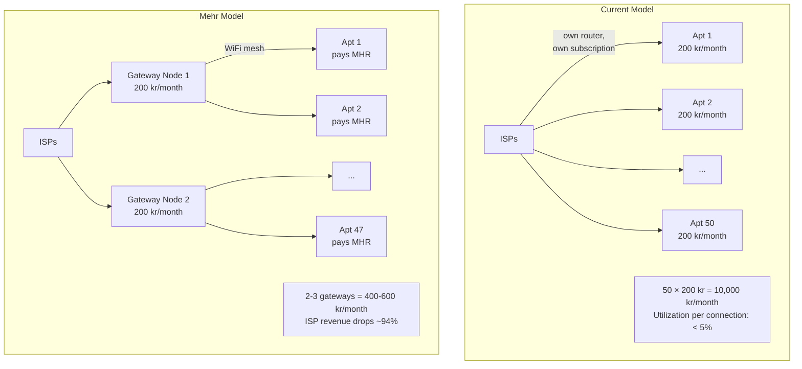

# Real-World Economics

Mehr doesn't exist in a vacuum. It interacts with the existing internet economy — ISPs, cloud providers, and the people who pay for connectivity today. This page examines what happens when a mesh network meets existing infrastructure economics.

## The Apartment Building Scenario

Consider a typical apartment building in Denmark:



### Why This Works

Residential internet connections are massively over-provisioned. A 1 Gbps connection serving one household averages under 50 Mbps actual usage, and most of that is concentrated in evening hours. The infrastructure exists to handle peak load, but sits idle the vast majority of the time.

With Mehr, 2-3 well-placed gateway nodes with good internet connections can serve an entire building. The gateway operators earn MHR from the other residents — effectively becoming micro-ISPs within their building.

### What Happens to ISPs?

**Mehr doesn't kill ISPs. It restructures them.**

| Today | With Mehr |
|-------|-----------|
| ISPs sell per-household subscriptions | ISPs sell per-building or per-community connections |
| Revenue depends on subscriber count | Revenue depends on bandwidth sold |
| Last-mile infrastructure to every apartment | Last-mile to building entry point; mesh handles internal distribution |
| ISPs handle per-customer support | Gateway operators handle local support |
| ISPs own the customer relationship | The community owns its own network |

The key insight: **ISPs already don't want to be last-mile providers.** Last-mile infrastructure (running cable to every apartment) is their most expensive, lowest-margin business. Mehr handles last-mile distribution through the mesh, letting ISPs focus on what they're actually good at — backbone transit and peering.

ISPs would likely respond by:
1. Offering **building connections** — one fat pipe per building at a higher bandwidth tier
2. Pricing by **bandwidth consumed**, not by connection count
3. Becoming **backbone providers** to Mehr gateway operators
4. Running their own **Mehr backbone nodes** to earn routing fees

### The Math for Gateway Operators

```
Gateway operator costs:
  Internet subscription: 200 kr/month
  Hardware (Pi 4 + LoRa + modem): ~300 kr one-time (~25 kr/month amortized over 1 year)
  Total: ~225 kr/month

Gateway operator revenue:
  ~47 apartments paying for shared internet
  If each pays 50 kr/month equivalent in MHR: 2,350 kr/month
  After subtracting costs: ~2,125 kr/month profit

Resident savings:
  Was paying: 200 kr/month
  Now paying: ~50 kr/month in MHR
  Saving: 150 kr/month (75% reduction)
```

Both sides win. Gateway operators earn significant income from hardware they'd have anyway. Residents save money. The only loser is the ISP's per-household billing model — which was always an artifact of last-mile economics, not actual cost.

## How You Earn on Mehr

Every node earns proportionally to the value it provides:

### Relay Earnings

The simplest way to earn. Any node that forwards packets for non-trusted traffic participates in the [stochastic relay lottery](payment-channels). More traffic through your node = more lottery wins = more MHR.

```
Relay earnings estimate (at ~5 μMHR expected reward per packet):
  Minimal relay (ESP32 + LoRa): ~5,000–50,000 μMHR/month
    → ~30-300 packets/day, zero operating cost (solar powered)

  Community bridge (Pi Zero + WiFi): ~50,000–500,000 μMHR/month
    → Bridges LoRa to WiFi, moderate traffic

  Gateway (Pi 4 + cellular): ~500,000–5,000,000 μMHR/month
    → Internet uplink, high-value traffic

  Backbone (mini PC + directional WiFi): 5,000,000+ μMHR/month
    → High-throughput transit between mesh segments
```

### Storage Earnings

Nodes with disk space earn by storing data for the network via [MHR-Store](../services/mhr-store):

- Store popular content that others request frequently
- Host replicated data for availability
- Cache content for faster local access

### Compute Earnings

Nodes with CPUs or GPUs earn by executing contracts and offering inference via [MHR-Compute](../services/mhr-compute):

- Run MHR-Byte contracts for constrained nodes
- Offer WASM execution for heavier workloads
- Provide ML inference (speech-to-text, translation, image generation)

### Gateway Earnings

The highest-value service. Internet gateway operators earn from:

- HTTP proxy services
- DNS relay
- Bridge traffic between mesh and internet
- All of the above, plus relay/storage/compute earnings

### What Makes a Node Valuable?

The marketplace naturally prices capabilities based on scarcity and utility:

| Factor | Effect on Earnings |
|--------|-------------------|
| **Connectivity** | More links = more routing traffic = more relay earnings |
| **Location** | Strategic position (bridge between clusters) = higher routing value |
| **Uptime** | 24/7 availability = more agreements, better reputation |
| **Storage capacity** | More disk = more storage contracts |
| **Compute power** | GPU = high-value inference contracts |
| **Internet access** | Gateway capability = premium pricing |
| **Trust network size** | More trusted peers = higher credit lines, more routing |

## Broader Economic Implications

### For Developing Regions

In areas with no ISP at all, Mehr enables community networks from scratch:

1. One satellite or cellular connection serves an entire village via mesh
2. The gateway operator earns from the community
3. Community members earn by relaying for each other and for outsiders
4. Economic activity within the mesh is free (trusted peers)
5. External connectivity costs are shared, not per-household

### For Urban Areas

In cities where internet is available but expensive:

1. Shared internet connections reduce per-household costs by 50-75%
2. Local services (storage, compute, messaging) run on the mesh with no cloud dependency
3. Community infrastructure becomes an income source, not a cost center

### For Censorship-Resistant Communication

When governments control the internet:

1. The mesh operates independently of ISP infrastructure
2. Even if internet gateways are shut down, local communication continues
3. Gateway nodes with satellite uplinks or VPN tunnels become high-value — and the market prices them accordingly
