# How Mehr Works (Simple Version)

No jargon. No technical details. Just how it works.

## The Problem

When you send a message to your neighbor across the street, it travels like this:

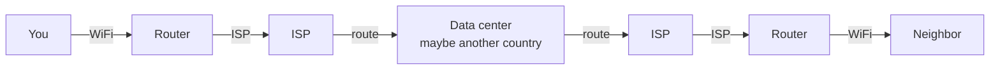

Your message travels hundreds of miles to reach someone 50 feet away. You pay a phone company for this. If the company shuts off your service — or a government tells them to — you can't communicate at all.

## The Solution

Mehr lets devices talk directly:

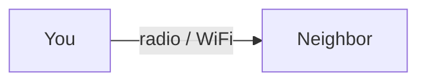

No phone company. No data center. No monthly bill. Just devices talking.

## How It Gets Bigger

One house talking to another is nice, but not very useful by itself. Mehr gets useful when many devices form a chain:

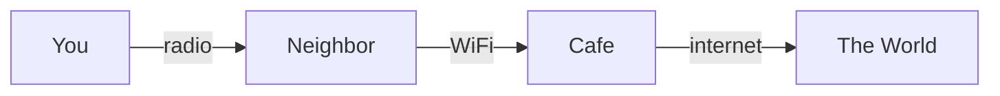

Each device passes messages along, like a bucket brigade. Your message hops from device to device until it reaches its destination. This chain of devices is called a **mesh**.

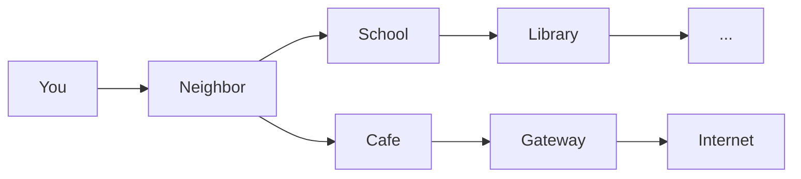

Messages find the best path automatically. If the cafe goes offline, traffic routes through the school instead. No single point of failure.

## Three Rules

**Rule 1: Friends help for free.**

You mark people as "trusted" — like adding a contact. Your devices help each other automatically, at no cost. A neighborhood where everyone trusts each other communicates completely free.

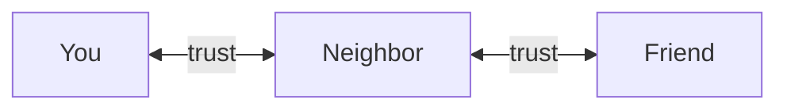

> Messages between these three: always free. No tokens. No payments. No overhead.

**Rule 2: Strangers pay a tiny fee.**

If your message passes through a stranger's device, you pay a tiny fee. This is fair — they're using their electricity and bandwidth to help you.

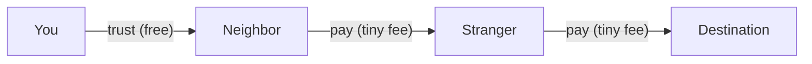

**Rule 3: Helping earns you credit.**

Every time your device passes along someone else's message, you earn credit. This credit is called **MHR**. You spend MHR when you use the network. You earn MHR when others use yours.

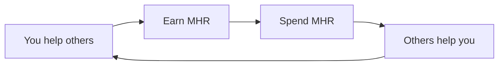

## What You Can Do

| What | How | Cost |
|------|-----|------|
| Message a friend | Like texting, but encrypted | Free |
| Message a stranger | Same, routed through the mesh | Tiny fee |
| Browse social feeds | See headlines and previews | Free |
| Read full posts | Tap to open content you want | Small fee to author |
| Post content | Text, photos, music, anything | You pay to publish |
| Host a website | Your device serves it | Visitors pay their own way |
| Make a voice call | Works well on WiFi | Same as messaging |
| Store files | Other devices keep copies | Small ongoing fee |

## Social Media on Mehr

Every post has two layers:

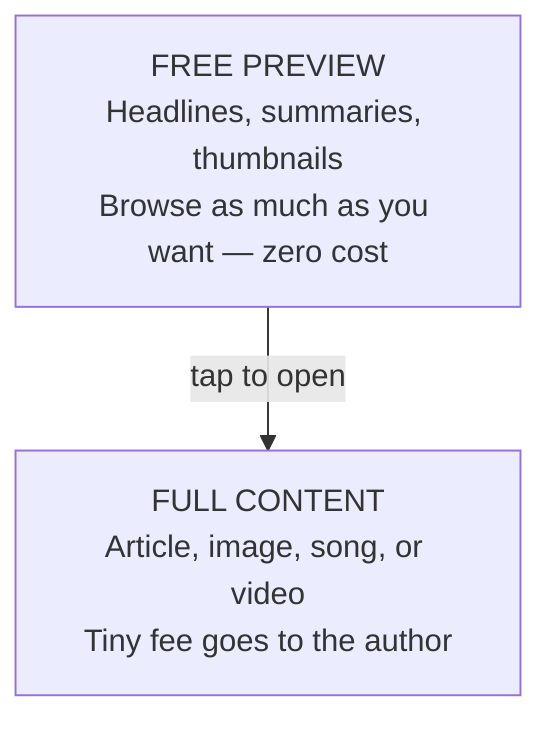

**Popular posts pay for themselves.** If enough people read a post, the author earns more than it cost to publish. Posts nobody reads expire naturally — no moderator needed.

**No algorithm decides what you see.** You follow people. You subscribe to topics ("gaming", "local news"). You follow curators — real humans who pick the best stuff. Your feed is what you chose, in chronological order.

## The Money Part

MHR is like tokens at an arcade. You earn them by helping (relaying messages, storing data) and spend them by using (reaching distant people, reading content).

**Can I buy MHR with real money?** The network doesn't have a store, but people may sell tokens to each other. This is fine — someone earned those tokens through real work.

**Can I get rich from MHR?** That's not the point. MHR is designed to be spent, not saved. It's bus tokens, not stocks.

**What if I have no tokens?** You can still talk to your friends for free. MHR only matters when your messages cross through strangers' devices.

## What If I Don't Have Internet?

That's the whole point. Mehr works with:

| Connection | Speed | What you can do |
|-----------|-------|----------------|
| Radio (LoRa) | Slow but long range (up to 15 km) | Text messages, headlines, basic feeds |
| WiFi | Fast, short range | Everything — photos, video, calls |
| Cellular | Fast, wide range | Everything |
| Satellite | Fast, expensive | Gateway for an entire community |
| Anything else | Varies | If it moves bytes, Mehr uses it |

A village with no internet can communicate over radio. Add one satellite dish and the whole village gets internet access through the mesh — shared, at a fraction of the individual cost.

**Traditional model** (everyone pays separately — total: $1,500/month):

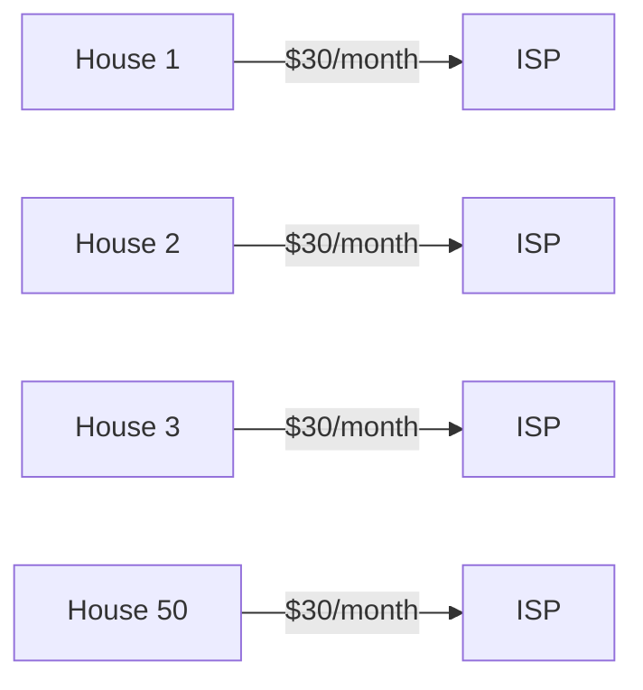

**Mehr model** (shared through the mesh — total: ~$30/month + tiny MHR fees):

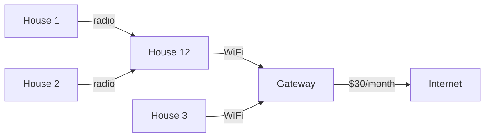

> Gateway operator earns from the neighborhood. Everyone else saves 75%+.

## Who Controls It?

Nobody. There is no company behind Mehr. No server to shut down. No account to ban. No terms of service to accept.

- **Your identity** is a cryptographic key on your device. No email, no phone number, no real name required.
- **Your data** lives on your device and your community's devices — not on a corporate server.
- **Your feed** is what you chose to follow — not what an algorithm chose for you.
- **Your content** stays up as long as you (or your readers) pay for it — no platform can remove it.

## The Big Picture

**Traditional internet:**

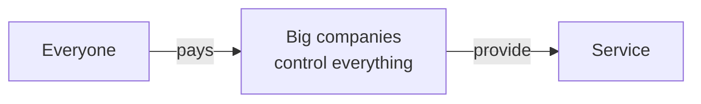

**Mehr:**

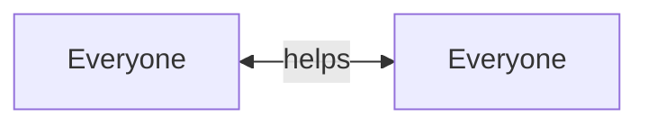

## Want to Learn More?

- [FAQ](faq) — answers to common questions in plain language
- [Introduction](introduction) — the full technical overview
- [MHR Token](economics/mhr-token) — how the economy works in detail
- [Social](applications/social) — how social media works on Mehr
- [Real-World Economics](economics/real-world-impact) — actual cost savings and earnings
