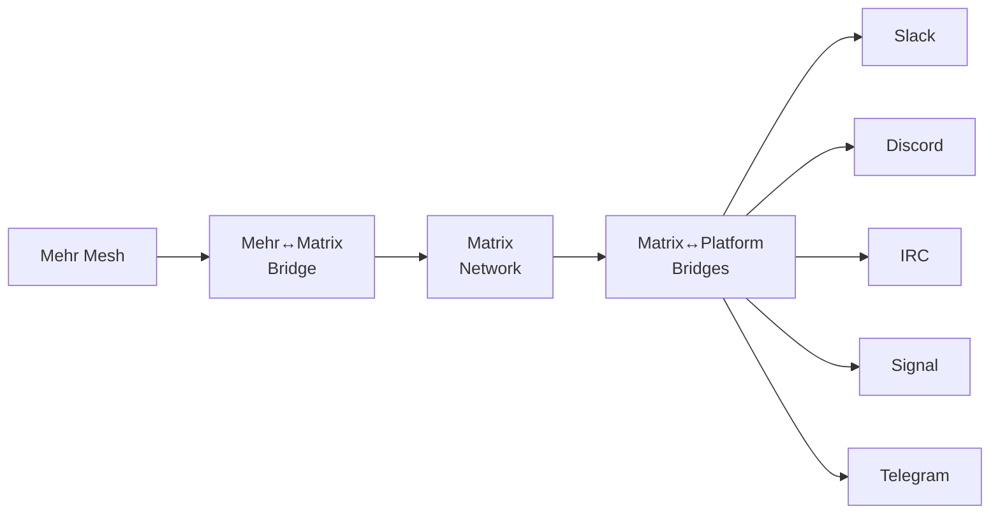

# Matrix Bridge

[Matrix](https://matrix.org/) is the strategic bridge target for Mehr. Not because Matrix is the most philosophically aligned protocol — [Scuttlebutt](scuttlebutt) holds that distinction — but because Matrix is the **most connected**. Matrix's federation protocol already bridges to IRC, Slack, Discord, Signal, Telegram, WhatsApp, and dozens of other platforms. A single Mehr↔Matrix bridge gives Mehr transitive access to all of them.



One bridge. Dozens of reachable networks. This is the multiplier effect.

:::tip[Key Insight]
Matrix is the strategic bridge target because of its transitive connectivity. A single Mehr↔Matrix bridge gives Mehr access to IRC, Slack, Discord, Signal, Telegram, and every other platform Matrix already bridges to — one integration, dozens of networks.
:::

## Why Matrix

| Property | Value for Mehr |
|----------|---------------|
| **Open standard** | Fully specified ([spec.matrix.org](https://spec.matrix.org/)), no vendor lock-in |
| **Federation** | No central server — homeservers federate like email. Bridge runs its own homeserver. |
| **E2E encryption** | Olm/Megolm (Double Ratchet-based). Widely deployed. |
| **Rich ecosystem** | Element, FluffyChat, Nheko, Cinny — dozens of clients across all platforms |
| **Bridge infrastructure** | Mature bridge ecosystem via [matrix-appservice-bridge](https://github.com/matrix-org/matrix-appservice-bridge) |
| **Room model** | Rooms are the unit of communication — maps to Mehr's pub/sub topics |
| **DAG-based state** | Room state is a directed acyclic graph (not a linear chain). Handles concurrent events. |
| **Active development** | Matrix 2.0 (sliding sync, OIDC, VoIP) actively evolving |

**What Matrix lacks that Mehr provides**: Offline operation, mesh radio transport, constrained-device support, economic incentives, partition tolerance. Matrix assumes always-on internet — a Mehr bridge extends Matrix's reach to off-grid communities.

## Architecture

The Mehr↔Matrix bridge is an L2 Mehr node that also runs a Matrix homeserver (or connects to one as an application service).

### Deployment Options

**Option A: Bridge with Embedded Homeserver (Recommended)**

The bridge runs its own lightweight Matrix homeserver (e.g., [Conduit](https://conduit.rs/) — written in Rust, low resource usage):

```
┌──────────────────────────────────────────┐
│          Mehr↔Matrix Bridge Node          │
│                                           │
│  ┌──────────────┐  ┌───────────────────┐ │
│  │  Mehr L2      │  │  Conduit          │ │
│  │  Stack        │  │  (Matrix HS)      │ │
│  │               │  │                   │ │
│  │  • MHR-Store  │  │  • Federation     │ │
│  │  • MHR-Pub    │  │  • Room state     │ │
│  │  • MHR-DHT    │  │  • E2E (Megolm)   │ │
│  │  • Marketplace│  │  • Media store    │ │
│  └──────┬────────┘  └────────┬──────────┘ │
│         │                     │            │
│  ┌──────┴─────────────────────┴──────────┐ │
│  │         Translation Layer              │ │
│  │                                        │ │
│  │  • Room ↔ Topic mapper                │ │
│  │  • User ↔ Identity attestation        │ │
│  │  • Message format translator          │ │
│  │  • Media ↔ DataObject mapper          │ │
│  │  • E2E re-encryption handler          │ │
│  └────────────────────────────────────────┘ │
│                                           │
│  Internet ←→ Matrix federation            │
│  Mesh     ←→ Mehr network                 │
└──────────────────────────────────────────┘
```

**Advantage**: Self-contained. The bridge controls its own homeserver, can operate in restricted federation mode, and doesn't depend on external homeserver operators.

**Option B: Application Service on Existing Homeserver**

The bridge registers as a [Matrix application service](https://spec.matrix.org/latest/application-service-api/) on an existing homeserver (e.g., a community Synapse/Dendrite instance):

```
[Existing Homeserver] ←─ appservice ─→ [Mehr Bridge] ←─ mesh ─→ [Mehr Network]
```

**Advantage**: Uses existing homeserver infrastructure. Community that already runs a Matrix server adds Mehr connectivity with just the bridge component.

**Disadvantage**: Depends on external homeserver operator. Bridge availability tied to homeserver uptime.

## Room ↔ Topic Mapping

Matrix rooms map to Mehr [MHR-Pub](../services/mhr-pub) topics and [scope subscriptions](../economics/trust-neighborhoods).

### Mapping Rules

```
Matrix Room                        Mehr Equivalent
───────────                        ───────────────
#general:example.org          →    topic:general
#portland-mesh:example.org    →    geo:us/oregon/portland
#dev:mehr.network             →    topic:mehr/dev
!roomid:server (unnamed)      →    topic:bridge/<room_id_hash>
```

| Matrix Concept | Mehr Concept | Translation |
|---------------|-------------|-------------|
| Room | MHR-Pub topic + scope | Bridge creates/joins corresponding topic |
| Room membership | Scope subscription | Join room → subscribe to topic |
| Message (m.room.message) | DataObject + Pub notification | Content stored in MHR-Store, notification via MHR-Pub |
| Room state events | Mutable DataObjects | Room name, topic, avatar → mutable DataObjects in DHT |
| Reactions | DataObject references | Reaction → small DataObject referencing original |
| Threads | DataObject reply chain | Thread root → DataObject; replies reference parent |
| Media (images, files) | DataObjects with MIME metadata | Stored in MHR-Store; served to Matrix via homeserver media API |

### Bidirectional Sync

**Matrix → Mehr**:

1. Bridge's homeserver receives federated events for bridged rooms
2. Translation layer converts each event to Mehr DataObjects
3. DataObjects stored in [MHR-Store](../services/mhr-store)
4. [MHR-Pub](../services/mhr-pub) notifies Mehr subscribers of the new content
5. Mehr users see Matrix messages attributed to Matrix identities (via bridge attestation)

**Mehr → Matrix**:

1. Bridge subscribes to relevant Mehr topics via MHR-Pub
2. New Mehr posts trigger translation to Matrix events
3. Bridge's homeserver sends events to bridged rooms via federation
4. Matrix users see Mehr messages attributed to virtual Matrix users (e.g., `@mehr_a1b2c3d4:bridge.mehr.network`)

### Virtual Users

The bridge creates Matrix "ghost" users for each Mehr identity that sends messages through the bridge:

```
Mehr identity: a1b2c3d4e5f6a7b8
Matrix ghost:  @mehr_a1b2c3d4:bridge.mehr.network
Display name:  "alice [Mehr]" (if Mehr profile has display name)
Avatar:        Bridged from Mehr profile (if available)
```

Matrix users can message these ghost users directly (DMs) or interact with them in rooms. The bridge translates all interactions back to Mehr.

## Identity

### Matrix → Mehr Attestation

A Matrix user wanting a Mehr identity:

1. Creates a Mehr Ed25519 keypair (or uses existing one)
2. Sends a verification message to the bridge bot in Matrix: `!mehr verify a1b2c3d4...`
3. Bridge sends a challenge to the Mehr identity
4. User signs the challenge with their Mehr key and responds
5. Bridge creates and stores the attestation:

```
MatrixBridgeAttestation {
    mehr_pubkey: Ed25519PublicKey,
    matrix_user_id: "@alice:example.org",
    bridge_node: NodeID,
    challenge: [u8; 32],
    mehr_signature: Ed25519Signature,    // Mehr key signs challenge
    matrix_proof: String,                // Matrix message ID containing Mehr pubkey
    timestamp: LamportTimestamp,
}
```

### Mehr → Matrix Attestation

A Mehr user wanting to be reachable from Matrix:

1. User connects to the bridge service on the Mehr network
2. Bridge provides a Matrix ghost user ID for their Mehr identity
3. User can optionally claim an existing Matrix account (via the challenge flow above)
4. Without claiming: messages from Mehr appear from the ghost user
5. With claiming: messages appear from their real Matrix account (bridge posts on their behalf via application service)

## Message Format Translation

### Text Messages

```
Matrix event (m.room.message):          Mehr DataObject:
{                                       {
  "type": "m.room.message",              hash: Blake3(content),
  "content": {                           owner: bridge_node_id,
    "msgtype": "m.text",                 type: Immutable,
    "body": "Hello from Matrix!",        data: {
    "format": "org.matrix.custom.html",    text: "Hello from Matrix!",
    "formatted_body": "<b>Hello</b>..."    format: "html",
  },                                       source: "matrix",
  "sender": "@alice:example.org",          sender_attestation: <hash>,
  "origin_server_ts": 1706000000000      },
}                                       }
```

**Format preservation**: Matrix supports HTML formatting. The bridge preserves this in Mehr DataObject metadata. Mehr clients that understand HTML render it; others display the plaintext `body` fallback.

### Media Messages

Matrix media (images, video, files) are uploaded to the homeserver's media repository. The bridge:

1. Downloads media from Matrix homeserver
2. Stores as Mehr immutable DataObject in [MHR-Store](../services/mhr-store)
3. Sets `min_bandwidth` based on file size:
   - Images below 50 KB: `min_bandwidth: 1200` (OK for LoRa)
   - Images 50 KB-1 MB: `min_bandwidth: 10000` (WiFi only)
   - Video/large files: `min_bandwidth: 100000` (broadband only)
4. Mehr clients receive metadata (filename, size, type) over any link; content downloads only when bandwidth permits

Going the other direction:

1. Mehr DataObject with media content arrives at bridge
2. Bridge uploads to its Matrix homeserver media repository
3. Bridge posts Matrix message with `mxc://` media URL
4. Matrix clients download media from the homeserver as usual

### Encrypted Messages (Megolm ↔ Mehr E2E)

Matrix E2E uses Megolm (a group ratchet). Mehr uses per-recipient E2E encryption. These are fundamentally different:

- **Megolm**: One outbound session key per sender per room. All room members decrypt with the same session key. Efficient for groups.
- **Mehr E2E**: Each message encrypted individually for each recipient's Ed25519 public key. More expensive for large groups but simpler.

**Bridge handling**:

For **E2E rooms**, the bridge must be a member of the room's Megolm session to decrypt messages. This means:

- Bridge is trusted with plaintext (same as any room member)
- Bridge decrypts from Megolm, re-encrypts with Mehr E2E for destination
- Users are warned: E2E guarantee is bridge-to-endpoint, not true end-to-end across the bridge

For **unencrypted rooms** (common for public channels), no re-encryption is needed — the bridge simply translates the message format.

:::caution[Trade-off]
Matrix E2E (Megolm group ratchet) and Mehr E2E (per-recipient encryption) are fundamentally different. The bridge must be a Megolm session member to decrypt, making it a trust boundary. True end-to-end encryption across the bridge is not possible — only bridge-to-endpoint.
:::

**Recommendation**: Use unencrypted Matrix rooms for public/community bridging. For private conversations that require E2E, both parties should be on the same protocol.

## Payment Flows

### Public Channel Bridging

Community rooms (public, unencrypted) bridged at the bridge operator's discretion:

```
Revenue model for bridge operator:
  • Mehr users pay per-message via service agreement (e.g., 10 μMHR/message)
  • Matrix users use the room for free (standard Matrix)
  • Bridge operator pays:
    - Homeserver hosting costs (fiat)
    - Mehr relay costs for outbound (MHR)
    - MHR-Store costs for caching Matrix content (MHR)
  • Bridge operator earns:
    - Service fees from Mehr users
    - Optionally: MHR relay rewards for hosting a well-connected node
```

### Direct Message Bridging

DMs between a Mehr user and a Matrix user:

```
Mehr user → Bridge:
  Pays per-message service fee (marketplace agreement)
  Bridge handles Matrix delivery

Matrix user → Bridge:
  Free (standard Matrix)
  Bridge pays Mehr relay costs for delivery to mesh
  Bridge recoups via:
    - Inbound delivery fee charged to Mehr recipient
    - Or subsidized as part of public bridge operation
    - Or donation-supported
```

### Self-Hosting Economics

A community running its own bridge:

- Operate a Raspberry Pi as both Matrix homeserver (Conduit) and Mehr L2 node
- Bridge their community Matrix room to their local Mehr mesh
- **Zero external cost** if all parties are in the community's [trust neighborhood](../economics/trust-neighborhoods) (free relay)
- Internet connectivity only needed for Matrix federation to the wider Matrix network
- If internet goes down, local Mehr mesh continues; Matrix bridge resumes when connectivity returns

## Offline and Partition Behavior

Matrix assumes persistent internet. Mehr doesn't. The bridge handles the mismatch:

### Bridge Online (Normal Operation)

- Messages flow bidirectionally in near real-time
- Matrix federation delivers to/from the bridge homeserver
- Mehr pub/sub delivers to/from mesh subscribers
- Latency: Matrix-side ~1s (internet), Mehr-side 2-30s (depending on transport)

### Bridge Offline (Internet Down, Mesh Up)

- Matrix federation stops — no new messages from Matrix network
- Mehr mesh continues operating independently
- Local Mehr users still communicate with each other
- Bridge queues outbound Matrix messages for delivery when internet returns
- On reconnection: queued messages sent, missed Matrix messages synced via federation backfill

### Bridge Partitioned (Mesh Splits)

- Mehr mesh partition: each partition's bridge node continues operating independently
- If a room is bridged by multiple bridge nodes in different partitions, each operates independently
- On partition heal: Mehr's CRDT-based state converges; duplicate messages are deduplicated by content hash

### Extended Offline

If the bridge is offline for an extended period:

- Matrix: Federation handles backfill. Bridge catches up on all missed events when it reconnects (Matrix homeservers cache events for offline servers).
- Mehr: [MHR-Store](../services/mhr-store) preserves messages. Bridge retrieves missed Mehr posts from the DHT on reconnection.

No messages are lost in either direction, assuming storage nodes on both sides remain operational during the outage.

## Deployment Guide

### Minimum Hardware

| Component | Specification |
|-----------|--------------|
| **Device** | Raspberry Pi 4 (2 GB RAM minimum, 4 GB recommended) |
| **Storage** | 32 GB SD card (64 GB for active communities) |
| **Network** | Internet connectivity (WiFi or Ethernet) + Mehr mesh interface |
| **Mehr interface** | USB-connected RNode (LoRa) or WiFi (for internet-only Mehr) |

### Software Stack

```
┌─────────────────────────────┐
│  Conduit (Matrix homeserver) │  Port 8448 (federation)
│  Rust, ~50 MB RAM           │  Port 443 (client API)
├─────────────────────────────┤
│  Mehr L2 daemon             │  Reticulum transport
│  Rust, ~30 MB RAM           │
├─────────────────────────────┤
│  Bridge service              │  Connects both stacks
│  Rust, ~20 MB RAM           │
└─────────────────────────────┘
  Total: ~100 MB RAM + OS
```

### Configuration

```
# bridge.toml

[matrix]
homeserver = "bridge.mehr.network"    # federation domain
port = 8448
registration_enabled = false          # ghost users only, no public registration

[mehr]
node_identity = "path/to/keyfile"
trust_config = "path/to/trust.toml"
marketplace_fee = 10                  # μMHR per bridged message

[bridge]
rooms = [
    { matrix = "#community:example.org", mehr_scope = "topic:community" },
    { matrix = "#portland:example.org", mehr_scope = "geo:us/oregon/portland" },
]
media_max_size = 5_000_000            # 5 MB max media bridge
media_min_bandwidth = 10000           # only bridge media to WiFi+ links
```

## Comparison with Existing Matrix Bridges

Matrix already has bridges to many platforms. How does a Mehr bridge compare?

| Aspect | Typical Matrix Bridge | Mehr↔Matrix Bridge |
|--------|----------------------|-------------------|
| **Transport** | Internet-only (HTTP API) | Mesh + internet (LoRa, WiFi, cellular) |
| **Availability** | Requires both sides online | Mehr side tolerates offline, store-and-forward |
| **Economics** | Free (bridge operator absorbs costs) | Service marketplace — bridge earns MHR |
| **Identity** | Platform-specific (Slack ID, Discord tag) | Cryptographic (Ed25519 attestation) |
| **E2E** | Varies (some bridges break E2E) | Explicitly handled — users warned about trust boundary |
| **Decentralized** | Bridge is a single point of failure | Multiple bridge operators possible per room |
| **Partition tolerant** | No — internet outage breaks bridge | Yes — Mehr side continues, reconciles on reconnect |

The Mehr bridge is unique in that the bridged network (Mehr) can operate independently during internet outages. This makes it particularly valuable for communities in areas with unreliable connectivity — they get Matrix-world access when internet is available and local mesh communication when it's not.
