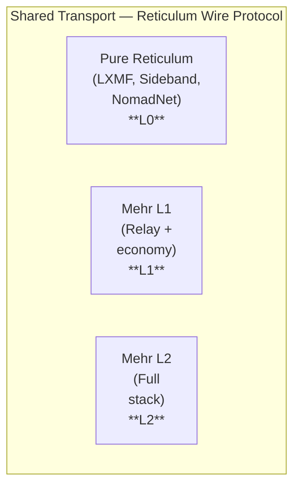

# Reticulum Ecosystem

Mehr is built on [Reticulum](https://reticulum.network/). This isn't a bridge — it's coexistence. Mehr extends Reticulum with economic primitives, storage, compute, and a capability marketplace. Pure Reticulum applications (LXMF, Sideband, NomadNet) already share the same transport layer. The question isn't *how to bridge* but *how to coexist gracefully and offer an upgrade path*.

## The Relationship



All three participation levels share the same Reticulum transport. An L0 node running Sideband and an L2 node running full Mehr relay packets for each other on the same mesh. They use the same encryption, the same announce mechanism, the same link establishment protocol.

Mehr's economic extensions ([CompactPathCost](/docs/L1-network/network-protocol#mehr-extension-compact-path-cost), VRF lottery proofs, settlement records) are carried as opaque payload in Reticulum's announce DATA field. Pure Reticulum nodes forward these announces without parsing the Mehr-specific bytes — they just see more data in the announce and relay it.

## LXMF Compatibility

[LXMF](https://github.com/markqvist/LXMF) (Lightweight Extensible Message Format) is Reticulum's message layer. Sideband and NomadNet use LXMF for messaging.

### How Messages Coexist

LXMF messages and Mehr messages both travel over Reticulum links. They are distinguished by their Reticulum **aspect** — the application identifier in the destination hash:

| Message Type | Reticulum Aspect | Handling |
|-------------|-----------------|----------|
| LXMF message | `lxmf.delivery` | Processed by LXMF-aware applications |
| Mehr DataObject | `mehr.store` | Processed by Mehr L2 nodes |
| Mehr Pub notification | `mehr.pub` | Processed by Mehr L2 nodes |

A node running both Sideband and Mehr L2 handles both aspects simultaneously. LXMF messages arrive through the LXMF stack. Mehr messages arrive through the Mehr stack. Same radio, same transport, different application handlers.

### LXMF-to-Mehr Message Translation

For users who want Sideband contacts to receive Mehr messages (or vice versa), a bridge service translates between the two:

```
LXMF Message                    Mehr Message
┌──────────────────┐            ┌──────────────────┐
│ source_hash      │   Bridge   │ sender: NodeID   │
│ destination_hash │  ────────→ │ recipient: NodeID│
│ content          │            │ DataObject       │
│ timestamp        │            │   (immutable)    │
│ title (optional) │            │ MHR-Pub notify   │
│ fields (dict)    │            │ payment: channel │
└──────────────────┘            └──────────────────┘
```

**Translation details**:

1. **Identity**: LXMF uses Reticulum destination hashes (derived from Ed25519 keys). Mehr uses the same Ed25519 keys and the same destination hash derivation. **Identity is natively shared** — no attestation needed if the user controls the same key on both sides.

2. **Content**: LXMF `content` field → Mehr immutable DataObject (stored in [MHR-Store](/docs/L5-services/mhr-store)). LXMF `fields` dict → Mehr DataObject metadata.

3. **Delivery**: LXMF delivery → Mehr [MHR-Pub](/docs/L5-services/mhr-pub) notification. The bridge publishes a Pub notification that triggers Mehr-side delivery.

4. **Encryption**: Both use the same underlying crypto (X25519 ECDH + symmetric cipher). LXMF link encryption maps directly to Reticulum link encryption, which is the same link encryption Mehr uses. No re-encryption needed at the bridge for transport-layer security. E2E encryption differs: LXMF uses Reticulum's built-in E2E; Mehr uses its own envelope format. The bridge re-wraps E2E content.

### Shared Identity (Zero-Cost Bridge)

Because LXMF and Mehr both derive identity from Ed25519 keypairs via Reticulum's destination hash:

- A user with the same keypair is **the same identity** on both LXMF and Mehr
- No attestation, no bridge registration, no identity mapping
- Sideband shows your Reticulum hash. Mehr shows the same hash.
- If Alice's Sideband identity is `a1b2c3d4...`, her Mehr identity is `a1b2c3d4...`

This means a "bridge" for existing Reticulum users is really just **running Mehr alongside their existing Reticulum applications**. Same key, same identity, additional capabilities.

:::tip[Key Insight]
LXMF and Mehr share the same Ed25519 keypair and Reticulum destination hash derivation. A user’s Sideband identity and Mehr identity are cryptographically identical — no attestation, registration, or bridge configuration needed.
:::

## Sideband Integration

[Sideband](https://github.com/markqvist/Sideband) is the most popular Reticulum messaging application — available on Android, Linux, and macOS.

### Coexistence Path

Sideband users adopt Mehr in stages:

**Stage 1: Shared Transport (Today)**

- Sideband and Mehr daemon run on the same device
- Both register with the local Reticulum instance
- Both use the same radio interfaces
- No interaction between the two — they share transport, not data

**Stage 2: Unified Contact List**

- Mehr reads Sideband's known destinations (same key format)
- Contacts appear in both applications
- Messages between two Mehr users go through Mehr (with economics, storage)
- Messages to Sideband-only users go through LXMF (free, no economics)

**Stage 3: Mehr-Enhanced Sideband**

- Sideband plugin or fork that optionally uses Mehr services:
  - **MHR-Store** for persistent message storage (Sideband messages are ephemeral)
  - **MHR-Pub** for group notifications (Sideband has limited group support)
  - **MHR-DHT** for contact discovery beyond direct announces
  - **Payment channels** for relay incentives (Sideband relays are volunteer-only)

**Stage 4: Sideband as Mehr Frontend**

- Sideband evolves into a Mehr client application
- All messaging uses Mehr primitives
- LXMF compatibility maintained as a legacy bridge
- The Sideband UI, which is already familiar to the Reticulum community, becomes a Mehr frontend

This path is **not a hostile takeover**. Each stage is optional. Many Sideband users may never go past Stage 1, and that's fine — they're already contributing to the transport layer by running Reticulum nodes.

## NomadNet Integration

[NomadNet](https://github.com/markqvist/NomadNet) is a terminal-based communication platform on Reticulum — messaging, file sharing, and microblogging via a text-based interface.

### Bridgeable Features

| NomadNet Feature | Mehr Equivalent | Bridge Approach |
|-----------------|----------------|-----------------|
| Pages (microblog) | [Social posts](/docs/L6-applications/social) | NomadNet page → Mehr `PostEnvelope` DataObject |
| File hosting | [MHR-Store](/docs/L5-services/mhr-store) | NomadNet hosted files → Mehr DataObjects with storage agreements |
| Messaging | [Messaging](/docs/L6-applications/messaging) | LXMF translation (same as above) |
| Node directory | [MHR-DHT](/docs/L5-services/mhr-dht) | NomadNet announces → Mehr DHT entries |

NomadNet's page system (Markdown-like `.mu` format) maps naturally to Mehr's social layer. A bridge can publish NomadNet pages as Mehr social posts and vice versa — expanding the audience for NomadNet content to Mehr users.

## RNode Hardware

[RNode](https://reticulum.network/manual/hardware.html) is the reference hardware for Reticulum — a LoRa transceiver firmware that runs on common ESP32+LoRa boards. RNodes are used by both Reticulum/Sideband and can serve Mehr.

### RNode as Mehr Transport

An RNode running its standard firmware serves as a radio modem for a host running Reticulum. If that host also runs Mehr, the RNode provides LoRa transport for Mehr traffic — no RNode firmware changes needed.

```
[Raspberry Pi]
  ├── Reticulum daemon
  ├── Mehr L2 daemon
  └── USB serial ──→ [RNode (ESP32 + LoRa)]
                          │
                     LoRa radio
                          │
                     [Other nodes]
```

### RNode with Mehr L1

For standalone operation (no host computer), an RNode can be extended with Mehr L1 firmware:

- Parse CompactPathCost from announces
- Run VRF relay lottery
- Maintain minimal payment channel state (200 bytes per channel)
- Report to a nearby L2 node for settlement

This turns a $15-25 RNode into a self-contained, revenue-generating Mehr relay. The same hardware that today serves as a volunteer Reticulum modem becomes an economically incentivized node.

## Protocol Compatibility Details

### Announce Format

Reticulum announces carry a DATA field that applications can populate. Mehr uses this field for CompactPathCost and capability advertisements:

```
Reticulum Announce:
  ├── destination_hash (16 bytes)
  ├── public_key (32 bytes)
  ├── app_data (variable)       ← Mehr extensions go here
  │     ├── CompactPathCost (6 bytes)
  │     ├── capability_bitfield (2 bytes)
  │     ├── cost_tier (1 byte)
  │     └── load (1 byte)
  └── signature (64 bytes)

Total Mehr overhead in announce: ~10 bytes
```

Pure Reticulum nodes see the `app_data` field but don't parse it — they forward the announce with the field intact. Mehr-aware nodes parse it and use it for routing and marketplace decisions.

**Backward compatibility**: If a pure Reticulum application sets its own `app_data`, Mehr nodes ignore unrecognized formats. The `0x4D48` ("MH") magic prefix identifies Mehr-specific app_data.

### Link Encryption

Reticulum provides link-layer encryption:
- X25519 ECDH key exchange
- AES-256-CBC (current) or ChaCha20-Poly1305 (future)
- Counter-based nonces
- Automatic key rotation

Mehr uses this encryption directly — no additional link-layer crypto. E2E encryption is an additional layer on top, but transport security is inherited from Reticulum.

### Gossip Bandwidth

Mehr's [gossip protocol](/docs/L1-network/network-protocol#gossip-protocol) operates within a strict bandwidth budget (10% of link capacity, tiered). On a shared Reticulum transport, this budget covers both Mehr gossip and Reticulum's native announce propagation:

| Traffic Type | Budget Allocation |
|-------------|-------------------|
| Reticulum announces (routing) | Part of Tier 1 (3%) |
| Mehr CompactPathCost gossip | Part of Tier 2 (3%) |
| Mehr service/DHT/pub gossip | Tier 3 (2%) |
| Mehr social/trust gossip | Tier 4 (2%) |
| LXMF message delivery | User traffic (90% budget) |
| Mehr data transfer | User traffic (90% budget) |

LXMF messages and Mehr data transfers share the 90% user traffic budget. On constrained LoRa links, Mehr's priority queuing ensures high-priority messages (both LXMF and Mehr) are delivered first.

## Community Considerations

The Reticulum community values simplicity, volunteer operation, and freedom from economic coercion. Mehr's economic layer could be seen as contradicting these values. The coexistence model addresses this:

1. **Opt-in economics**: No Reticulum user is forced to participate in Mehr economics. Running a pure Reticulum node alongside Mehr nodes works perfectly — L0 participation with zero economic overhead.

2. **Free between friends**: Mehr's [trust-based free tier](/docs/L3-economics/trust-neighborhoods) means a local Reticulum community can adopt Mehr and still relay for free among trusted peers. Economics only activate when traffic crosses trust boundaries.

3. **No protocol tax**: Mehr doesn't charge existing Reticulum traffic. LXMF messages between two Sideband users continue to flow for free even on a link shared with Mehr traffic.

4. **Volunteer operation remains viable**: Operators who want to relay without earning MHR simply run as L0 (or L1 with lottery earnings they ignore). The protocol doesn't require economic participation.

5. **Upstream contribution**: Mehr development benefits Reticulum — performance improvements, hardware support, and testing capacity flow back to the transport layer.

The goal is to be a **superset**, not a replacement. Reticulum is excellent at what it does. Mehr adds what it doesn't do (economics, storage, compute) without diminishing what it already provides.
:::caution[Trade-off]
Mehr’s economic layer risks alienating the Reticulum community, which values volunteer operation and simplicity. The coexistence model mitigates this: economics are strictly opt-in, LXMF traffic remains free, and L0 participation requires zero economic overhead.
:::