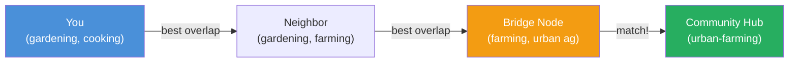

# Capability Discovery

Discovery uses concentric rings to minimize bandwidth while ensuring nodes can find the capabilities they need. Most needs are satisfied locally — physically close nodes are cheapest and fastest.

## Discovery Rings

### Ring 0 — Direct Neighbors

```
Scope: Nodes directly connected via any transport
Update frequency: Every gossip round (60 seconds)
Detail level: Full capability exchange
Cost: Free (direct neighbor communication)
```

This is the most detailed and most frequently updated view. A node knows exactly what its immediate neighbors can offer.

### Ring 1 — 2-3 Hops

```
Scope: Nodes reachable in 2-3 hops
Update frequency: Every few minutes
Detail level: Summarized capabilities, aggregated by type
Example: "There's a WASM node 2 hops away, cost ~X"
```

Capabilities are summarized to reduce gossip bandwidth. Instead of full advertisements, nodes share aggregated summaries using `CapabilitySummary` records:

```
CapabilitySummary {
    type: u8,           // matches beacon bitfield (0=relay, 1=gateway, 2=storage, etc.)
    count: u8,          // number of providers of this type (capped at 255)
    min_cost: u16,      // cheapest provider (log₂-encoded μMHR/byte)
    avg_cost: u16,      // average cost across providers (log₂-encoded)
    min_hops: u8,       // nearest provider (hop count)
    max_hops: u8,       // farthest provider (hop count)
}
// 8 bytes per capability type; typical Ring 1 summary: 5-6 types × 8 = 40-48 bytes

Cost encoding: identical to CompactPathCost log₂ formula:
  encoded = round(16 × log₂(value + 1))
  decoded = (2 ^ (encoded / 16.0)) - 1

Special values:
  0x0000 = free (0 μMHR) — valid for trusted-peer services
  0xFFFF = cost unknown or unavailable
```

A Ring 1 gossip message contains one `CapabilitySummary` per capability type present in the 2-3 hop neighborhood. Nodes that appear in multiple capability types are counted in each.

### Ring 2 — Trust Neighborhood

```
Scope: Nodes reachable through the trust graph (friends of friends)
Update frequency: Periodic, via trust-weighted gossip
Detail level: Neighborhood capability summary
Example: "Your neighborhood has 5 gateways, 20 storage nodes"
```

The trust graph provides a natural scope for aggregated capability information. Trusted peers share more detailed information than strangers — this is both efficient (trust = proximity in most cases) and privacy-preserving.

### Ring 3 — Beyond Neighborhood

```
Scope: Nodes beyond the trust graph
Update frequency: On demand (query-based)
Detail level: Coarse hints via Reticulum announces
Example: "A node with GPU compute exists at cost ~X, 8 hops away"
```

Beyond-neighborhood discovery is intentionally coarse and query-driven. The details are resolved when a node actually needs to use a remote capability.

## Bandwidth Efficiency

The ring structure ensures that the most detailed (and most bandwidth-expensive) capability information is only exchanged between direct neighbors, where communication is free. As discovery scope increases, detail decreases proportionally:

```
Ring 0: ~200 bytes per neighbor per round (full capabilities)
Ring 1: ~50 bytes per summary per round (aggregated)
Ring 2: proportional to trust neighborhood size (periodic)
Ring 3: 0 bytes proactive (query-only)
```

On constrained links (< 10 kbps), Rings 2-3 are pull-only — no proactive gossip, only responses to explicit requests. This fits within [Tier 3 of the bandwidth budget](../protocol/network-protocol#bandwidth-budget).

## Discovery Process

When a node needs a capability it doesn't have locally:

1. **Check Ring 0**: Can any direct neighbor provide this?
2. **Check Ring 1**: Are there known providers 2-3 hops away?
3. **Check Ring 2**: Does the trust neighborhood have this capability?
4. **Query Ring 3**: Send a capability query beyond the neighborhood

Most requests resolve at Ring 0 or Ring 1. The further out a query goes, the higher the latency and cost — which naturally incentivizes local provision of common capabilities.

:::tip[Key Insight]
The concentric ring design means discovery bandwidth scales with detail — Ring 0 exchanges full capabilities for free between neighbors, while Ring 3 transmits zero proactive bytes. On constrained LoRa links, this keeps discovery overhead under 50 bytes per gossip round.
:::

## Interest-Based Greedy Routing

Capability discovery (Rings 0–3) answers "who can store my data?" or "who has compute?" — it finds **service providers**. Interest-based routing answers a different question: "who shares my interests?" or "where is the community discussing X?" — it finds **content and communities**.

### Interests as Coordinates

Each node maintains a lightweight **interest vector** derived from the topics it subscribes to (via [MHR-Pub](../services/mhr-pub)), the feeds it follows (via [social](../applications/social)), and the names it resolves frequently (via [MHR-Name](../services/mhr-name)). The interest vector is not shared directly — instead, nodes exchange **interest summaries**: a compact Bloom filter (64–256 bytes) encoding the topic hashes they care about.

```
InterestSummary {
    node_id: [u8; 16],
    bloom: [u8; 64],       // Bloom filter of subscribed topic hashes
    depth: u8,             // 0 = own interests, 1 = neighbors' aggregate, etc.
    cardinality_hint: u8,  // approximate number of distinct interests (log₂-encoded)
}
// 82 bytes — exchanged during Ring 1 gossip
```

The Bloom filter uses 3 hash functions over Blake3-hashed topic strings, giving a false-positive rate under 5% for up to 50 interests in a 512-bit filter.

### Greedy Forwarding

When a node wants to discover a community or topic it doesn't know about, it uses greedy routing — forwarding the query to the neighbor whose interest summary has the highest overlap with the target:

1. **Encode the target** as a topic hash (e.g., `Blake3("community:urban-farming")`)
2. **Check local subscriptions** — if you already follow this topic, done
3. **Check Ring 0 neighbors** — does any neighbor's Bloom filter match the target hash?
4. **Forward to best match** — pick the neighbor whose interest summary has the most bits in common with the query target
5. **Repeat** — the next node checks its neighbors and forwards again

This converges because trust graphs exhibit **small-world structure**: people cluster around shared interests, and a few "bridge" nodes connect disparate clusters. The interest overlap at each hop increases monotonically (on average), just like geographic distance decreases in Kleinberg's navigable small-world model.



### Convergence Properties

Greedy routing on small-world graphs reaches the target in $O(\log^2 n)$ hops on average (Kleinberg, 2000). In Mehr's trust graph:

- **Average path length**: For a network of 10,000 nodes, expected ~8–12 hops to reach any interest cluster
- **Failure mode**: If no neighbor is closer to the target than the current node ("local minimum"), the query falls back to Ring 3 DHT lookup — broadcast to the wider network
- **Loop prevention**: Queries carry a visited-set Bloom filter (128 bytes); nodes that detect themselves in the filter drop the query

### Depth Aggregation

Nodes don't just know their own interests — they aggregate neighbor interests at increasing depth:

| Depth | Scope | Filter Size | Update Frequency |
|-------|-------|-------------|------------------|
| 0 | Own subscriptions | 64 bytes | On subscription change |
| 1 | Direct neighbors' aggregated interests | 128 bytes | Every gossip round |
| 2 | 2-hop neighborhood interests | 256 bytes | Every few minutes |

Deeper aggregation uses larger Bloom filters to maintain acceptable false-positive rates as cardinality grows. A depth-2 summary lets a node answer "is anyone within 2 hops interested in X?" without forwarding the query — useful for deciding whether to subscribe to a new topic based on local demand.

### Privacy Considerations

Interest summaries reveal what topics a node cares about. To limit exposure:

- **Noise injection**: Nodes add random bits to their Bloom filter (increasing false positives from 5% to ~15%), obscuring exact interests
- **Depth-only sharing**: Nodes can share only depth ≥ 1 summaries (aggregate neighbor interests) without revealing their own subscriptions
- **Opt-out**: Interest routing is optional. Nodes that don't publish an `InterestSummary` are simply skipped during greedy forwarding — they still participate in Ring-based capability discovery normally

:::tip[Key Insight]
Interest-based routing turns the trust graph into a navigable map of communities. Instead of searching "what services exist nearby?", you search "what communities exist that match my goals?" — and the small-world structure of human social connections ensures you reach them in logarithmically few hops.
:::

## Mobile Handoff

When a mobile node (phone, laptop, vehicle) moves between areas, its Ring 0 neighbors change. Old relay agreements and payment channels become unreachable. The handoff protocol re-establishes connectivity in the new location.

### Presence Beacons

Mehr nodes periodically broadcast a lightweight presence beacon on all their interfaces:

:::info[Specification]
PresenceBeacons are only 20 bytes and broadcast every 10 seconds. They are **never relayed** — only originating nodes transmit them, keeping bandwidth overhead minimal even in dense deployments.
:::

```
PresenceBeacon {
    node_id: [u8; 16],       // destination hash
    capabilities: u16,        // bitfield (see below)
    cost_tier: u8,            // 0=free/trusted, 1=cheap, 2=moderate, 3=expensive
    load: u8,                 // current utilization (0-255)
}
// 20 bytes — broadcast every 10 seconds

Capability bitfield assignments:
  Bit 0:  relay (L1+ — will forward packets)
  Bit 1:  gateway (internet uplink available)
  Bit 2:  storage (MHR-Store provider)
  Bit 3:  compute_byte (MHR-Byte interpreter)
  Bit 4:  compute_wasm (WASM runtime — Light or Full)
  Bit 5:  pubsub (MHR-Pub hub)
  Bit 6:  dht (MHR-DHT participant)
  Bit 7:  naming (MHR-Name resolver)
  Bits 8-15: reserved (must be 0; future: inference, bridge, etc.)
```

Beacons are transport-agnostic — they go out over whatever interfaces the node has (LoRa, WiFi, BLE, etc.). A mobile node passively receives beacons to discover local Mehr nodes before initiating any connection. This is the decentralized equivalent of a cellular tower scan.

**Beacon propagation rules**:
- Beacons are broadcast by the originating node only — **not relayed** by others
- Scope: local interface (each transport broadcasts independently)
- Collision handling: CSMA/CA at the transport layer (listen-before-talk on LoRa)
- Missed beacons: a node that misses one beacon catches the next in 10 seconds
- **Density adaptation**: if local channel utilization exceeds 50% (measured via CSMA/CA back-off frequency), beacon interval doubles to 20 seconds. Above 75%, interval increases to 30 seconds. This prevents beacons from consuming excessive bandwidth in dense deployments
- Redundancy: Ring 1 gossip (CapabilitySummary) provides backup discovery for nodes that miss beacons — discovery is not solely beacon-dependent

### Handoff Sequence

When a mobile node detects new beacons (new area) or loses contact with its current relay:

```
Handoff:
  1. Select best relay from received beacons (lowest cost × load)
  2. Connect and establish link-layer encryption
  3. Open payment channel (both sign initial state)
  4. Resume communication through new relay
```

On high-bandwidth links (WiFi, BLE), this completes in under 500ms. On LoRa, a few seconds.

### Credit-Based Fast Start

For latency-sensitive handoffs (e.g., active voice call), a credit mechanism allows immediate relay before the payment channel is fully established:

```
CreditGrant {
    grantor: NodeID,              // relay
    grantee: NodeID,              // mobile node
    credit_limit_bytes: u32,      // relay allowance before channel required
    valid_for_ms: u16,            // credit window (default: 30 seconds)
    condition: enum {
        VisibleBalance(min_mhr),  // grantee has balance on CRDT ledger
        TrustGraph,               // grantee is in grantor's trust graph
        Unconditional,            // free initial credit (attract users)
    },
}
```

The relay checks the mobile node's balance on the CRDT ledger (already available via gossip) and extends temporary credit. Packets flow immediately while the channel opens in the background.

**Staleness tolerance**: The relay's CRDT view may be stale (especially after a partition). The credit grant is bounded by `credit_limit_bytes` and `valid_for_ms`, limiting risk to at most one credit window of unpaid traffic. Relays rate-limit fast start grants to **one active grant per unknown node** — a node that exhausts its credit without opening a channel cannot receive another grant for 10 minutes. For `VisibleBalance` grants, the relay requires a balance of at least `2 × credit_limit_bytes × cost_per_byte` to absorb staleness.

If the mobile node has no visible balance and no trust relationship, it must complete the channel open first.

### Roaming Cache

Mobile nodes cache relay information for areas they've visited:

```
RoamingEntry {
    area_fingerprint: [u8; 16],  // Blake3 hash of sorted beacon node_ids
    relays: [{
        node_id: NodeID,
        capabilities: u16,
        last_cost_tier: u8,
        last_seen: Timestamp,
        channel: Option<ChannelState>,  // preserved from last visit
    }],
    ttl: Duration,                // expire after 30 days of non-visit
}
```

When a mobile node enters a previously visited area, it recognizes the beacon fingerprint and reconnects to a cached relay. If a preserved `ChannelState` exists and the relay is still alive, the old channel resumes with zero handoff latency — no new negotiation needed.

**Fingerprint tolerance**: The area fingerprint is approximate — node churn between visits is expected. The mobile node matches if at least 60% of current beacon node_ids appear in the cached fingerprint's sorted set. This is computed as `|intersection| / |cached_set| >= 0.6`. If below threshold, the area is treated as new (full discovery). Beacon node_ids are sorted by numeric value of the destination hash.

### Graceful Departure

No explicit teardown:
- Old agreements expire naturally via `valid_until`
- Old payment channels remain valid and settle lazily (next contact, or via gossip)
- The mobile node's trust graph travels with it — if trusted peers exist in the new area, relay is free immediately
