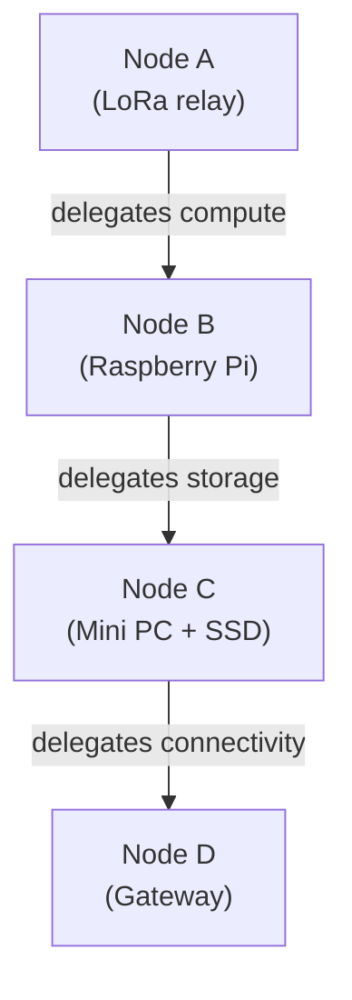

# Layer 4: Capability Marketplace

The capability marketplace is the unifying abstraction of Mehr. Every node advertises what it can do. Every node can request capabilities it lacks. The marketplace matches supply and demand through local, bilateral negotiation — no central coordinator.

This is the layer that makes Mehr a **distributed computer** rather than just a network.

:::tip[Key Insight]
There are no fixed node roles in Mehr. Every capability — relay, storage, compute, connectivity — is discoverable, negotiable, verifiable, and payable through the same marketplace abstraction. Specialization is emergent, not assigned.
:::

## The Unifying Abstraction

In Mehr, there are no fixed node roles. Instead:

- A node with a LoRa radio and solar panel advertises: *"I can relay packets 24/7"*
- A node with a GPU advertises: *"I can run Whisper speech-to-text"*
- A node with an SSD advertises: *"I can store 100 GB of data"*
- A node with a cellular modem advertises: *"I can route to the internet"*

Each of these is a **capability** — discoverable, negotiable, verifiable, and payable.

## Capability Advertisement

Every node broadcasts its capabilities to the network:

```
NodeCapabilities {
    node_id: NodeID,
    timestamp: Timestamp,
    signature: Ed25519Signature,

    // ── CONNECTIVITY ──
    interfaces: [{
        medium: TransportType,
        bandwidth_bps: u64,
        latency_ms: u32,
        reliability: u8,            // 0-255 (avoids FP on constrained devices)
        cost_per_byte: u64,
        internet_gateway: bool,
    }],

    // ── COMPUTE ──
    compute: {
        cpu_class: enum { Micro, Low, Medium, High },
        available_memory_mb: u32,
        mhr_byte: bool,            // can run basic contracts
        wasm: bool,                // can run full WASM
        cost_per_cycle: u64,
        offered_functions: [{
            function_id: Hash,
            description: String,
            cost_structure: CostStructure,
            max_concurrent: u32,
        }],
    },

    // ── STORAGE ──
    storage: {
        available_bytes: u64,
        storage_class: enum { Volatile, Flash, SSD, HDD },
        cost_per_byte_day: u64,
        max_object_size: u32,
        serves_content: bool,
    },

    // ── AVAILABILITY ──
    uptime_pattern: enum {
        AlwaysOn, Solar, Intermittent, Scheduled(schedule),
    },
}
```

### No Special Protocol Primitives

Heavy compute like ML inference, transcription, translation, and text-to-speech are **not protocol primitives**. They are compute capabilities offered by nodes that have the hardware to run them.

A node with a GPU advertises `offered_functions: [whisper-small, piper-tts]`. A consumer requests execution through the standard compute delegation path. The protocol is agnostic to what the function does — it only cares about discovery, negotiation, verification, and payment.

## Emergent Specialization

Nodes naturally specialize based on hardware and market dynamics:

| Hardware | Natural Specialization | Earns From | Delegates |
|---|---|---|---|
| ESP32 + LoRa + solar | Packet relay, availability | Routing fees | Everything else |
| Raspberry Pi + LoRa + WiFi | Compute, LoRa/WiFi bridge | Compute delegation, bridging | Bulk storage |
| Mini PC + SSD + Ethernet | Storage, DHT, HTTP proxy | Storage fees, proxy fees | Nothing |
| Phone (intermittent) | Consumer, occasional relay | Relaying while moving | Almost everything |
| GPU workstation | Heavy compute (inference, etc.) | Compute fees | Nothing |

## Capability Chains

Delegation cascades naturally:



Each link is a bilateral agreement with its own [payment channel](../economics/payment-channels). No central coordination required.

:::caution[Trade-off]
Capability chains create multi-hop economic dependencies — if any intermediate node goes offline, the entire delegation chain must re-negotiate. The protocol mitigates this with `valid_until` expiration and automatic re-discovery, but latency spikes during re-negotiation are unavoidable.
:::

<!-- faq-start -->

## Frequently Asked Questions

<details className="faq-item">
<summary>What is the marketplace actually for?</summary>

The capability marketplace is how nodes buy and sell services from each other — relay bandwidth, storage space, compute power, and internet connectivity. If your node lacks something (e.g., storage), it can find a nearby node that offers it, negotiate a price, and pay automatically via payment channels. Think of it as a local services market that runs in the background.

</details>

<details className="faq-item">
<summary>How are prices set? Is there a fixed rate?</summary>

Prices are set by individual node operators in their capability advertisements. There is no fixed rate — it’s a free market. If many nodes offer storage in your area, competition drives prices down. If relay bandwidth is scarce, prices go up. Your node selects providers based on cost, latency, and reliability automatically.

</details>

<details className="faq-item">
<summary>Can I browse available services without buying anything?</summary>

Yes. Capability advertisements propagate freely through the mesh. Your node maintains a local view of nearby capabilities — who offers storage, compute, relay, and at what prices — without forming any agreements or spending MHR. You only pay when you actually consume a service.

</details>

<details className="faq-item">
<summary>What happens if a provider doesn’t deliver the service I paid for?</summary>

For verifiable services (storage, deterministic compute), the protocol includes challenge-response proofs — you can check that a storage node actually holds your data. For opaque services, repeated failure damages the provider’s reputation, causing other nodes to avoid them. Payment channels settle incrementally, so you’re never out more than one settlement period’s worth of fees.

</details>

<!-- faq-end -->
