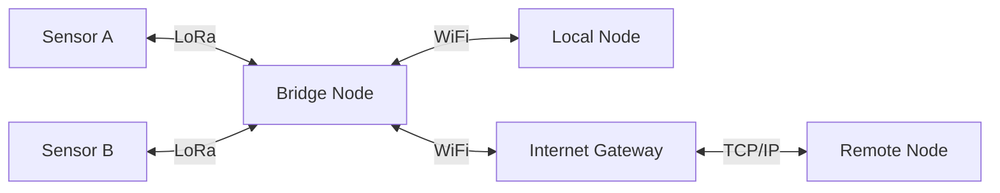

# Layer 0: Physical Transport

Mehr is transport-agnostic — any medium that can move bits is a valid link. LoRa, WiFi, Ethernet, cellular, packet radio, fiber, free-space optical: if it supports at least a half-duplex channel with ≥5 bps throughput and ≥500 byte MTU, Mehr will run on it. The transport layer is a swappable implementation detail — Mehr defines the interface it needs, not the implementation.

## Transport Requirements

The transport layer must provide:

- **Any medium is a valid link**: LoRa, LTE-M, NB-IoT, WiFi, Ethernet, serial, packet radio, fiber, free-space optical, TCP/IP
- **Multiple simultaneous interfaces**: A node can bridge between transports automatically
- **Announce-based routing**: No manual configuration of addresses, subnets, or routing tables
- **Mandatory encryption**: All traffic is encrypted; unencrypted packets are dropped as invalid
- **Sender anonymity**: No source address in packets
- **Constrained-link operation**: Functional at ≥5 bps

:::info[Specification]
Minimum transport interface: half-duplex channel, ≥5 bps throughput, ≥500 byte MTU, mandatory link-layer encryption. Any medium meeting these requirements is a valid Mehr transport.
:::

## Current Implementation: Reticulum

The current transport implementation uses the [Reticulum Network Stack](https://reticulum.network/), which satisfies all requirements above and is proven on links as slow as 5 bps. Mehr extends it with [CompactPathCost](network-protocol#mehr-extension-compact-path-cost) annotations on announces and an economic layer above. All Mehr extensions are carried as opaque payload data within Reticulum's announce DATA field — a clean separation that allows the transport to be replaced without affecting any layer above.

:::tip[Key Insight]
All economic extensions ride as opaque payload in transport announces — the transport never needs to understand Mehr. This means the transport can be swapped for a clean-room implementation in the future without changes to any protocol layer above.
:::

## Participation Levels

Not all nodes need to understand Mehr extensions. Three participation levels coexist on the same mesh:

| Level | Node Type | Understands | Earns MHR | Marketplace |
|-------|-----------|-------------|-----------|-------------|
| **L0** | Transport-only | Wire protocol only | No | No |
| **L1** | Mehr Relay | L0 + CompactPathCost + stochastic rewards | Yes (relay only) | No |
| **L2** | Full Mehr | Everything | Yes | Yes |

**L0 nodes** relay packets and forward announces (including Mehr extensions as opaque bytes) but do not parse economic extensions, earn rewards, or participate in the marketplace. They are zero-cost hops from Mehr's perspective. This ensures the mesh works even when some nodes run the transport layer alone.

**L1 nodes** are the minimum viable Mehr implementation — they parse CompactPathCost, run the VRF relay lottery, and maintain payment channels. This is the target for ESP32 firmware.

**L2 nodes** implement the full protocol stack including capability marketplace, storage, compute, and application services.

## Implementation Strategy

| Platform | Implementation |
|---|---|
| Raspberry Pi, desktop, phone | Rust implementation (primary) |
| ESP32, embedded | Rust `no_std` implementation (L1 minimum) |

All implementations speak the same wire protocol and interoperate on the same network.

## Supported Transports

| Transport | Typical Bandwidth | Typical Range | Typical Latency | Duplex | Notes |
|---|---|---|---|---|---|
| **LoRa (ISM band)** | 0.3-50 kbps | 2-15 km | 1-5 s | Half | Unlicensed, low power, high range. [RNode](https://reticulum.network/manual/hardware.html) as reference hardware. |
| **WiFi (local)** | 10-300 Mbps | 50-200 m | 1-10 ms | Full | Infrastructure or mesh (802.11s); ubiquitous, short range |
| **WiFi (point-to-point)** | 100-800 Mbps | 1-10 km | 1-5 ms | Full | Directional antennas for backbone links between fixed sites |
| **Cellular (LTE/5G)** | 1-100 Mbps | Via carrier | 10-50 ms | Full | Requires carrier subscription |
| **LTE-M** | 0.375-1 Mbps | Via carrier | 50-100 ms | Full | Licensed LPWAN; better building penetration than LoRa, carrier-managed |
| **NB-IoT** | 0.02-0.25 Mbps | Via carrier | 1-10 s | Half | Licensed LPWAN; extreme range and battery life, carrier-managed |
| **Ethernet** | 100 Mbps-10 Gbps | Local | ≤1 ms | Full | Backbone, data center |
| **Serial (RS-232, AX.25)** | 1.2-56 kbps | Varies | 10-500 ms | Half | Legacy radio, packet radio |
| **Fiber** | 1-100 Gbps | Long haul | ≤1 ms | Full | Backbone |
| **Bluetooth/BLE** | 1-3 Mbps | 10-100 m | 5-30 ms | Full | Wearables, phone-to-phone |
| **TCP/IP (Internet)** | Varies | Global | 10-200 ms | Full | Standard internet overlay; most accessible entry point for new nodes |

A node can have **multiple interfaces active simultaneously**. The network layer selects the best interface for each destination based on cost, latency, and reliability.

## Multi-Interface Bridging

A node with both LoRa and WiFi interfaces automatically bridges between the two networks. Traffic arriving on LoRa can be forwarded over WiFi and vice versa.

The bridge node is where bandwidth characteristics change dramatically — and where the [capability marketplace](../marketplace/overview) becomes valuable. A bridge node can:

- Accept low-bandwidth LoRa traffic from remote sensors
- Forward it over high-bandwidth WiFi to a local network
- Earn relay rewards for the bridging service
- Advertise its bridging capability to nearby nodes

## Bandwidth Ranges and Their Implications

The 20,000,000x range between the slowest and fastest supported transports (500 bps to 10 Gbps) has profound implications for protocol design:

:::caution[Trade-off]
Supporting 500 bps to 10 Gbps (a 20,000,000x range) means every protocol overhead byte must be budgeted. Data objects carry `min_bandwidth` requirements so large transfers are never attempted over constrained links — only hashes and metadata propagate on LoRa.
:::

- **All protocol overhead must be budgeted.** Gossip, routing updates, and economic state consume bandwidth that could carry user data. On a 1 kbps LoRa link, every byte matters.
- **Data objects carry minimum bandwidth requirements.** A 500 KB image declares `min_bandwidth: 10000` (10 kbps). LoRa nodes never attempt to transfer it — they only propagate its hash and metadata.
- **Applications adapt to link quality.** The protocol provides link metrics; applications decide what to send based on available bandwidth.

## NAT Traversal

Residential nodes behind NATs (common for WiFi and Ethernet interfaces) are handled at the transport layer. The NATed node initiates an outbound TCP or UDP connection to a publicly reachable peer, establishing a persistent bidirectional channel — the same mechanism that WebSockets and persistent TCP connections use to bypass NAT. No port forwarding, STUN, or TURN servers are required.

For nodes that cannot establish outbound connections (rare), the announce mechanism still propagates their presence. Traffic destined for a NATed node is routed through a neighbor that does have a direct link — functionally equivalent to standard relay forwarding. No special NAT-awareness is needed at the Mehr protocol layers above transport.

## What Mehr Adds Above Transport

The transport layer provides packet delivery, routing, and encryption. Mehr adds everything above:

| Extension | Purpose |
|---|---|
| **[CompactPathCost](network-protocol#mehr-extension-compact-path-cost) on announces** | Enables economic routing — cheapest, fastest, or balanced path selection |
| **[Stochastic relay rewards](../economics/payment-channels)** | Incentivizes relay operators without per-packet payment overhead |
| **[Capability advertisements](../marketplace/overview)** | Makes compute, storage, and connectivity discoverable and purchasable |
| **[CRDT economic ledger](../economics/crdt-ledger)** | Tracks balances without consensus or blockchain |
| **[Trust graph](../economics/trust-neighborhoods)** | Enables free communication between trusted peers |
| **[Congestion control](network-protocol#congestion-control)** | CSMA/CA, per-neighbor fair sharing, priority queuing, backpressure |

These extensions ride on top of the transport's existing gossip and announce mechanisms, staying within the protocol's [bandwidth budget](network-protocol#bandwidth-budget).

## Security Considerations

RF Jamming / Denial of Service

**Vulnerability:** An adversary overwhelms LoRa, WiFi, or BLE frequencies with noise, denying service to all nodes within range.

**Mitigation:** Multi-interface failover — if LoRa is jammed, WiFi or Ethernet interfaces continue operating. Mesh routing automatically reroutes traffic around the jammed area. Frequency-hopping radios (BLE, some LoRa modes) increase jamming cost. Sustained wideband jamming in close proximity can deny all RF links; wired fallback (Ethernet, serial) is the only complete counter.

Traffic Analysis via RF Observation

**Vulnerability:** Encrypted content is unreadable, but an observer with a software-defined radio can detect *that* communication is happening, measure volume, and correlate timing patterns to infer activity.

**Mitigation:** LoRa frames are [padded to fixed size](security#link-layer-encryption), preventing message-length analysis. Multi-path routing reduces timing correlation. Optional dummy traffic on quiet links raises the noise floor. A local observer with directional antennas can still detect RF activity from a specific location, but cannot determine content, sender, or recipient.

Direction Finding / Node Localization

**Vulnerability:** An adversary with multiple receivers triangulates RF emissions to determine the physical location of a transmitting node.

**Mitigation:** Omnidirectional antennas reduce bearing precision. The relay topology means the emitting node may not be the message originator — [sender anonymity](security#sender-anonymity) ensures a relay can't distinguish originator from forwarder. Low-power LoRa limits detection range. A determined adversary with multiple coordinated receivers can localize any actively transmitting node; operational countermeasures (elevated or concealed antenna placement) reduce this risk.

RF Fingerprinting

**Vulnerability:** Each radio has unique analog characteristics (clock drift, power ramp shape, modulation quirks) that can identify a specific physical device across sessions, even if cryptographic identity changes.

**Mitigation:** Not mitigated by protocol — this is a hardware-layer property below the transport abstraction. Identity is already pseudonymous (destination hashes, no source addresses), so fingerprinting reveals physical device continuity but not identity. Operational countermeasure: rotate or swap radio hardware. Practical impact is limited unless combined with direction finding.

Rogue Relay / Eclipse Attack

**Vulnerability:** An adversary controls all physical links to a target node (e.g., operates the only LoRa gateway within range), enabling selective packet dropping, traffic manipulation, or isolation.

**Mitigation:** Multiple simultaneous interfaces reduce single-point dependency — a node with both LoRa and WiFi is harder to eclipse. [Trust neighborhoods](../economics/trust-neighborhoods) detect behavioral anomalies from relays. The economic layer makes sustained eclipse costly — the attacker must fund [payment channels](../economics/payment-channels) and maintain them. A geographically isolated node with a single transport has no alternative path; physical diversity (adding a second radio or wired link) is the operational counter.

Physical Tampering

**Vulnerability:** An adversary gains physical access to an unattended node (rooftop relay, solar station, rural repeater) and extracts cryptographic keys, installs modified firmware, or implants surveillance hardware.

**Mitigation:** Tamper-evident enclosures for outdoor deployments. Secure boot on ESP32 and similar MCUs prevents unauthorized firmware. Keys stored in hardware secure elements where available. [KeyCompromiseAdvisory](security#key-compromise-and-identity-migration) enables identity migration after detected compromise. Unattended outdoor nodes are inherently vulnerable to physical access — deployments in hostile environments should assume eventual physical compromise and plan for key rotation.

Replay at RF Layer

**Vulnerability:** An adversary captures RF frames and re-transmits them to inject duplicate packets, confuse routing, or replay old announces.

**Mitigation:** [Link-layer encryption](security#link-layer-encryption) with rotating keys and sequence numbers ensures replayed frames fail authentication and are dropped as invalid. No residual risk — replay is fully mitigated by the transport's cryptographic layer.

<!-- faq-start -->

## Frequently Asked Questions

Which radios should I buy to get started with Mehr?

The easiest entry point is an [RNode](https://reticulum.network/manual/hardware.html) — a LoRa-based radio that serves as the reference hardware for the transport layer. For higher bandwidth, any WiFi-capable device (Raspberry Pi, laptop, phone) can participate. You don’t need a specific radio to join — any supported transport works, and nodes with multiple interfaces bridge between them automatically.

What kind of range can I expect from LoRa?

LoRa typically achieves 2–15 km line-of-sight depending on antenna height, terrain, and power settings. In urban areas with buildings in the way, expect 1–5 km. Directional antennas and elevated mounting points dramatically improve range. For longer distances, WiFi point-to-point links can reach 1–10 km.

Can Mehr work over the regular internet, or does it require radio hardware?

Mehr works over any transport — including the internet. Ethernet, WiFi, and cellular connections all function as valid transports. You can run a Mehr node on a home computer connected to your router. Radio hardware (LoRa, packet radio) extends the network into areas without internet connectivity, but it’s not required.

What happens when a message crosses from LoRa to WiFi or vice versa?

Bridge nodes with multiple interfaces handle this transparently. A packet arriving on LoRa is forwarded over WiFi (or any other interface) by the bridge node. The sender and receiver don’t need to know which transports were used — the routing layer picks the best path automatically. The bridge node can earn relay rewards for providing this service.

Does mixing slow and fast transports create bottlenecks?

The protocol is designed for this. Data objects carry a `min_bandwidth` field that prevents large transfers from being attempted over slow links. A 500 KB image won’t be pushed over LoRa — only its hash and metadata propagate. Applications adapt to link quality in real time, degrading gracefully on constrained links and resuming full quality on fast ones.

<!-- faq-end -->
