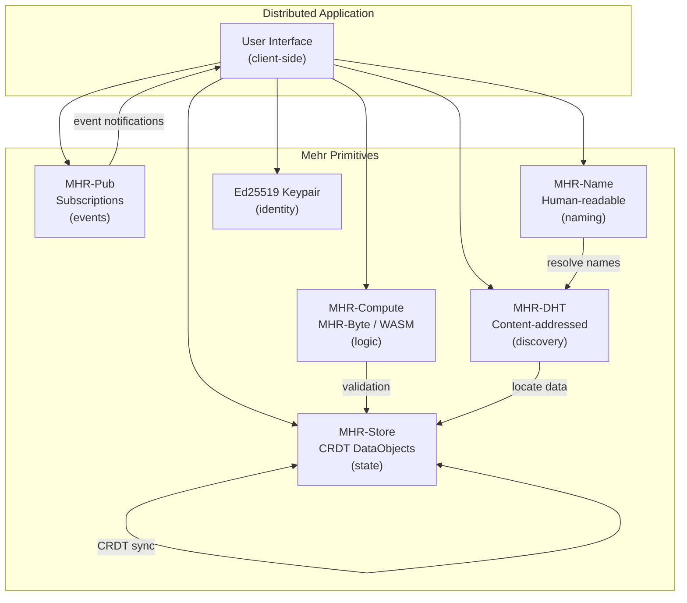

# MHR-App: Distributed Applications

Mehr provides low-level primitives — storage, compute, pub/sub, DHT, naming, identity. This page describes how those primitives compose into distributed applications without a central server, blockchain, or global consensus.

## Application Model

An application on Mehr is a composition of five elements:

```
Application = State + Logic + Events + Identity + Discovery

  State:     CRDT DataObjects in MHR-Store (replicated, eventually consistent)
  Logic:     MHR-Byte / WASM in MHR-Compute (deterministic, verifiable)
             Opaque compute for heavy workloads (GPU/NPU, reputation-verified)
  Events:    MHR-Pub subscriptions (reactive updates, scoped)
  Identity:  Ed25519 keypairs (same as node identity)
  Discovery: MHR-DHT (content-addressed) + MHR-Name (human-readable)
```

There is no "app server." Each user's node runs the application logic, stores its own state, and synchronizes with other participants through the mesh.

## How It Works



**State** lives in [MHR-Store](../mhr-store) as CRDT DataObjects. CRDTs guarantee eventual consistency without consensus — two nodes that edit the same object offline will converge when they reconnect. No conflict resolution protocol needed.

**Logic** runs in [MHR-Compute](../mhr-compute). Deterministic contracts (MHR-Byte or WASM) handle validation, access control, and state transitions. Heavy workloads (ML inference, media processing) use [opaque compute](../mhr-compute#opaque-compute-hardware-accelerated-services) — delegated to GPU/NPU nodes and verified by reputation or redundant execution.

**Events** flow through [MHR-Pub](../mhr-pub). When state changes, the authoring node publishes a notification. Subscribers receive updates reactively — no polling.

**Identity** is an Ed25519 keypair — the same key used for node identity. No separate "app accounts." A user's identity is portable across applications.

**Discovery** uses [MHR-DHT](../mhr-dht) for content-addressed lookups and [MHR-Name](../mhr-name) for human-readable resolution.

## AppManifest

An **AppManifest** binds together an application's components — contract code, UI, state schema, event topics — into a single content-addressed artifact. The manifest is an immutable [DataObject](../mhr-store) in MHR-Store, identified by its Blake3 hash. Human-readable access uses [MHR-Name](../mhr-name) with the [AppManifest target type](../mhr-name#name-targets).

```
AppManifest {
    // ── IDENTITY ──
    manifest_version: u8,               // format version (starts at 1)
    app_version: u16,                   // monotonically increasing application version
    publisher: NodeID,                  // publisher's Ed25519 identity
    created: u64,                       // epoch when this manifest was created

    // ── APP CLASSIFICATION ──
    app_type: u8,                       // 0=Full, 1=Headless, 2=Static
    min_tier: u8,                       // minimum device tier required
    compute_tier: u8,                   // 0=None, 1=MHR-Byte, 2=WASM-Light, 3=WASM-Full

    // ── CODE ──
    contract_count: u8,                 // number of contracts (0-15)
    contracts: [Blake3Hash],            // hashes of MHR-Contract code in MHR-Store
    entry_contract: u8,                 // index of primary contract (0xFF = none)

    // ── UI ──
    ui_root: Option<Blake3Hash>,        // root DataObject of UI bundle

    // ── STATE ──
    state_schema_hash: Option<Blake3Hash>, // hash of CRDT state schema definition

    // ── EVENTS ──
    pub_topic_count: u8,                // number of MHR-Pub topic templates (0-4)
    pub_topics: [PubTopicTemplate],     // scoped event channels

    // ── DEPENDENCIES ──
    dependency_count: u8,               // number of app dependencies (0-8)
    dependencies: [AppDependency],      // other apps/contracts this app requires

    // ── METADATA ──
    name_len: u8,                       // display name length (max 32 bytes)
    name: [u8],                         // UTF-8 display name
    description_hash: Option<Blake3Hash>, // hash of full description DataObject

    // ── SIGNATURE ──
    signature: Ed25519Signature,        // publisher signs all fields above
}

PubTopicTemplate {
    scope_type: u8,                     // 0=Geo (inherit user's geo), 1=Topic
    suffix_len: u8,
    suffix: [u8],                       // UTF-8 topic suffix
}

AppDependency {
    dep_type: u8,                       // 0=Contract, 1=App, 2=StorageObject
    hash: Blake3Hash,                   // hash of the required artifact
}
```

:::info[Specification]
The AppManifest binds contracts, UI, state schema, event topics, and dependencies into a single content-addressed artifact. Signed by the publisher's Ed25519 key and identified by its Blake3 hash. Three app types: Full (contracts + UI), Headless (contracts only), and Static (UI only).
:::

### App Types

| | Full | Headless | Static |
|---|---|---|---|
| **Contracts** | 1+ | 1+ | 0 |
| **UI** | Required | None | Required |
| **State schema** | Optional | Optional | None |
| **Min tier** | Community+ | Minimal+ | Community+ |
| **Example** | Forum, marketplace | Validation bot, escrow agent | Blog, documentation site |

**Full**: Contracts + UI + state. The typical distributed application.

**Headless**: Contracts + state, no UI. Background services, validation bots, protocol extensions. Can run on ESP32 if using MHR-Byte contracts.

**Static**: UI only, no contracts. A website served from the mesh. Equivalent to the [hosting](../../applications/hosting) model with a formal manifest.

### Dependencies

Apps can declare dependencies on other artifacts:

```
AppDependency types:
  0x00 = Contract    — requires a specific contract by code hash
  0x01 = App         — requires another app's manifest (shared libraries)
  0x02 = StorageObject — requires specific content in MHR-Store (datasets, models, configs)
```

Dependencies are resolved at install time. If a required contract is already cached locally (shared with another app), it is reused. Missing dependencies are fetched from MHR-Store/DHT.

This enables:
- **Shared contracts**: A "CRDT merge library" contract used by multiple apps
- **Data dependencies**: An ML app that requires a specific model stored in MHR-Store
- **App composition**: A dashboard app that depends on a weather app and a forum app

### Manifest Wire Format

| Field | Size | Description |
|-------|------|-------------|
| `manifest_version` | 1 byte | Format version (currently 1) |
| `app_version` | 2 bytes | Application version (u16 LE) |
| `publisher` | 16 bytes | Publisher's destination hash |
| `created` | 8 bytes | Creation epoch (u64 LE) |
| `app_type` | 1 byte | 0=Full, 1=Headless, 2=Static |
| `min_tier` | 1 byte | 0=Minimal, 1=Community, 2=Gateway, 3=Backbone, 4=Inference |
| `compute_tier` | 1 byte | 0=None, 1=MHR-Byte, 2=WASM-Light, 3=WASM-Full |
| `contract_count` | 1 byte | Number of contracts (0-15) |
| `contracts` | 32 x N bytes | Blake3 hashes of contract code |
| `entry_contract` | 1 byte | Index of primary contract (0xFF=none) |
| `ui_root_flag` | 1 byte | 0=absent, 1=present |
| `ui_root` | 0 or 32 bytes | Blake3 hash of UI bundle root |
| `state_schema_flag` | 1 byte | 0=absent, 1=present |
| `state_schema_hash` | 0 or 32 bytes | Blake3 hash of state schema |
| `pub_topic_count` | 1 byte | Number of topic templates (0-4) |
| `pub_topics` | variable | Per template: scope_type (1) + suffix_len (1) + suffix (variable) |
| `dependency_count` | 1 byte | Number of dependencies (0-8) |
| `dependencies` | 33 x N bytes | Per dependency: dep_type (1) + hash (32) |
| `name_len` | 1 byte | Display name length |
| `name` | variable | UTF-8 display name (max 32 bytes) |
| `description_flag` | 1 byte | 0=absent, 1=present |
| `description_hash` | 0 or 32 bytes | Blake3 hash of description DataObject |
| `signature` | 64 bytes | Ed25519 signature over all preceding fields |

**Size examples:**

| App Type | Contracts | Deps | Total |
|----------|-----------|------|-------|
| Headless (1 contract, ESP32) | 32 | 0 | ~185 bytes |
| Static site (no contracts) | 0 | 0 | ~130 bytes |
| Forum (2 contracts + UI) | 64 | 0 | ~285 bytes |
| Complex app (4 contracts + UI + 2 deps) | 128 | 66 | ~395 bytes |

All fit within the 465-byte packet data limit.

### Manifest Message Types

App manifest messages use context byte `0xF7` (social) with sub-types:

| Sub-Type | Name | Description |
|----------|------|-------------|
| `0x0B` | ManifestPublish | Announce a new or updated app manifest |
| `0x0C` | ManifestLookup | Query for an app manifest by hash |
| `0x0D` | ManifestLookupResponse | Return the requested manifest |

## Publishing an Application

```
Developer workflow:

  1. DEVELOP
     Write contract(s) as MHR-Byte bytecode or WASM.
     Build UI as static assets (HTML/CSS/JS).
     Define CRDT state schema (field names, CRDT types, initial values).

  2. STORE CODE
     For each contract:
       Compute Blake3(code) → contract_hash
       Store as immutable DataObject in MHR-Store
       Form StorageAgreements for replication (k≥3 recommended)

  3. STORE UI (if applicable)
     Store each UI asset as an immutable DataObject.
     Create a UI root DataObject linking to all asset hashes.
     Store with replication.

  4. STORE STATE SCHEMA (if applicable)
     Encode CRDT type definitions.
     Store as immutable DataObject.

  5. CREATE MANIFEST
     Populate AppManifest with all hashes, metadata, and dependencies.
     Sign with publisher's Ed25519 key.
     Store manifest as immutable DataObject in MHR-Store.

  6. REGISTER NAME
     Register MHR-Name binding:
       name: "my-forum"
       scope: Topic("apps", "forums")
       target: AppManifest(manifest_hash)    ← target type 0x03
     The name becomes the human-friendly app identifier.

  7. ANNOUNCE (optional)
     Publish notification via MHR-Pub on Scope(Topic("apps"), Prefix).
     Nodes subscribed to app announcements discover the new app.
```

## Discovering and Installing

```
User workflow:

  1. DISCOVER
     Find an app through one of:
       a. Name lookup: "forum-app@topic:apps/forums"
          → resolves to AppManifest hash (target type 0x03)
       b. Topic subscription: subscribe to Scope(Topic("apps"), Prefix)
          → receive announcements of new apps
       c. Peer recommendation: a trusted peer shares a manifest hash
       d. DHT search: query MHR-DHT for a known manifest hash

  2. FETCH MANIFEST
     Retrieve manifest DataObject by hash from MHR-Store/DHT.
     Verify Blake3(manifest_bytes) == expected_hash.
     Verify Ed25519 signature against publisher's public key.
     Check publisher's trust score via MHR-ID:
       trusted publisher     → proceed
       untrusted publisher   → warn user

  3. CHECK COMPATIBILITY
     Compare min_tier against local device capabilities.
     Compare compute_tier against local execution capability:
       MHR-Byte:    any device
       WASM-Light:  Community+ (Pi Zero 2W+)
       WASM-Full:   Gateway+ (Pi 4/5+)
     If underpowered: offer to delegate contract execution via marketplace.

  4. RESOLVE DEPENDENCIES
     For each AppDependency:
       Check local cache — already have it?
       If not: fetch from MHR-Store/DHT by hash.
       Verify content hash on download.
     Dependencies shared across apps are downloaded once.

  5. FETCH COMPONENTS
     Download contract code DataObjects (by hash from contracts[]).
     Download UI root → parse for asset hashes → download assets.
     Download state schema.
     All downloads are content-hash verified.

  6. INITIALIZE STATE
     If state_schema_hash present:
       Parse schema → create local CRDT DataObjects.
       Initialize with default values.
     If joining an existing community (e.g., a forum):
       Discover existing state via DHT/Pub → CRDT merge with peers.

  7. SUBSCRIBE TO EVENTS
     For each PubTopicTemplate:
       Resolve scope_type with user's own scope:
         scope_type=Geo  → use user's Geo scope + suffix
         scope_type=Topic → use suffix directly
       Subscribe via MHR-Pub.
     Subscribe to manifest update channel: Key(manifest_hash).

  8. DONE
     App is "installed" — a purely local operation.
     No server was contacted. No account was created.
```

## App Naming

Apps use the [AppManifest target type](../mhr-name#name-targets) (0x04) in MHR-Name. This lets the naming layer distinguish apps from regular content, enabling app-specific discovery and UI treatment.

**Naming convention**: Apps register under `topic:apps/*` scopes:

```
forum-app@topic:apps/forums
wiki-app@topic:apps/collaboration
weather-bot@topic:apps/utilities
portland-transit@geo:portland           ← geo-scoped app
```

**App lifecycle maps to name lifecycle**:

| App Action | Name Operation |
|-----------|---------------|
| Publish app | Register name → AppManifest(hash) |
| New version | Update name (sequence+1) → AppManifest(new_hash) |
| Unpublish | Revoke name |
| Browse apps | Query `Scope(Topic("apps"), Prefix)` filtered by target type 0x03 |

**Trust-weighted discovery** applies naturally — apps from trusted publishers rank higher in resolution. An untrusted publisher's app scores at the 0.01 floor, making it nearly invisible unless the user explicitly searches for it by hash.

**App browsing**: Subscribe to `Scope(Topic("apps"), Prefix)` via MHR-Pub to receive announcements of new and updated apps within your scope. This is Mehr's equivalent of an app store — decentralized, trust-weighted, with no central curation.
