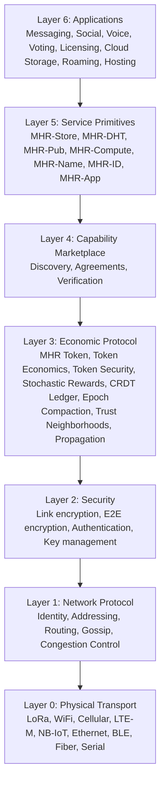

import DownloadButton from '@site/src/components/DownloadButton';

<DownloadButton />

# Mehr Protocol Specification v1.0

This page is the normative reference for the Mehr protocol. Individual documentation pages provide detailed explanations; this page summarizes the protocol constants, wire formats, and layer dependencies in one place.

## Status

| | |
|---|---|
| **Version** | 1.0 |
| **Status** | Design complete, pre-implementation |
| **Normative sections** | Layers 0–5 (transport through services) |
| **Informative sections** | Layer 6 (applications), hardware reference, roadmap |

## Protocol Constants

| Constant | Value | Defined In |
|----------|-------|-----------|
| Gossip interval | 60 seconds | [Network Protocol](/docs/L1-network/network-protocol#gossip-protocol) |
| Protocol overhead budget | ≤10% of link bandwidth | [Bandwidth Budget](/docs/L1-network/network-protocol#bandwidth-budget) |
| CompactPathCost size | 7 bytes (constant) | [Network Protocol](/docs/L1-network/network-protocol#mehr-extension-compact-path-cost) |
| MehrExtension magic byte | `0x4E` ('N') | [Network Protocol](/docs/L1-network/network-protocol#mehr-extension-compact-path-cost) |
| Destination hash size | 16 bytes (128-bit) | [Network Protocol](/docs/L1-network/network-protocol#identity-and-addressing) |
| Smallest MHR unit | 1 μMHR | [MHR Token](/docs/L3-economics/mhr-token#properties) |
| Supply ceiling | 2^64 μMHR (asymptotic) | [MHR Token](/docs/L3-economics/mhr-token#supply-model) |
| Default relay lottery probability | 1/100 | [Stochastic Rewards](/docs/L3-economics/payment-channels#example) |
| Payment channel state size | 200 bytes | [Payment Channels](/docs/L3-economics/payment-channels#channel-state) |
| Dispute challenge window | 2,880 gossip rounds (~48h) | [Payment Channels](/docs/L3-economics/payment-channels#channel-lifecycle) |
| Channel abandonment threshold | 4 epochs | [Payment Channels](/docs/L3-economics/payment-channels#channel-lifecycle) |
| Epoch trigger: settlement count | ≥10,000 batches | [CRDT Ledger](/docs/L3-economics/epoch-compaction#epoch-triggers) |
| Epoch trigger: GSet memory | ≥500 KB | [CRDT Ledger](/docs/L3-economics/epoch-compaction#epoch-triggers) |
| Epoch acknowledgment threshold | 67% of active set | [CRDT Ledger](/docs/L3-economics/epoch-compaction#epoch-lifecycle) |
| Epoch verification window | 4 epochs after activation | [CRDT Ledger](/docs/L3-economics/epoch-compaction#epoch-lifecycle) |
| Bloom filter FPR (epoch) | 0.01% | [CRDT Ledger](/docs/L3-economics/epoch-compaction#bloom-filter-sizing) |
| DHT replication factor | k=3 | [MHR-DHT](/docs/L5-services/mhr-dht#replication-factor) |
| DHT XOR weight (w_xor) | 0.7 | [MHR-DHT](/docs/L5-services/mhr-dht#lookup-scoring-function) |
| Storage chunk size | 4 KB | [MHR-Store](/docs/L5-services/mhr-store#chunking) |
| Presence beacon size | 20 bytes | [Discovery](/docs/L4-marketplace/discovery#presence-beacons) |
| Presence beacon interval | 10 seconds | [Discovery](/docs/L4-marketplace/discovery#presence-beacons) |
| Transitive credit limit | 10% per hop, max 2 hops | [Trust & Neighborhoods](/docs/L3-economics/trust-neighborhoods#trust-based-credit) |
| Constrained transport class MTU | 484 bytes | [Physical Transport](/docs/L0-physical/physical-transport#transport-classes-and-variable-packet-sizes) |
| Standard transport class MTU | 1,500 bytes | [Physical Transport](/docs/L0-physical/physical-transport#transport-classes-and-variable-packet-sizes) |
| Bulk transport class MTU | 4,096 bytes | [Physical Transport](/docs/L0-physical/physical-transport#transport-classes-and-variable-packet-sizes) |
| Route probe rate limit | 1 probe/minute per destination | [Network Protocol](/docs/L1-network/network-protocol#route-probing) |
| Route probe min link bandwidth | 10 kbps | [Network Protocol](/docs/L1-network/network-protocol#route-probing) |
| ReservationRequest size | 43 bytes | [Network Protocol](/docs/L1-network/network-protocol#bandwidth-reservation) |
| ReservationCommitment size | 23 bytes | [Network Protocol](/docs/L1-network/network-protocol#bandwidth-reservation) |
| ReservationRelease size | 11 bytes | [Network Protocol](/docs/L1-network/network-protocol#bandwidth-reservation) |
| Reservation escrow floor | 10% of estimated total | [Payment Channels](/docs/L3-economics/payment-channels#reservation-payment-progressive-escrow) |
| Reservation chunk size | 1 MB | [Payment Channels](/docs/L3-economics/payment-channels#reservation-payment-progressive-escrow) |
| Reservation inactivity timeout | 60 seconds | [Network Protocol](/docs/L1-network/network-protocol#bandwidth-reservation) |
| Reservation underperformance threshold | &lt;50% committed_bps for 3 chunks | [Network Protocol](/docs/L1-network/network-protocol#bandwidth-reservation) |
| Reservation reroute: cost improvement | ≥25% reduction | [Network Protocol](/docs/L1-network/network-protocol#bandwidth-reservation) |
| Reservation reroute: bandwidth improvement | ≥50% increase | [Network Protocol](/docs/L1-network/network-protocol#bandwidth-reservation) |
| PacketTooBig signal size | 18 bytes | [Physical Transport](/docs/L0-physical/physical-transport#path-mtu-behavior) |
| Max scopes per node | 8 | [Trust & Neighborhoods](/docs/L3-economics/trust-neighborhoods#hierarchical-scopes) |
| Max scope depth | 8 segments | [Trust & Neighborhoods](/docs/L3-economics/trust-neighborhoods#wire-format) |
| Max scope segment length | 32 characters | [Trust & Neighborhoods](/docs/L3-economics/trust-neighborhoods#wire-format) |
| Vouch expiry (default) | 30 epochs | [MHR-ID](/docs/L5-services/mhr-id#vouch-properties) |
| Kickback rate range | 0–255 (u8) | [MHR-Store](/docs/L5-services/mhr-store#kickback-rate) |
| Default kickback rate | 128 (~50%) | [Content Propagation](/docs/L3-economics/propagation#protocol-constants) |
| IdentityClaim min size | 126 bytes | [MHR-ID](/docs/L5-services/mhr-id#wire-format) |
| Vouch size | 121 bytes | [MHR-ID](/docs/L5-services/mhr-id#vouch-wire-format) |
| Claim type: GeoPresence | 0 | [MHR-ID](/docs/L5-services/mhr-id#claim-types) |
| Claim type: CommunityMember | 1 | [MHR-ID](/docs/L5-services/mhr-id#claim-types) |
| Claim type: KeyRotation | 2 | [MHR-ID](/docs/L5-services/mhr-id#claim-types) |
| Claim type: Capability | 3 | [MHR-ID](/docs/L5-services/mhr-id#claim-types) |
| Claim type: ExternalIdentity | 4 | [MHR-ID](/docs/L5-services/mhr-id#claim-types) |
| Claim type: ProfileField | 5 | [MHR-ID](/docs/L5-services/mhr-id#profile-fields) |
| Visibility: Public | 0 | [MHR-ID](/docs/L5-services/mhr-id#visibility-controls) |
| Visibility: TrustNetwork | 1 | [MHR-ID](/docs/L5-services/mhr-id#visibility-controls) |
| Visibility: DirectTrust | 2 | [MHR-ID](/docs/L5-services/mhr-id#visibility-controls) |
| Visibility: Named | 3 | [MHR-ID](/docs/L5-services/mhr-id#visibility-controls) |
| ProfileField value type: Text | 0 | [MHR-ID](/docs/L5-services/mhr-id#value-types) |
| ProfileField value type: ContentHash | 1 | [MHR-ID](/docs/L5-services/mhr-id#value-types) |
| ProfileField value type: Coordinates | 2 | [MHR-ID](/docs/L5-services/mhr-id#value-types) |
| ProfileField value type: Integer | 3 | [MHR-ID](/docs/L5-services/mhr-id#value-types) |
| Identity challenge method: Crawler | 0 | [MHR-ID](/docs/L5-services/mhr-id-verification#identity-linking) |
| Identity challenge method: OAuth | 1 | [MHR-ID](/docs/L5-services/mhr-id-verification#identity-linking) |
| Max name length | 64 bytes | [MHR-Name](/docs/L5-services/mhr-name#name-format) |
| Name binding min size | 122 bytes | [MHR-Name](/docs/L5-services/mhr-name#namebinding) |
| Name expiry | 30 epochs | [MHR-Name](/docs/L5-services/mhr-name#name-registration) |
| Name target type: NodeID | `0x01` | [MHR-Name](/docs/L5-services/mhr-name#wire-format) |
| Name target type: ContentHash | `0x02` | [MHR-Name](/docs/L5-services/mhr-name#wire-format) |
| Name target type: AppManifest | `0x03` | [MHR-Name](/docs/L5-services/mhr-name#wire-format) |
| Name context sub-type: Register | `0x08` | [MHR-Name](/docs/L5-services/mhr-name#message-types) |
| Name context sub-type: Lookup | `0x09` | [MHR-Name](/docs/L5-services/mhr-name#message-types) |
| Name context sub-type: LookupResponse | `0x0A` | [MHR-Name](/docs/L5-services/mhr-name#message-types) |
| AppManifest format version | 1 | [MHR-App](/docs/L5-services/mhr-app#manifest-wire-format) |
| Max contracts per manifest | 15 | [MHR-App](/docs/L5-services/mhr-app#appmanifest) |
| Max app dependencies per manifest | 8 | [MHR-App](/docs/L5-services/mhr-app#dependencies) |
| Max pub topic templates per manifest | 4 | [MHR-App](/docs/L5-services/mhr-app#appmanifest) |
| Max app display name | 32 bytes | [MHR-App](/docs/L5-services/mhr-app#appmanifest) |
| App type: Full | 0 | [MHR-App](/docs/L5-services/mhr-app#app-types) |
| App type: Headless | 1 | [MHR-App](/docs/L5-services/mhr-app#app-types) |
| App type: Static | 2 | [MHR-App](/docs/L5-services/mhr-app#app-types) |
| App context sub-type: ManifestPublish | `0x0B` | [MHR-App](/docs/L5-services/mhr-app#manifest-message-types) |
| App context sub-type: ManifestLookup | `0x0C` | [MHR-App](/docs/L5-services/mhr-app#manifest-message-types) |
| App context sub-type: ManifestLookupResponse | `0x0D` | [MHR-App](/docs/L5-services/mhr-app#manifest-message-types) |
| Geo verification: min vouches | 3 (for Verified level) | [Voting](/docs/L6-applications/voting#geoverificationlevel) |
| Protocol version encoding | 1 byte (major 4 bits, minor 4 bits) | [Versioning](/docs/L1-network/versioning#version-field) |
| Extended version escape | Major = 15 → read u16 pair from TLV | [Versioning](/docs/L1-network/versioning#version-field) |
| Current protocol version | `0x10` (v1.0) | [Versioning](/docs/L1-network/versioning#version-field) |
| Emission halving shift clamp | max 63 (prevents UB at epoch 6.4M+) | [MHR Token](/docs/L3-economics/mhr-token#supply-model) |
| Max curated feed entries | 256 per page | [Social](/docs/L6-applications/social#5-curated-feed) |
| LicenseOffer min size | ~160 bytes | [Digital Licensing](/docs/L6-applications/licensing#wire-format) |
| LicenseGrant size | 226 bytes | [Digital Licensing](/docs/L6-applications/licensing#wire-format) |
| Max custom license terms | 1024 characters | [Digital Licensing](/docs/L6-applications/licensing#licenseoffer) |

## Cryptographic Primitives

| Purpose | Algorithm | Output / Key Size |
|---------|-----------|-------------------|
| Identity / Signing | Ed25519 | 256-bit (32-byte public key) |
| Key Exchange | X25519 (Curve25519 DH) | 256-bit |
| Identity Hashing | Blake2b | 256-bit → 128-bit truncated |
| Content Hashing | Blake3 | 256-bit |
| Symmetric Encryption | ChaCha20-Poly1305 | 256-bit key, 96-bit nonce |
| Relay Lottery (VRF) | ECVRF-ED25519-SHA512-TAI (RFC 9381) | 80-byte proof |
| Erasure Coding | Reed-Solomon | Configurable k,m |

## Layer Dependency Graph



Each layer depends **only** on the layer directly below it. Applications never touch transport details. Payment never touches routing internals.

## Serialization Rules

All Mehr wire formats use the following conventions:

| Rule | Value |
|------|-------|
| **Byte order** | Little-endian for all multi-byte integers (u16, u32, u64, i64) |
| **Encoding** | Fixed-size binary fields; no self-describing framing (not CBOR, not JSON) |
| **TLV extensions** | Type (u8), Length (u8, max 255), Data (variable). Used in MehrExtension only |
| **Strings** | UTF-8, length-prefixed with u16 (community labels, function IDs) |
| **Hashes** | Raw bytes, no hex encoding on the wire |
| **Signatures** | Raw 64-byte Ed25519 signatures, no ASN.1/DER wrapping |
| **Normalized scores** | Computed on **decoded** values, then divided by the max decoded value in the candidate set. Result is IEEE 754 f32 on nodes that support FP; 16-bit fixed-point (Q0.16, value × 65535) on constrained nodes. Both yield equivalent routing decisions within rounding tolerance |

## Wire Format Summary

### Packet Format

```
[HEADER 2B] [DEST_HASH 16B] [CONTEXT 1B] [DATA 0-N bytes]
Constrained transport class: max 484 bytes (DATA 0-465B)
Standard transport class:    max 1,500 bytes (DATA 0-1,481B)
Bulk transport class:        max 4,096 bytes (DATA 0-4,077B)
Path max packet size: min(transport class MTU) across all hops
Source address: NOT PRESENT (structural sender anonymity)
```

### Mehr Announce Extension

```
[MAGIC 1B: 0x4E] [VERSION 1B] [CompactPathCost 7B] [TLV extensions...]
Minimum: 9 bytes. Carried in announce DATA field.
```

### CompactPathCost

```
[cumulative_cost 2B] [worst_latency_ms 2B] [bottleneck_bps 1B] [hop_count 1B] [bottleneck_mtu 1B]
Total: 7 bytes (constant regardless of path length)
```

### Payment Channel State

```
[channel_id 16B] [party_a 16B] [party_b 16B] [balance_a 8B]
[balance_b 8B] [sequence 8B] [sig_a 64B] [sig_b 64B]
Total: 200 bytes
```

## Specification Sections

| Spec Section | Documentation Page |
|-------------|-------------------|
| 0. Design Philosophy | [Introduction](introduction) |
| 1. Layer 0: Physical Transport | [Physical Transport](/docs/L0-physical/physical-transport) |
| 2. Layer 1: Network Protocol | [Network Protocol](/docs/L1-network/network-protocol) |
| 3. Layer 2: Security | [Security](/docs/L2-security/security) |
| 4. Layer 3: Economic Protocol | [MHR Token](/docs/L3-economics/mhr-token), [Token Economics](/docs/L3-economics/token-economics), [Token Security](/docs/L3-economics/token-security), [Stochastic Relay Rewards](/docs/L3-economics/payment-channels), [CRDT Ledger](/docs/L3-economics/crdt-ledger), [Epoch Compaction](/docs/L3-economics/epoch-compaction), [Trust & Neighborhoods](/docs/L3-economics/trust-neighborhoods), [Content Propagation](/docs/L3-economics/propagation), [Content Governance](/docs/L3-economics/content-governance), [Real-World Economics](/docs/L3-economics/real-world-impact) |
| 5. Layer 4: Capability Marketplace | [Overview](/docs/L4-marketplace/overview), [Discovery](/docs/L4-marketplace/discovery), [Agreements](/docs/L4-marketplace/agreements), [Verification](/docs/L4-marketplace/verification) |
| 6. Layer 5: Service Primitives | [MHR-Store](/docs/L5-services/mhr-store), [MHR-DHT](/docs/L5-services/mhr-dht), [MHR-Pub](/docs/L5-services/mhr-pub), [MHR-Compute](/docs/L5-services/mhr-compute), [MHR-Name](/docs/L5-services/mhr-name), [MHR-ID](/docs/L5-services/mhr-id), [MHR-App](/docs/L5-services/mhr-app) |
| 7. Layer 6: Applications | [Messaging](/docs/L6-applications/messaging), [Social](/docs/L6-applications/social), [Voice](/docs/L6-applications/voice), [Community Apps](/docs/L6-applications/community-apps), [Voting](/docs/L6-applications/voting), [Digital Licensing](/docs/L6-applications/licensing), [Cloud Storage](/docs/L6-applications/cloud-storage), [Roaming](/docs/L6-applications/roaming), [Hosting](/docs/L6-applications/hosting) |
| 8. Hardware Reference | [Reference Designs](hardware/reference-designs), [Device Tiers](hardware/device-tiers) |
| 9. Implementation Roadmap | [Roadmap](development/roadmap) |
| 10. Design Decisions | [Design Decisions](development/design-decisions) |
| 11. Protocol Versioning | [Versioning](/docs/L1-network/versioning) |
| 12. Open Questions | [Open Questions](development/open-questions) |

## Version

| Version | Status |
|---------|--------|
| **v1.0** | **Current** |

---

*The foundation — transport-agnostic mesh networking, cryptographic identity, Kleinberg small-world routing, stochastic relay rewards, CRDT settlement, epoch compaction, emergent trust neighborhoods, and the capability marketplace — is the protocol. Everything above it — storage, compute, pub/sub, naming, and applications — are services built on that foundation.*
